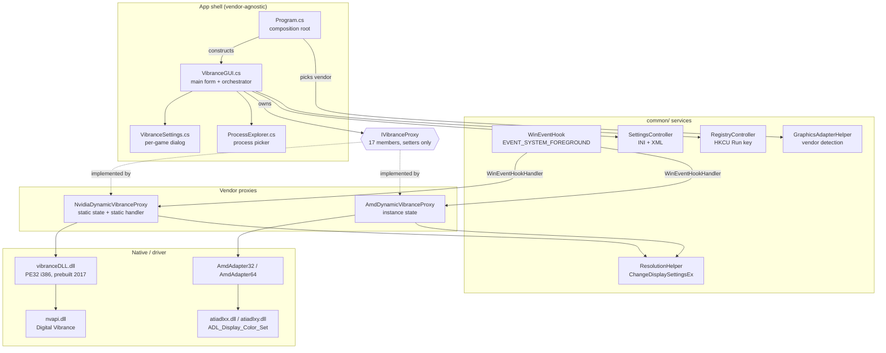
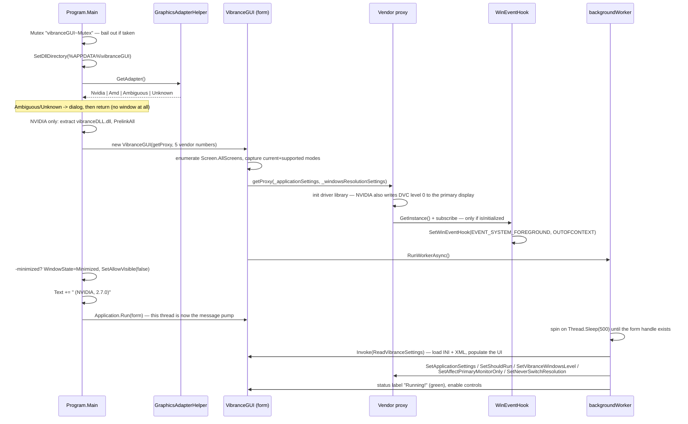
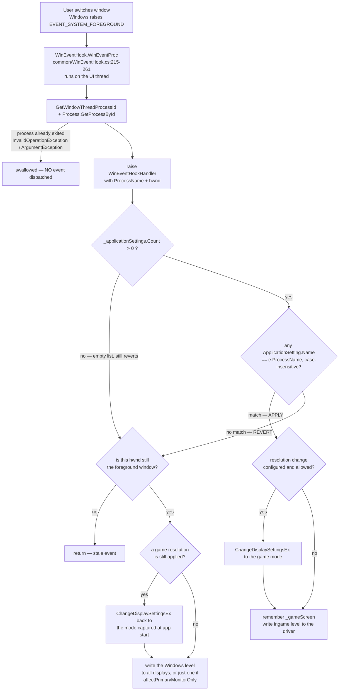
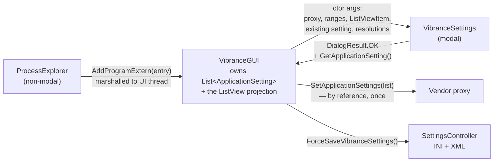

# vibranceGUI — Codebase Guide

> **What this document is.** A complete technical reference for the vibranceGUI source tree: what the
> program does for its users, how it is built, how it is wired together, what happens at runtime, what
> is broken, and what you must not break when you change it. It is written for two readers with zero
> prior context: a contributor fixing a bug or adding a feature, and an AI coding agent that has to
> orient itself quickly without damaging anything.
>
> **Provenance.** Synthesised from two full-source archaeology passes over `master` as it then stood,
> commit `919a9f2` (assembly version `2.3.1.1`), performed 2026-08-24, plus direct reading of the
> source. It has been kept current with `master` since, and describes `688ca85` (version `2.7.0`,
> `vibrance.GUI/Properties/AssemblyInfo.cs:35-36`). Statements about the prebuilt native
> `vibranceDLL.dll` come from parsing its PE headers and hand-decoding x86 at named RVAs; they are
> marked **VERIFIED (binary)**. Claims that could not be confirmed by execution are marked
> **INFERENCE** or **UNCERTAIN** and must not be repeated as fact.
>
> **Most of this was established by reading the source, not by running it.** There is no test project,
> but there are now 515 automated checks across eleven fixtures (see [§3.7](#37-tests-and-ci)) — they
> drive fakes and stubs, not a real driver, display or game. Exactly one change has been watched
> working in a real game session (vibrance applied on focus and restored on exit); the resolution
> and gamma paths have never run outside a fixture.

---

## Table of contents

1. [What this program actually does](#1-what-this-program-actually-does)
2. [Orientation: TL;DR for the impatient](#2-orientation-tldr-for-the-impatient)
3. [Tech stack, build & run](#3-tech-stack-build--run)
4. [Repository map](#4-repository-map)
5. [Architecture](#5-architecture)
6. [The runtime story, end to end](#6-the-runtime-story-end-to-end)
7. [The NVIDIA path](#7-the-nvidia-path)
8. [The AMD path](#8-the-amd-path)
9. [Settings & persistence](#9-settings--persistence)
10. [UI surface](#10-ui-surface)
11. [Data models reference](#11-data-models-reference)
12. [Known defects & risk register](#12-known-defects--risk-register)
13. [How to extend it](#13-how-to-extend-it)
14. [Open questions for maintainers](#14-open-questions-for-maintainers)

---

## 1. What this program actually does

### 1.1 The product, in plain language

vibranceGUI is a small Windows tray utility that **turns up your monitor's colour saturation while you
are playing a game, and turns it back down when you are not**.

It does this by driving the graphics driver's own saturation control — the same setting you would
otherwise change by hand in the NVIDIA Control Panel ("Digital Vibrance") or AMD's driver software
("Saturation"). Competitive players use a high vibrance level in-game because it makes enemy player
models stand out from the background, but they do not want their desktop, browser and video
permanently oversaturated. Doing it by hand on every launch and every alt-tab is tedious; this program
automates it.

The user's model of the app is:

1. Add one or more game executables to a watch list.
2. For each game, pick an **ingame level** — how saturated things should be while that game is in front.
3. Pick one global **Windows level** — what the desktop should look like the rest of the time.
4. Leave it running in the tray, optionally starting minimised with Windows.

From then on, every time the foreground window changes:

- if the new foreground window belongs to a watched game → the driver is set to that game's ingame
  level;
- if it belongs to anything else → the driver is set back to the Windows level.

Two extras ride along on the same mechanism:

- **An optional per-game resolution switch.** Each watched game can carry a target display mode; it is
  applied when the game takes the foreground and reverted when you leave. It exists for
  (borderless) windowed-mode players, and it is the most failure-prone feature in the program
  (see [§6.4](#64-the-optional-resolution-switch) and [§12](#12-known-defects--risk-register)).
- **An optional "affect primary monitor only"** mode, limiting changes to one display.

### 1.2 The two vendor scales the user sees

There is no vendor-neutral "saturation percentage" anywhere in the program. The number in the UI *is*
the number handed to the driver, and its meaning differs per vendor:

| | NVIDIA | AMD |
|---|---|---|
| Driver control | Digital Vibrance Control (DVC) via NvAPI | Saturation via ADL (`ADL_Display_Color_Set`) |
| Slider range | `0 … 63` | `0 … 300` |
| Neutral / "no boost" | `0` | `100` |
| Label beside the slider | `"50%" … "100%"`, matching the NVIDIA Control Panel | the raw number, no unit |
| Wired up at | `vibrance.GUI/Program.cs:322-330` (`Main`) | `vibrance.GUI/Program.cs:301-308` (`Main`) |

So on NVIDIA `0` means *no boost* and is displayed as `50%` — where the NVIDIA Control Panel's own
slider sits by default. On AMD `100` is neutral; the app lets you go below it (desaturate) but will
not persist that choice across restarts (see [§9.4](#94-value-clamping-on-load)).

### 1.3 What it is not, and what it will not do

- **It is not a colour-profile manager.** It writes a live driver setting and keeps no record of what
  it changed. If the process is killed, crashes, or the machine loses power while a game is in the
  foreground, **the display stays at the ingame level** — there is no "we changed this, restore it
  next time" record anywhere in the code.
- **No Intel support.** Vendor detection knows exactly two DLL names
  (`vibrance.GUI/common/GraphicsAdapter.cs:78-81`, `_nvidiaDllName`); anything else falls through to `Unknown` and the
  app shows an error and exits.
- **NVIDIA laptops** are declared unsupported by the README, but the code *no longer enforces this*:
  the laptop rejection message exists as a constant and is never shown
  (`vibrance.GUI/NVIDIA/NvidiaDynamicVibranceProxy.cs:159-161` (`NvapiErrorSystypeUnsupported`), dead — see [§12](#12-known-defects--risk-register)).
- **It never asks for administrator rights.** There is no application manifest at all, so it runs
  `asInvoker`. One visible consequence: elevated games do not show up in the built-in process picker,
  because opening their process handle fails (`vibrance.GUI/common/ProcessExplorer.cs:75-76`, `GetPathFromProcessId`).
- **It only reacts to foreground *changes*.** A game already in the foreground when vibranceGUI starts
  produces no event, so it gets no vibrance until you alt-tab away and back.

---

## 2. Orientation: TL;DR for the impatient

### 2.1 "I want to change X → look at Y"

| I want to change… | Go to |
|---|---|
| What happens when a game gains or loses focus (the heart of the app) | `vibrance.GUI/NVIDIA/NvidiaDynamicVibranceProxy.cs:263-394` (`OnWinEventHook`) and `vibrance.GUI/AMD/AmdDynamicVibranceProxy.cs:146-246` (`OnWinEventHook`) |
| How a foreground window is matched to a watched game | `ApplicationSettingMatcher.FindMatch` (`vibrance.GUI/common/ApplicationSettingMatcher.cs:47-83`), called from `NvidiaDynamicVibranceProxy.cs:269` (`OnWinEventHook`) / `AmdDynamicVibranceProxy.cs:152` (`OnWinEventHook`) — exact `ApplicationSetting.Name` vs `ProcessName` first, then the longest `InstallDirectory` that prefixes the process image path |
| How foreground changes are detected at all | `vibrance.GUI/common/WinEventHook.cs` — one system-wide `SetWinEventHook` on `EVENT_SYSTEM_FOREGROUND` |
| Which GPU vendor is chosen, and the "both drivers found" dialog | `vibrance.GUI/common/GraphicsAdapter.cs:84-109` (`GetAdapter`) |
| Slider ranges, defaults, level→label mapping | `vibrance.GUI/Program.cs:294-331` (`Main`) (five numbers per vendor) and `vibrance.GUI/common/SettingsController.cs:246-255` (`ReadVibranceSettings`) (a second, inconsistent copy) |
| Settings file format, defaults, clamping | `vibrance.GUI/common/SettingsController.cs` |
| Autostart with Windows | `vibrance.GUI/common/RegistryController.cs` + `vibrance.GUI/common/VibranceGUI.cs:625-661` (`checkBoxAutostart_CheckedChanged`) |
| The main window (controls, workers, watched-app list) | `vibrance.GUI/common/VibranceGUI.cs` + `VibranceGUI.Designer.cs` |
| The per-game dialog (ingame level, resolution) | `vibrance.GUI/common/VibranceSettings.cs` |
| The running-process picker | `vibrance.GUI/common/ProcessExplorer.cs` |
| Resolution switching / `DispChangeBadFlags` errors | `vibrance.GUI/common/ResolutionHelper.cs:250-383` (`ChangeResolutionEx`) — see [§6.4](#64-the-optional-resolution-switch) |
| NVIDIA native calls (P/Invoke declarations) | `vibrance.GUI/NVIDIA/NvidiaDynamicVibranceProxy.cs:45-128` — the implementation is a **prebuilt binary from another repository** |
| AMD native calls | `vibrance.GUI/AMD/vendor/AmdAdapter32.cs` (and its clone `AmdAdapter64.cs`) plus `vibrance.GUI/AMD/vendor/adl32/`, `adl64/` |
| Startup wiring / which proxy gets built | `vibrance.GUI/Program.cs` — the only composition root |
| Adding a source file to the build | `vibrance.GUI/vibrance.GUI.csproj:91-232` (`Compile`) — pre-SDK project, every file listed by hand |

### 2.2 Five facts that will bite you first

1. **There is no "apply vibrance" method in the abstraction.** `IVibranceProxy`
   (`vibrance.GUI/common/IVibranceProxy.cs:31-79`) contains only configuration *setters*. Every real
   driver write happens inside each proxy's private WinEvent handler. Nothing can ask a proxy to apply
   a level now, and the shell never tries.
2. **Everything runs on the UI thread — including the driver calls.** The hook is
   `WINEVENT_OUTOFCONTEXT`, so callbacks arrive through the message queue of the thread that installed
   it, which is the WinForms UI thread (`common/WinEventHook.cs:187-190`, pumped by `Program.cs:355`, `Main`).
   NvAPI round-trips, ADL calls and `ChangeDisplaySettingsEx` all block the UI. **Historical note:**
   one path used to pop a modal message box from inside this very callback on a resolution-change
   failure (`common/ResolutionHelper.cs`, pre-`work/resolution-change`) — i.e. over the game that had
   just taken focus. `ResolutionHelper.cs` no longer has a `using System.Windows.Forms` or any
   `MessageBox` call site (the word itself still appears once, in a doc comment describing this very
   fact); see [§6.4](#64-the-optional-resolution-switch) and **D2**.
3. **The build is x86-only, and stays that way until someone rebuilds the native DLL.**
   `vibrance.GUI/NVIDIA/vibranceDLL.dll` is a PE32 i386 image (VERIFIED binary), and `PlatformTarget`
   is `x86` in all four configurations (`vibrance.GUI.csproj:32,43,64,73`, `PlatformTarget`).
4. **The NVIDIA native layer is not in this repository.** `vibranceDLL.dll` is a checked-in binary
   built 2017-01-02 from `juvlarN/vibranceDLL` (embedded PDB path, VERIFIED binary). Its 12 bound
   exports are the entire NVIDIA capability surface; adding one means rebuilding that other project.
5. **NVIDIA proxy state is `static`.** `_vibranceInfo`, `_applicationSettings`,
   `_windowsResolutionSettings`, `_gameScreen` and the hook handler are all static
   (`NvidiaDynamicVibranceProxy.cs:165-169,263`, `_vibranceInfo`), making the class a de-facto singleton — a second
   instance silently clobbers the first. The AMD proxy is instance-scoped **except** `_gameScreen`
   (`AmdDynamicVibranceProxy.cs:24`, `_gameScreen`).

Runner-up, because it wastes a lot of debugging time: **`SetVibranceIngameLevel` is a no-op.** Both
implementations write `VibranceInfo.userVibranceSettingActive`, and *nothing in the solution ever reads
that field*. The intended live preview while dragging the ingame slider does not work
(`NvidiaDynamicVibranceProxy.cs:799-802` (`SetVibranceIngameLevel`), `AmdDynamicVibranceProxy.cs:108-111`, `SetVibranceIngameLevel`).

### 2.3 Repo state: this is a fork, and `master` is current

Read this before basing work on `master` or trying to reproduce a user's bug report.

- **Work from `master`** — `688ca85` when this was written, building version `2.7.0`
  (`vibrance.GUI/Properties/AssemblyInfo.cs:35-36`).
- **Both tags are ancestors of `master`**, so nothing that was published is missing from it: `v2.5.0`
  → `431d295` (upstream's release) and `v2.6.0` → `8609a93` (this fork's first). At `688ca85`,
  `master` is 84 commits past `v2.5.0` and 44 past `v2.6.0`; neither tag is ahead of it.
- **`v2.6.0` is still the only release.** Builds of `master` report `2.7.0`, but no `v2.7.0` tag
  exists and nothing has been published for it — the version number was raised so a bug report can
  name the code that produced it, not because a release was cut.
- **The colour-settings work is on `master`** — per-game gamma/brightness/contrast, the
  `neverSwitchResolution` default of `true`, the `--force-amd` / `--force-nvidia` flags. It was
  written upstream on `feature/add-color-settings`, which `v2.5.0` tags mid-branch; `master` took
  that branch's *head*, `18e54cd`, three commits past the tag, through the merge `4fb598c`, which
  reached `master` in this fork's PR #2 together with fixes for six blocking defects it carried.
  Upstream PR #140 for the branch is still open — the code is here because the branch was merged,
  not because that PR landed.
- **Upstream is a different repository, and a bare `master` here never means it.** Throughout this
  guide `master` is *this fork's*; upstream's is written `upstream/master`, and `juv/vibranceGUI`'s
  is still at `919a9f2` / `2.3.1.1`. Unless a number is explicitly called this fork's, every `#NNN`
  below is an upstream issue or PR that `git log` here will never show landing. The warning this
  section replaced was not invented: its figures were all true of `upstream/master`, and it froze
  there while this fork moved out from under it.
- **`Refactoring_to_WPF`, `Dynamic_VibranceGUI` and `temp`** exist on both remotes, were last touched
  between 2014 and 2016, and are more than a hundred commits behind. Nothing on them is live.

---

## 3. Tech stack, build & run

### 3.1 What it is made of

| | |
|---|---|
| Language / runtime | C#, .NET Framework **4.0** (`vibrance.GUI.csproj:12`; `App.config` `supportedRuntime v4.0`) |
| UI | Windows Forms — three forms, all with designer files |
| Output | `WinExe`, assembly name `vibrance.GUI`, root namespace `vibrance.GUI` (`csproj:8-11`) |
| Platform target | **x86 in every configuration** (`csproj:32,43,64,73`, `PlatformTarget`); `Prefer32Bit=false` in the two AnyCPU groups only (`csproj:40,50`) |
| Project style | pre-SDK MSBuild, `ToolsVersion 4.0`, every source file listed explicitly (`csproj:91-225`, `Compile`) |
| Solution | `vibrance.GUI.sln`, format 12.00, "# Visual Studio 2012", one project |
| NuGet packages | none, as of v2.6.0 — `Fody`, `Costura.Fody`, and the unused `CommonServiceLocator` were all removed; the build requires no NuGet restore |
| Native dependencies | `nvapi.dll` (NVIDIA, resolved dynamically inside the prebuilt DLL); `atiadlxy.dll` / `atiadlxx.dll` (AMD, static `DllImport`); plus `user32`, `kernel32`, `psapi`, `advapi32` |
| Size | 64 tracked files in the repo; 58 items in the project; 48 `.cs` files, ~4,622 lines of C# |

### 3.2 Building

```bash
# from the repository root
msbuild vibrance.GUI.sln /p:Configuration=Release /p:Platform=x86
```

No NuGet restore step is needed: as of v2.6.0 the project references no NuGet packages at all, so
there is no `packages/` directory to populate and no restore-related build target to satisfy.

Because the project targets `v4.0`, you need a toolchain that can still target .NET Framework 4.0 (the
4.0 targeting / multi-targeting pack). Open PR #153 proposes moving to .NET 4.8.

**A C# 6 compiler is mandatory despite the 4.0 target framework.** The solution header says "Visual
Studio 2012", but the source uses interpolated strings (`Program.cs:313` (`Main`), `VibranceGUI.cs:577` (`backgroundWorker_ProgressChanged`),
`VibranceSettings.cs:247`, `reloadTitle`) and a get-only auto-property initialiser
(`NVIDIA/NvidiaDynamicVibranceProxy.cs:823` (`GraphicsAdapter`) — `public GraphicsAdapter GraphicsAdapter { get; } = GraphicsAdapter.Nvidia;`).
Building with the VS 2012/2013 compiler fails: target framework and language version are independent.

Output paths by configuration (`csproj:36,46,61,69`, `OutputPath`):

| Configuration | Output path |
|---|---|
| `Debug` + `Any CPU` | `vibrance.GUI/bin/Debug/` |
| `Release` + `Any CPU` | remapped by the solution to `Release`+`x86` → `vibrance.GUI/bin/x86/Release/` |
| `Debug` + `x86` | `vibrance.GUI/bin/x86/Debug/` |
| `Release` + `x86` | `vibrance.GUI/bin/x86/Release/` |

The shipped artefact is a single `vibrance.GUI.exe`. There is no installer, no post-build step, and no
loose files to copy beside it.

### 3.3 The x86 rule, and why it is not negotiable

The README says only *"When compiling, make sure to compile for x86 target platform."* The reasons are
concrete:

1. **`vibrance.GUI/NVIDIA/vibranceDLL.dll` is a 32-bit PE32 i386 image** (VERIFIED binary: machine
   `0x14c`, 163,840 bytes, link timestamp 2017-01-02 18:22:43 UTC, SHA-256
   `0f229f79934f21617337c28915a9449f7b2395b20d7fb0e4a02d14277163cea0`). A 64-bit process cannot load
   it, and no 64-bit build of it exists in this repository.
2. **Vendor detection probes the 32-bit system directory.** `GraphicsAdapterHelper.GetAdapter()` looks
   in `Environment.SpecialFolder.SystemX86` (`common/GraphicsAdapter.cs:166`, `IsVendorDriverInstalled`) — `C:\Windows\SysWOW64`
   on 64-bit Windows — which is where the *32-bit* `nvapi.dll` and `atiadlxy.dll` live.
3. **The AMD binding assumes a 32-bit caller.** A 32-bit process on 64-bit Windows must load
   `atiadlxy.dll` rather than `atiadlxx.dll`; that assumption is baked into the `adl32`/`adl64` split
   (see [§8.4](#84-the-adl32adl64-duplication-and-why-the-names-are-backwards)).
4. **The code knows it is 32-bit and works around it.** `ProcessExplorer.GetPathFromProcessId` uses
   `psapi!GetModuleFileNameEx` with the comment *"Process.MainModule.FileName crashes when called on a
   x64 process because vibranceGUI is running as x86 process."* (`common/ProcessExplorer.cs:63-72`, `GetAllProcesses`).

`IntPtr` being 4 bytes is also load-bearing for some P/Invoke signatures — e.g. `getGpuSystemType` is
declared taking an `int` in C# where the native side takes an `int*`
(see [§7.5](#75-the-__thiscall-as-stdcall-binding--the-single-biggest-contributor-hazard)).

### 3.4 The `Debug|Any CPU` trap — with a correction

The solution remaps `Release|Any CPU` to the project's `Release|x86` (`vibrance.GUI.sln:18-19`) but
**does not remap `Debug|Any CPU`**, which stays `Debug|Any CPU` (`vibrance.GUI.sln:14-15`). Pressing
F5 in Visual Studio with the default "Any CPU" solution configuration therefore builds a *different
project configuration* than a Release build does.

**Correction to a claim you will hear about this repo:** this does **not** produce a 64-bit process.
The `Debug|AnyCPU` property group explicitly sets `<PlatformTarget>x86</PlatformTarget>`
(`vibrance.GUI.csproj:32` (`PlatformTarget`), with `Prefer32Bit=false` at `:40`), so the executable is still 32-bit and
can still load `vibranceDLL.dll`. What actually differs:

- the output directory is `bin/Debug/` instead of `bin/x86/Debug/`, so the binary you just built is
  not where you expect it and a stale binary in the other folder is easy to run by mistake;
- `Debug|Any CPU` does not set `CodeAnalysisRuleSet`, which both `x86` configurations do
  (`csproj:66,75`, `CodeAnalysisRuleSet`).

The practical advice is unchanged — **select the `x86` solution platform** — but when you are chasing a
"it won't load the native DLL" report, do not assume bitness is the cause on this branch; verify it.

### 3.5 How the native NVIDIA DLL is deployed (not what you would guess)

As of v2.6.0 the project no longer uses Costura.Fody. It previously merged *managed* references into
the output assembly, configured by an empty `<Costura/>` element in `vibrance.GUI/FodyWeavers.xml`;
given the reference list the only copy-local managed reference it ever merged was
`Microsoft.Practices.ServiceLocation.dll`, from the unused `CommonServiceLocator` package. That package
was removed in the same release, so Costura had nothing left to do and was dropped alongside it — the
build now references no NuGet packages at all (§3.2).

**The native DLL was never Costura's job.** `vibranceDLL.dll` is deployed via plain MSBuild plus
hand-written extraction, untouched by the Costura removal:

- `vibrance.GUI.csproj:243` (`EmbeddedResource`) — `<EmbeddedResource Include="NVIDIA\vibranceDLL.dll" />`, giving the
  manifest resource name `vibrance.GUI.NVIDIA.vibranceDLL.dll`;
- `Program.cs:312-317` (`Main`) reconstructs exactly that name and calls
  `CommonUtils.LoadUnmanagedLibraryFromResource(...)`;
- `AMD/vendor/utils/CommonUtils.cs:20-36` reads the resource, **writes it to
  `%APPDATA%\vibranceGUI\vibranceDLL.dll`, overwriting on every launch**, and calls
  `kernel32!LoadLibrary("vibranceDLL.dll")`, which resolves through the directory registered with
  `SetDllDirectory` (`Program.cs:260` (`Main`), and again in the `NativeMethods` static constructor,
  `AMD/vendor/utils/NativeMethods.cs:8-11` — so the call is made twice).

Two consequences. The extraction helper lives in the **AMD** utils namespace but is used only by the
NVIDIA path — a misfiled utility, not a behavioural bug. And `File.WriteAllBytes` on a locked file
throws `IOException`, while neither the extraction nor the following
`Marshal.PrelinkAll(typeof(NvidiaDynamicVibranceProxy))` (`Program.cs:318`, `Main`) sits in a `try`/`catch` — so
a locked or mismatched DLL is an unhandled exception out of `Main`, not a friendly error.

### 3.6 Running it

`vibrance.GUI.exe` recognises these arguments:

| Argument | Effect |
|---|---|
| `-minimized` | start minimised and hidden (`Program.cs:349-353`, `Main`). Matched with `args.Contains("-minimized")` — ordinal, case-sensitive, whole token. This is the flag the autostart registry entry uses. |
| `--help`, `-h`, `/?` | show every flag in a message box and exit (`CliOptions.cs`, `IsHelpRequested`). Dispatched **before** the mutex, so it answers while another instance is running. |
| `--set-vibrance <n>` | set the Windows-level vibrance and continue. With an instance already running, the value is relayed to it rather than opening a second one (`VibranceCliRelay.cs`); otherwise applied in-process after `ReadVibranceSettings` populates the trackbar. Range-checked per vendor (NVIDIA 0–63, AMD 0–300). |
| `--force-nvidia`, `--force-amd` | skip vendor detection (§6.1). |
| `--selftest-*` | run one fixture and exit (§3.7). |

Anything else is ignored. Upstream feature request #120 asked for the options above and is
addressed by them. Only one instance may run
per session, enforced with a `Mutex` named `vibranceGUI~Mutex` (`Program.cs:76`, `Main`); the absence of a
`Global\` prefix makes it session-local, so two logged-in users can each run one.

### 3.7 Tests and CI

- **There is no test project**, but there are automated checks: 515 of them across eleven
  `*Fixture.cs` files — nine in `vibrance.GUI/common/`, two in `vibrance.GUI/common/gamefinder/`
  — compiled into the app and run through twelve `--selftest-*` flags dispatched early in
  `Program.cs`, before the single-instance mutex. They report through `Checklist`
  (PASS/FAIL/SKIP), not a third-party assertion library, so searching for `Assert.` or
  `*Test*` finds nothing and wrongly suggests the project is untested.
- **CI is dead.** `.travis.yml` targets travis-ci.org (shut down) with `dist: trusty`, `mono: beta`,
  `dotnet: 1.0.3`. There is no GitHub Actions workflow. Assume nothing is verified on push.
- **`.gitattributes` sets `*.sln merge=union` and `*.csproj merge=union`.** Union merge on project
  files concatenates both sides of a conflict, which can silently produce duplicated or invalid XML.
  If you touch the csproj on a branch, inspect it after any merge.

---

## 4. Repository map

```
vibranceGUI/
├── README.md                      product blurb, the "compile for x86" warning, support contacts
├── .travis.yml                    dead CI (travis-ci.org, mono beta) — see §3.7
├── .gitattributes                 *.sln / *.csproj merge=union — see §3.7
├── vibrance.GUI.sln               one project; Debug|Any CPU is NOT remapped to x86 (§3.4)
└── vibrance.GUI/
    ├── Program.cs                 ENTRY POINT and the only composition root (§5.3)
    ├── App.config                 supportedRuntime v4.0
    ├── vibrance.GUI.csproj        pre-SDK project; add new files here by hand
    ├── setting.ico                application icon
    │
    ├── common/                    the app shell — vendor-agnostic (52 files)
    │   │
    │   │   forms and their designers
    │   ├── VibranceGUI.cs             main form + de-facto orchestrator (2120 lines) (§6, §10.1)
    │   ├── VibranceGUI.Designer.cs    control layout (German designer comments)
    │   ├── VibranceSettings.cs        per-game modal dialog, incl. the HDR level (§10.2)
    │   ├── VibranceSettings.Designer.cs
    │   ├── ProcessExplorer.cs         running-process picker (§10.3)
    │   ├── ProcessExplorer.Designer.cs
    │   ├── ProcessExplorerEntry.cs    DTO: path + icon + process name (§11.5)
    │   ├── GameFinder.cs              installed-game scan dialog, drives gamefinder/
    │   ├── GameFinder.Designer.cs
    │   ├── GraphicsAdapterChooser.cs  vendor picker, shown when detection is ambiguous
    │   ├── GraphicsAdapterChooser.Designer.cs
    │   │
    │   │   seams — every OS/driver dependency behind an interface with a test injection point
    │   ├── IVibranceProxy.cs          THE vendor seam (§5.2)
    │   ├── IHdrStateReader.cs         DISPLAYCONFIG HDR reads; the P/Invoke surface for §6.10
    │   ├── IForegroundWindowReader.cs foreground window, process name and image path
    │   ├── IHotkeyRegistrar.cs        RegisterHotKey — never a keyboard hook (§10.5)
    │   ├── ILogSink.cs                the log seam. DEFAULTS TO SILENCE; Main installs the real
    │   │                              sink only when no --selftest flag is present (§9.1)
    │   ├── ISettingsController.cs     internal; SetVibranceSetting() is never called
    │   ├── IRegistryController.cs     internal; incomplete — see §5.4
    │   │
    │   │   settings and persistence (§9)
    │   ├── SettingsController.cs      INI + XML persistence; each value parses independently (§9.3)
    │   ├── RegistryController.cs      HKCU\...\Run autostart (§9.5)
    │   ├── ApplicationSetting.cs      one watched game, incl. HdrIngameLevel (§11.1)
    │   ├── Definitions.cs             the VibranceInfo struct (§11.2)
    │   ├── TrackbarLabelHelper.cs     vendor-aware slider labels + range clamping
    │   │
    │   │   matching, toggling and restore bookkeeping
    │   ├── ApplicationSettingMatcher.cs  name and directory matching for the foreground process
    │   ├── PathResolver.cs               process image path via QueryFullProcessImageName
    │   ├── ProfileToggleHelper.cs        which profiles the toggle hotkey has suppressed
    │   ├── VibranceRestoreHelper.cs      the displays currently holding a game level; HoldingCount
    │   ├── HotkeyBinding.cs              the modifier/key model behind the toggle hotkey
    │   ├── HotkeyRegistration.cs         its live registration state
    │   │
    │   │   display: resolution, gamma and HDR
    │   ├── ResolutionHelper.cs             DEVMODE / ChangeDisplaySettingsEx (§6.4)
    │   ├── ResolutionModeWrapper.cs        serialisable display mode (§11.3)
    │   ├── ResolutionAdoptionDebouncer.cs  a mode must hold before it is adopted as the desktop's
    │   ├── FormsResolutionAdoptionTimer.cs the one-shot timer behind that debounce
    │   ├── WindowsResolutionRefresher.cs   re-reads the user's own mode after a change
    │   ├── DeviceGammaRampHelper.cs        gamma ramp read/write and baseline composition
    │   ├── HdrStateTracker.cs              per-display HDR state with a 1000 ms cache
    │   ├── HdrVibranceHelper.cs            resolves the SDR or HDR level for a profile
    │   ├── HdrRecheckTimer.cs              the recurring poll that notices HDR flipping under a game
    │   │
    │   │   command line (§3.6)
    │   ├── CliOptions.cs              parsing and validation for --help and --set-vibrance
    │   ├── VibranceCliRelay.cs        hands --set-vibrance to an already-running instance
    │   │
    │   │   foreground detection
    │   ├── WinEventHook.cs            THE foreground detector (§6.2)
    │   ├── WinEventHookEventArgs.cs   event payload; 4 of its 6 fields are dead (§11.6)
    │   ├── GraphicsAdapter.cs         vendor enum + detection (§6.1)
    │   │
    │   │   self-test fixtures — compiled in, run via --selftest-* (§3.7)
    │   ├── CliOptionsFixture.cs        48 checks
    │   ├── GammaRestoreFixture.cs      21 checks
    │   ├── GraphicsAdapterFixture.cs   38 checks
    │   ├── HdrVibranceFixture.cs       58 checks
    │   ├── MatchingFixture.cs          36 checks
    │   ├── ProfileToggleFixture.cs     91 checks
    │   ├── ResolutionChangeFixture.cs 158 checks
    │   ├── StabilityFixture.cs          6 checks
    │   ├── VibranceRestoreFixture.cs   38 checks
    │   │
    │   └── gamefinder/                installed-game discovery, feeding GameFinder.cs
    │       ├── IGameLibrarySource.cs      the source seam; sources are tried in registration order
    │       ├── SteamLibrarySource.cs      libraryfolders.vdf + appmanifest parsing
    │       ├── EpicLibrarySource.cs       the Epic manifests
    │       ├── UninstallRegistrySource.cs HKLM/HKCU uninstall entries, incl. DisplayIcon
    │       ├── StartMenuShortcutSource.cs Start Menu and desktop .lnk files, resolved through
    │       │                              IShellLink. Registered LAST and always as a guess; the
    │       │                              only source that finds a game with no uninstall entry
    │       ├── GameFinderScanner.cs       runs the sources and merges their candidates
    │       ├── GameScanContext.cs         per-scan state shared by the sources
    │       ├── GameCandidate.cs           one discovered game + its ExecutableConfidence
    │       ├── ExecutableEnumerator.cs    walks an install directory for candidate executables
    │       ├── ExecutablePicker.cs        picks the most likely executable of several
    │       ├── ExecutableRules.cs         the naming rules that ranking is built on
    │       ├── VdfTextReader.cs           minimal Valve VDF reader
    │       ├── SimpleJsonReader.cs        minimal JSON reader — no third-party dependency
    │       ├── ExecutablePickerFixture.cs          7 checks
    │       └── StartMenuShortcutSourceFixture.cs  14 checks
    │
    ├── NVIDIA/                    NVIDIA vendor path (§7)
    │   ├── NvidiaDynamicVibranceProxy.cs   IVibranceProxy impl + 12 P/Invokes into vibranceDLL
    │   ├── NvidiaTypes.cs                  NV_DISPLAY_DVC_INFO, NvApiStatus (dead), NvSystemType
    │   ├── NvidiaVibranceValueWrapper.cs   raw DVC level → "50%".."100%" label map
    │   └── vibranceDLL.dll                 PREBUILT NATIVE BINARY, source is in another repo (§7.2)
    │
    ├── AMD/                       AMD vendor path (§8)
    │   ├── AmdDynamicVibranceProxy.cs      IVibranceProxy impl
    │   └── vendor/
    │       ├── IAmdAdapter.cs              : IDisposable — but Dispose is never called (§8.6)
    │       ├── AmdAdapter32.cs             ADL enumeration + saturation writes
    │       ├── AmdAdapter64.cs             CLONE of AmdAdapter32: 195 of 197 lines identical
    │       ├── adl32/  (8 files)           ADL bindings → atiadlxx.dll
    │       ├── adl64/  (8 files)           CLONE of adl32 → atiadlxy.dll — names are backwards (§8.4)
    │       └── utils/
    │           ├── CommonUtils.cs          %APPDATA% path + the NVIDIA DLL extraction (misfiled)
    │           └── NativeMethods.cs        LoadLibrary / SetDllDirectory
    │
    └── Properties/                AssemblyInfo (version 2.7.0), Resources, Settings
```

Three structural facts worth internalising before you edit anything:

- **`common/` is not vendor-neutral.** `IVibranceProxy.cs:3` still has `using vibrance.GUI.NVIDIA;`
  (vestigial), `SettingsController.cs:10` imports the NVIDIA namespace to read `NvapiDefaultLevel` /
  `NvapiMaxLevel`, and `VibranceInfo` carries NVIDIA-shaped fields the AMD path never fills in.
- **`AMD/vendor/utils/` is not AMD-specific.** It hosts the `%APPDATA%` helper and the NVIDIA native
  DLL extraction used by `Program.cs`.
- **`adl32/` and `adl64/` are near-identical clones** carrying one string of difference. Any ADL fix
  must be applied twice ([§8.4](#84-the-adl32adl64-duplication-and-why-the-names-are-backwards)).

---

## 5. Architecture

### 5.1 The layering



Read the diagram with one correction to your instincts: **the arrow that matters most points from
`WinEventHook` *into* the proxies**, not from the shell. The shell configures a proxy and then has no
further say; the proxy drives the driver from an event handler the shell never sees.

### 5.2 The `IVibranceProxy` seam

`vibrance.GUI/common/IVibranceProxy.cs:31-79` — seventeen members (sixteen methods and one
property), no `IDisposable`, no events, no async:

| Member | Called from | Contract |
|---|---|---|
| `SetApplicationSettings(List<ApplicationSetting>)` | `VibranceGUI.cs:477` (`backgroundWorker_DoWork`) (worker thread, once after load) | **Store the reference, do not copy.** The shell keeps mutating that same list on every add/remove (`VibranceGUI.cs:1244,1663,1714`, `ReadVibranceSettings`). The call exists because `SettingsController.ReadVibranceSettings` returns a *new* list through an `out` parameter, orphaning the one the constructor was given (`VibranceGUI.cs:238-239`, `VibranceGUI`). |
| `SetShouldRun(bool)` | `VibranceGUI.cs:478` (`backgroundWorker_DoWork`), `:977` (`CleanUp`) | **Vestigial.** Both implementations only assign `VibranceInfo.shouldRun`, which nothing reads. Fossil of the pre-2015 polling design ([§6.6](#66-why-hooks-and-not-polling--reading-the-fossils)). |
| `SetVibranceWindowsLevel(int)` | `VibranceGUI.cs:479` (`backgroundWorker_DoWork`), `:365` (`trackBarWindowsLevel_Scroll`) | The desktop level. Stored, **not applied immediately** — dragging the desktop slider changes nothing visible until the next foreground change. |
| `SetVibranceIngameLevel(int)` | `VibranceSettings.cs:111` (`trackBarIngameLevel_Scroll`) | **Effectively a no-op** (see [§2.2](#22-five-facts-that-will-bite-you-first)). |
| `UnloadLibraryEx()` | `VibranceGUI.cs:1282` (`CleanUp`) | Tear down the hook and release native resources. Return value is **ignored** by the caller. |
| `HandleDvcExit()` | `VibranceGUI.cs:1280` (`CleanUp`) | Restore the Windows level on the affected displays before exit. |
| `SetAffectPrimaryMonitorOnly(bool)` | `VibranceGUI.cs:480` (`backgroundWorker_DoWork`), `:467` (`checkBoxPrimaryMonitorOnly_CheckedChanged`) | Whether the revert path touches all displays or one. |
| `GetVibranceInfo()` | `VibranceGUI.cs:329,347,974` (`backgroundWorker_DoWork`) | Returns the `VibranceInfo` **struct by value** — a copy. The shell consumes only `isInitialized`, which is the single "did the vendor layer come up?" signal that gates the entire UI. |
| `GraphicsAdapter { get; }` | `VibranceGUI.cs:1543` (`ReadVibranceSettings`) | Vendor tag, used to pick value ranges when loading settings. |
| `SetNeverSwitchResolution(bool)` | `VibranceGUI.cs:481` (`backgroundWorker_DoWork`), `:481` (`checkBoxNeverChangeResolutions_CheckedChanged`) | Global kill-switch for the resolution feature. |
| `SetNeverChangeColorSettings(bool)` | `VibranceGUI.cs:482` (`backgroundWorker_DoWork`, once after load) and `:671` (`checkBoxNeverChangeColorSettings_CheckedChanged`) | Master switch for the whole colour path. **Defaults to `true`** — brightness/contrast/gamma are OFF unless the user turns them on, which is the opposite of what the local initialiser in `VibranceGUI` suggests before `ReadVibranceSettings` overwrites it. |
| `SetWindowsColorSettings(int, int, int)` | `VibranceGUI.cs:483` (`backgroundWorker_DoWork`) | The three Windows-level colour values in one call, applied at load. |
| `SetWindowsColorBrightness(int)` | `VibranceGUI.cs:512` (`trackBarBrightness_Scroll`) | Live slider write. |
| `SetWindowsColorContrast(int)` | `VibranceGUI.cs:523` (`trackBarContrast_Scroll`) | Live slider write. |
| `SetWindowsColorGamma(int)` | `VibranceGUI.cs:532` (`trackBarGamma_Scroll`) | Live slider write. Gamma is the one that writes the display's LUT, so this is the path that can leave a machine mis-calibrated on exit (**§12.1**, upstream #128). |
| `ToggleForegroundProfile(IntPtr, string, string)` | `VibranceGUI.cs:966` (`OnToggleHotkeyPressed`) | Suspend or resume the profile owning the foreground window ([§10.5](#105-the-toggle-hotkey)). Direction comes from `ProfileToggleHelper`'s recorded intent, never from reading the driver. Returns a `ProfileToggleResult` so the caller can repaint the list. |
| `RecheckForegroundHdrLevel(IntPtr, string, string)` | `VibranceGUI.cs:1484` (`OnHdrRecheckTick`) | Re-resolve and re-apply after Windows' own HDR state changes under a running game ([§6.10](#610-the-separate-hdr-level-and-noticing-hdr-change)). A silent no-op when no profile owns the window, when the Windows level is not known yet, or when the resolved level is already applied. |

**The interface is not the real contract.** Three things escape it:

1. **Construction.** The constructors differ in shape —
   `NvidiaDynamicVibranceProxy(settings, resolutions)` (`NvidiaDynamicVibranceProxy.cs:185`) vs
   `AmdDynamicVibranceProxy(IAmdAdapter, settings, resolutions)` (`AmdDynamicVibranceProxy.cs:26`) —
   and `Program.cs:215-217,236-237` (`Main`) papers over the difference with two different lambdas.
2. **Value semantics.** The five numbers that define a vendor's scale (default Windows level, slider
   min, slider max, default ingame value, and the level→label function) are passed to the *form*, not
   to the proxy, and exist nowhere in the interface (`Program.cs:301-308` (`Main`), `:236-243`, `Main`).
3. **Behaviour on focus change.** Not on the interface at all; it is a private event handler in each
   implementation, and the two differ substantially ([§6.3](#63-vendor-divergence-in-the-same-flow)).

Rules a new implementation must honour: **never throw out of the constructor** (the shell has no
`try`/`catch` around `getProxy`); set `VibranceInfo.isInitialized` truthfully, because that flag alone
enables the GUI; subscribe to `WinEventHook.GetInstance().WinEventHookHandler` only when initialisation
actually succeeded; and tolerate being called from both the UI thread and the `backgroundWorker` thread
with no locking anywhere.

### 5.3 The composition root: `Program.cs`

`Program.Main` (`Program.cs:41-358`) is the only place that knows which vendor exists. It builds the
*same* `VibranceGUI` form in both branches, parameterised by a proxy factory and the vendor's value
scale:

| Constructor argument (`VibranceGUI.cs:182-245`, `VibranceGUI`) | AMD (`Program.cs:296-308`, `Main`) | NVIDIA (`Program.cs:322-330`, `Main`) |
|---|---|---|
| `getProxy` | `new AmdDynamicVibranceProxy(Is64BitOperatingSystem ? AmdAdapter64 : AmdAdapter32, x, y)` | `new NvidiaDynamicVibranceProxy(x, y)` |
| `defaultWindowsLevel` | `100` | `NvapiDefaultLevel` = `0` |
| `minTrackBarValue` | `0` | `0` |
| `maxTrackBarValue` | `300` | `NvapiMaxLevel` = `63` |
| `defaultIngameValue` | `100` | `0` |
| `resolveLabelLevel` | `x => x.ToString()` | `x => NvidiaVibranceValueWrapper.Find(x).Percentage` |

The AMD numbers `100/0/300/100` are **hardcoded literals in `Program.cs`**, and they are duplicated —
inconsistently — in `SettingsController.cs:251-255` (`ReadVibranceSettings`), which clamps loaded values to `100..300` while the
slider allows `0..300` ([§9.4](#94-value-clamping-on-load)).

### 5.4 Where the abstractions leak

- `IVibranceProxy` is `public`; `ISettingsController` and `IRegistryController` are `internal`, and
  both are instantiated concretely everywhere they are used
  (`VibranceGUI.cs:1187,1270` (`ReadVibranceSettings`), `:490` (`checkBoxAutostart_CheckedChanged`), `:1184`, `ReadVibranceSettings`) — so neither interface buys anything today.
- **`IRegistryController` is incomplete.** The UI calls `IsStartupPathUnchanged(appName, pathToExe)`
  (`VibranceGUI.cs:642`, `checkBoxAutostart_CheckedChanged`), which exists only on the concrete `RegistryController`
  (`RegistryController.cs:70-95`) and is *not* on the interface (`IRegistryController.cs:3-8`). The
  field is declared as the interface (`VibranceGUI.cs:63`, `_registryController`) yet a concrete instance is created locally
  to make that call (`VibranceGUI.cs:627`, `checkBoxAutostart_CheckedChanged`). Any alternative implementation would be unusable.
- `ISettingsController.SetVibranceSetting(szKeyName, value)` is **never called** — only declared and
  implemented.
- Both `SetVibranceSettings` and `SetVibranceSetting` return `bool`, and the returns are meaningless as
  implemented (`SettingsController.cs:93` (`SetVibranceSettings`), `:78` — `Marshal.GetLastWin32Error() == 0` after a full XML
  serialisation, with neither P/Invoke declaring `SetLastError = true`). Every caller ignores them.

---

## 6. The runtime story, end to end

This is the section to read if you read only one. Everything the program does is one of three things:
start up, react to a foreground change, or shut down.

### 6.1 Startup



Step by step, with the details that matter:

1. **Single instance** (`Program.cs:75-93`, `Main`). `new Mutex(true, "vibranceGUI~Mutex", out result)`; if the
   mutex was already held, show *"You can run vibranceGUI only once at a time!"* and return. Note this
   happens *before* `Application.EnableVisualStyles()` (`:54`, `Main`), so that first box is drawn unthemed.
2. **DLL search path** (`Program.cs:260`, `Main`). `SetDllDirectory(CommonUtils.GetVibrance_GUI_AppDataPath())`.
   That helper (`AMD/vendor/utils/CommonUtils.cs:9-18`) returns `%APPDATA%\vibranceGUI` **and creates
   the directory if it is missing** — the only place that is guaranteed to happen, which
   `SettingsController` silently depends on ([§9.3](#93-write-and-read-paths)).
3. **Vendor detection** (`Program.cs:262` (`Main`) → `common/GraphicsAdapter.cs:84-109`, `GetAdapter`):
   - if **both** the AMD DLL and `nvapi.dll` exist in `SysWOW64` → `Ambiguous`;
   - else if `LoadLibrary(amdDll)` succeeds **and** `IAmdAdapter.IsAvailable()` → `Amd`;
   - else if `LoadLibrary("nvapi.dll")` succeeds → `Nvidia`;
   - else `Unknown`.
   The AMD file name is chosen at static-init by *OS* bitness: `atiadlxy.dll` on 64-bit Windows,
   `atiadlxx.dll` on 32-bit (`GraphicsAdapter.cs:79-81`, `_amdDllName`). None of the `LoadLibrary` handles is ever
   freed.
4. **Error branches quit the process.** `Unknown` (`Program.cs:332-341`, `Main`) shows the "failed to determine
   your graphics adapter" text plus `new Win32Exception(Marshal.GetLastWin32Error()).Message`, and
   "Yes" opens `https://x.com/swatx18`. `Ambiguous` (`:255-261`, `Main`) shows the "uninstall your old
   drivers with DDU" text, and "Yes" opens the Guru3D DDU download page. **Both branches `return`
   after opening the browser** — "Yes" also quits. No window is ever shown.
5. **NVIDIA native bootstrap** (`Program.cs:312-318`, `Main`): extract the embedded DLL
   ([§3.5](#35-how-the-native-nvidia-dll-is-deployed-not-what-you-would-guess)), then
   `Marshal.PrelinkAll(typeof(NvidiaDynamicVibranceProxy))` to force every `DllImport` in that type to
   resolve immediately — so a missing `nvapi.dll` or an entry-point mismatch fails loudly at startup
   rather than mysteriously later. Neither call is guarded.
6. **The form constructor** (`VibranceGUI.cs:182-245`, `VibranceGUI`) does far more than lay out controls: it overrides
   the designer's trackbar range with the vendor's (`:142-143`, `VibranceGUI`), enumerates every `Screen.AllScreens`
   capturing the current mode and the full supported-mode list per device (`:1028-1045`, `RebuildWindowsResolutionSettings`), **builds the
   proxy** (`:175`, `VibranceGUI`), and kicks off the loading worker (`:180`, `VibranceGUI`). If `GetCurrentResolutionSettings` fails
   for a monitor, a modal box appears before the window is ever visible (`:1052-1055`, `ShowResolutionReadFailureDialog`).
   Note `_supportedResolutionList` is assigned **only for the primary screen** (`:155-160`, `VibranceGUI`) and is the
   only list the per-game dialog ever offers ([§12](#12-known-defects--risk-register)).
7. **The proxy constructor is where the driver comes up.** Both proxies subscribe to the hook only if
   initialisation succeeded; both catch every exception, show a dialog, and then **return a live but
   non-functional object** (`NvidiaDynamicVibranceProxy.cs:203-212` (`NvidiaDynamicVibranceProxy`), `AmdDynamicVibranceProxy.cs:48-57`, `AmdDynamicVibranceProxy`).
8. **The startup worker** (`VibranceGUI.cs:422-485`, `backgroundWorker_DoWork`) busy-waits `Thread.Sleep(500)` until
   `IsHandleCreated`, then marshals `ReadVibranceSettings` onto the UI thread, and — **only if
   `GetVibranceInfo().isInitialized`** — reports progress (status "Running!", green), enables the
   controls, and pushes the loaded configuration into the proxy. The busy-wait is why
   `SetVisibleCore` force-creates the handle when started `-minimized` (`VibranceGUI.cs:247-258`);
   without it a hidden form would never create a handle and the worker would spin forever.

### 6.2 The foreground-change flow — the heart of the app

Every vibrance change in the program originates here.



The mechanism underneath:

- **One hook, system-wide.** `SetWinEventHook(EVENT_SYSTEM_FOREGROUND, EVENT_SYSTEM_FOREGROUND,
  IntPtr.Zero, _procDelegate, 0, 0, WINEVENT_OUTOFCONTEXT)` — `common/WinEventHook.cs:187-190`.
  `idProcess`/`idThread` are `0`, so it observes all processes. `WINEVENT_SKIPOWNPROCESS` is *not*
  set, so vibranceGUI's own windows also raise callbacks (harmless: `vibrance.GUI` matches no game and
  the revert branch is idempotent on NVIDIA).
- **The delegate is rooted** in an instance field (`WinEventHook.cs:183`) and the instance in a static
  (`:181`), so the classic "GC collected my callback" crash is avoided — by luck rather than by a
  `GCHandle`.
- **The match rule** is one call in each proxy (`NvidiaDynamicVibranceProxy.cs:269` (`OnWinEventHook`),
  `AmdDynamicVibranceProxy.cs:152`, `OnWinEventHook`):

  ```csharp
  ApplicationSetting applicationSetting = _applicationSettings.Count > 0
      ? ApplicationSettingMatcher.FindMatch(_applicationSettings, e.ProcessName, e.ProcessImagePath)
      : null;
  ```

  `FindMatch` (`common/ApplicationSettingMatcher.cs:47-83`) runs **two passes, and
  never OR's them per entry**. First, an exact case-insensitive `ApplicationSetting.Name` vs
  `ProcessName` match anywhere in the list — the old rule, unchanged (`:89-94`, `NameMatches`).
  Only if no name matched does it try `InstallDirectory` as a path prefix of `e.ProcessImagePath`,
  longest match winning (`:64-80`, `FindMatch`). The order is deliberate: a name is what the user
  typed, a directory is an inference, and the settings list is silently reordered by an unrelated
  edit — testing both together would let a wrong game-finder guess shadow the user's own entry.
  Added on `work/directory-process-matching` (`4f3fd19`).

  **The path is no longer ignored — but only through `InstallDirectory`,** which the game finder
  fills in (`VibranceGUI.cs:1770-1776`, `AddProgramsBulk`) and the settings dialog reads back
  (`VibranceSettings.cs:53`, `VibranceSettings`) and writes out again (`:113`,
  `GetApplicationSetting`). `ApplicationSetting.FileName` is
  still used only for de-duplication, icon extraction and pruning, never for matching. An entry added
  by hand has no `InstallDirectory` at all, so for those the old behaviour stands exactly: *any*
  process named `csgo` triggers the `csgo` profile, wherever it lives (**D27**).
- **The `_applicationSettings.Count > 0` test no longer gates the whole handler.** **Fixed** on
  `work/stability-pass` (`466de41`, issue #138): it is now only a short-circuit around the match
  lookup, so an empty list yields a `null` `ApplicationSetting` and falls straight through to the
  revert branch (`NvidiaDynamicVibranceProxy.cs:268-272` (`OnWinEventHook`),
  `AmdDynamicVibranceProxy.cs:151-155`, `OnWinEventHook`). Deleting your last watched application
  while its game holds the foreground now restores vibrance, the resolution and the gamma ramp on
  the next foreground change (**D9**).
- **`WinEventHookEventArgs` is mostly dead.** `MainWindowTitle`, `WindowText` and `Process`
  (`common/WinEventHookEventArgs.cs:9-15`) are assigned (or in `Process`'s case not even that) and
  never read. The `Process.GetProcessById` round-trip exists solely to obtain `ProcessName`.

### 6.3 Vendor divergence in the same flow

The two handlers implement noticeably different behaviour. This table is the most useful thing to have
open when you are debugging a vendor-specific report:

| Aspect | NVIDIA (`NvidiaDynamicVibranceProxy.cs:263-394`, `OnWinEventHook`) | AMD (`AmdDynamicVibranceProxy.cs:146-246`, `OnWinEventHook`) |
|---|---|---|
| "Is this really the foreground?" | native `isWindowActive(ref hwnd)` (`:342`, `OnWinEventHook`) — the DLL compares against `GetForegroundWindow()` (VERIFIED binary) | inline `GetForegroundWindow() != processHandle` (`:228`, `OnWinEventHook`), own P/Invoke at `:143-144` |
| Which display gets the game level | per-window, via `getAssociatedNvidiaDisplayHandle(screen.DeviceName)`, now behind the `INvidiaVibranceDevice` seam (`:679-691`, `TryResolveDisplayHandle`) and called from `ApplyGameVibranceLevel` (`:453`) — the old `GetApplicationDisplayHandle` helper is deleted | `Screen.FromHandle(...).DeviceName` matched against the ADL adapter's `DisplayName` (`AmdAdapter32.cs:140`, `SetSaturationOnDisplay`) |
| Redundant-write suppression | **yes, per display** — an `IsAtLevel` (`equalsDVCLevel`) read before every write, in `ApplyGameVibranceLevel` (`:464`), `AllDisplaysAtLevel` (`:547`) and `RestoreOneDisplay` (`:573`) | **coarse only** — one `userVibranceSettingDefault != IngameLevel` test gates the whole apply (`:176`, `OnWinEventHook`); with no per-display read-back, a game level that differs from the Windows level is rewritten on every foreground change |
| Order of operations on game focus | vibrance → resolution change → gamma ramp (`:305`, `:316`, `:334`, `OnWinEventHook`) | the same order (`:180`/`:187`, `:205`, `:221`, `OnWinEventHook`). The unconditional "reset every display to the Windows level" that used to run *first*, making this a visible double-write, is **gone** (`62541a6`, on `master` since `4fb598c`) — see **D16** |
| `affectPrimaryMonitorOnly` on focus loss | honoured. The extra bail-out that skipped the restore unless the new window was on `_gameScreen` is **gone**: `RestoreWindowsVibranceLevel` restores every display holding a game level, plus the primary, wherever the focus landed (`:505-536`, `RestoreWindowsVibranceLevel`; `0c3057b`, issues #95/#144) | **now honoured** — the restore branches on the flag instead of always calling `SetSaturationOnAllDisplays` (`:265-297`, `RestoreWindowsVibranceLevel`; `0c3057b`, issues #60/#36) |
| `_gameScreen` assignment | assigned on any match not toggled off by hotkey, before any driver write (`:291`, `OnWinEventHook`); the old `displayHandle != -1 && !equalsDVCLevel(...)` gate around it is gone | the same (`:173`, `OnWinEventHook`). It used to sit **only inside the resolution-change `if`**, so with resolution switching off it stayed `null` and disabled AMD's own restore-resolution branch at `:236` (`OnWinEventHook`) — fixed by `62541a6` (**D18**) |
| On exit (`HandleDvcExit`) | honours `affectPrimaryMonitorOnly` (`:783-800`, `HandleDvcExit`) | **now honours it too** — `HandleDvcExit` goes through the same `RestoreWindowsVibranceLevel` as the focus-loss path (`:119-129`, `HandleDvcExit`) |

### 6.4 The optional resolution switch

**This section describes the post-fix design (branch `work/resolution-change`).** The two-phase
`CDS_UPDATEREGISTRY|CDS_NORESET` pattern this subsection used to describe, `ChangeResolution` (a
second, dead implementation of the same pattern) and the per-proxy `IsResolutionChangeNeeded`/
`PerformResolutionChange` duplication are all **gone**. The root `-4` (`DISP_CHANGE_BADFLAGS`) some
users hit could never be confirmed from this repository — it originates inside `user32` — so the fix
does not chase it; instead it closes every defect *around* the failure, which is where the real user
harm (a permanently blocked WinEvent thread, a stranded desktop resolution, an infinite retry loop)
actually lived. See `T0-CONTRACTS.md`-style history in the git log of this branch for the four
defects fixed together.

**The seam.** `common/ResolutionHelper.cs:18-28` defines `internal interface IDisplayModeDevice`
(`TryGetCurrentMode`, `TryEnumerateMode`, `ChangeMode` — `Devmode` passed **by value**, not `ref`, so
a fake can record exactly what it was handed). `RealDisplayModeDevice` (`:525-546`) is the only
production implementation, calling `EnumDisplaySettings`/`ChangeDisplaySettingsEx` directly.
`common/ResolutionChangeFixture.cs` drives the internal overloads against its own
`FakeDisplayModeDevice`, the same pattern `DeviceGammaRampHelper`/`IGammaDevice`/
`GammaRestoreFixture` already established for the gamma ramp.

**The call.** Both proxies now call two public members directly instead of their own duplicated
helpers: `ResolutionHelper.IsResolutionChangeNeeded(deviceName, target)` (`:190-193`) as a guard, then
`ResolutionHelper.ChangeResolutionEx(target, deviceName, isRevert)` (`:232-235`) to act
(`NvidiaDynamicVibranceProxy.cs:311-324,360-378` (`OnWinEventHook`); `AmdDynamicVibranceProxy.cs:200-213,236-250`, `OnWinEventHook`). The
`isRevert` flag selects which of two different give-up bounds applies (below) and which wording a
failure notification uses.

**The sequence** (internal overload, `common/ResolutionHelper.cs:250-383`, `ChangeResolutionEx`):

```
1. TryGetCurrentMode  -> unreadable: Failed, logged once, no notification, not counted toward give-up
2. target.MatchesAchievedMode(current)? -> AlreadyMatching, clear this device's failure state, done
3. copy current -> desired; overwrite width/height/bpp/frequency/fixedOutput; OR (not overwrite)
   OwnedFields into dmFields, so DM_POSITION (and anything else EnumDisplaySettings already set)
   survives untouched
4. ChangeMode(CDS_TEST)
     rejected AND DM_DISPLAYFIXEDOUTPUT was declared AND its value actually differs from the
     device's own current value -> drop that one bit, restore the device's own current value,
                                    retry ONCE (skipped when the value already matched - dropping
                                    the bit would change nothing observable, so it is never worth a
                                    second driver call)
     still rejected -> Failed (step 7), CDS_UPDATEREGISTRY is never reached
5. ChangeMode(CDS_UPDATEREGISTRY)
     Successful -> continue; Notupdated -> logged once, continue (mode is live regardless);
     anything else -> Failed (step 7)
6. TryGetCurrentMode again; must match target on the four fields, or -> AppliedUnverified (step 7) -
   a DISTINCT result from Failed, because CDS_UPDATEREGISTRY itself already reported success here;
   the mode most likely DID change, so the proxies keep treating it as applied rather than
   discarding a change that plausibly landed
7. Failed/AppliedUnverified: bump a per-(device,target,direction) consecutive-failure counter; log
   once per (device, dedup key) - the real DispChange code for a step 4/5 rejection, a fixed
   "readback-mismatch" key (with the achieved-vs-target values in the message, not a synthetic
   DispChange code) for step 6; once the counter reaches the direction's bound, raise
   ResolutionChangeFailed exactly once and every further call for that exact key returns Suppressed
   **without touching the driver at all**, until a success on a DIFFERENT target/direction for the
   same device clears it (see ClearFailureState - once a key is itself suppressed, the driver is
   never called for it again through this path, so it cannot produce a success of its own)
```

`CDS_TEST` then `CDS_UPDATEREGISTRY` replaces the old stage-then-commit pattern: `CDS_UPDATEREGISTRY`
alone both applies and persists in one authoritative call, so there is no longer a reachable state
where the registry holds a mode nothing ever confirmed was applied, and `CDS_TEST` catches a mode the
driver would reject before anything is written — which matters because `CDS_UPDATEREGISTRY` gets no
15-second revert-if-unconfirmed safety net the way an interactive Windows Settings change does.
`CDS_NORESET` is never passed at all (asserted by `ResolutionChangeFixture` check 1).

**No `using System.Windows.Forms` and no `MessageBox` call site in `ResolutionHelper.cs`.** A give-up
is reported through `ResolutionHelper.ResolutionChangeFailed` (`:123`), which `VibranceGUI`'s
constructor subscribes (`VibranceGUI.cs:232`, `VibranceGUI`) and turns into a `notifyIcon` balloon tip
(`OnResolutionChangeFailed`, `VibranceGUI.cs:1494-1517`) — non-modal, and, because the raise is
deferred to the give-up attempt rather than fired on every failure, at most one balloon per
(device, target) streak. There is deliberately no "IsGivingUp" flag on the event args: a give-up is
the only reason it is ever raised, so a field that would always read `true` carries no information.
`CleanUp()` unsubscribes both this and `SystemEvents.DisplaySettingsChanged` in a `finally`
(`VibranceGUI.cs:1294-1295`, `CleanUp`) — mandatory, not just good practice; see the guard described next.

**`OnDisplaySettingsChanged`/`OnResolutionChangeFailed` guard both `IsDisposed` and
`!IsHandleCreated`, not just `InvokeRequired`** (`VibranceGUI.cs:1370-1439`, `OnDisplaySettingsChanged`). `Control.InvokeRequired`
returns **false** whenever the control has no window handle yet, and the handle genuinely does not
exist for the whole span of the constructor's NvAPI/ADL initialisation after these handlers are
subscribed (`backgroundWorker_DoWork` busy-waits on `!IsHandleCreated`) — exactly the window in which
a `SystemEvents` notification is likely at autostart, as monitors settle, since `SystemEvents` starts
its own dedicated thread and message pump the moment the first handler is attached, independent of
the form's handle entirely. Without the explicit check, a notification landing in that window would
mutate `_windowsResolutionSettings` directly on the `SystemEvents` thread. The same guard covers the
symmetric shutdown case: `CleanUp()`'s `-=` cannot cover a notification already in flight, which
could otherwise find the handle destroyed, or the form disposed (`BeginInvoke` throwing
`ObjectDisposedException` on the `SystemEvents` thread with nothing there to catch it).

**Give-up bounds are asymmetric on purpose** (`ApplyFailureBound = 3`, `RevertFailureBound = 10`,
`ResolutionHelper.cs:87-88`): giving up on an *apply* only strands the user at their own Windows
resolution, the safe side; giving up on a *revert* strands them at the **game's** resolution, with
nothing else in the program that will ever retry it, so it is worth trying substantially longer
before accepting that outcome.

**The frozen-snapshot fix.** `_windowsResolutionSettings` (`VibranceGUI.cs`) used to be built once in
the constructor and never touched again — if the user changed their desktop resolution by hand, or
plugged in a monitor, the cached "Windows resolution" the revert path compares against went stale,
and every API call involved still reported success (see former defect **D58** below). The
constructor now calls `RebuildWindowsResolutionSettings(true)` (`VibranceGUI.cs:202`, `VibranceGUI`), which projects
`Screen.AllScreens` into a device-name list and delegates the actual refresh to
`WindowsResolutionRefresher.Refresh` (`WindowsResolutionRefresher.cs`) — extracted out of
`VibranceGUI.cs` so `ResolutionChangeFixture` can drive it through a fake `IDisplayModeDevice`, with
no `Screen`, no `Form` and no real display anywhere in the call stack. `SystemEvents.DisplaySettingsChanged`
(`Microsoft.Win32`, already referenced via `System.dll`) is subscribed in the constructor (`:172`, `VibranceGUI`) and
**must** be unsubscribed in `CleanUp()` (`:985`) — it holds a strong reference to the handler on its
own dedicated thread, so a leaked subscription leaks the form and can fault at shutdown. The handler
(`OnDisplaySettingsChanged`, `:1063-1117`) guards `IsDisposed`/`!IsHandleCreated` and marshals onto the
UI thread with `BeginInvoke` (see above) before handing off to `ResolutionAdoptionDebouncer` — **not**
calling `RebuildWindowsResolutionSettings(false)` directly any more (see "Known limitation" below for
why this changed) — which itself calls it, either immediately or after a debounce, with
`false` so a hot-plug or resolution change never pops the constructor's own failure dialog from
inside an arbitrary system event, which would be exactly the D2-shaped mistake this whole fix
removes.
**The single most dangerous line in the fix:** while `_v.GetVibranceInfo().isResolutionChangeApplied`
is true (a game's own resolution change is currently live), a refresh must **not** overwrite the
already-captured "Windows resolution" (`Item1`) for any known device — a live read at that moment
would return the *game's* mode, not the desktop's, and silently adopting it would strand the desktop
at the game's resolution forever, since the revert path compares against exactly that value
(`WindowsResolutionRefresher.Refresh`, `WindowsResolutionRefresher.cs:34-151`). `Item2` (the
supported-mode list) is carried over unchanged in that case — the same `List<ResolutionModeWrapper>`
instance, never re-enumerated; a screen with no prior entry still gets both captured fresh, since it
cannot be the screen the game is running on. That same instance is reused — never a fresh copy — for
any device already in the dictionary regardless of that flag, since it is a property of the device
rather than of whichever mode is currently active; re-enumerating it on every refresh would cost
several hundred `EnumDisplaySettings`
P/Invokes per screen on the UI thread, twice per alt-tab cycle (vibranceGUI's own resolution changes
fire `DisplaySettingsChanged` too), and reusing the identical instance is also what keeps
`_supportedResolutionList` — captured once, in the constructor, and `readonly` — from silently going
stale after a refresh.

**A device that drops out and later reattaches keeps its desktop mode.** `_lastKnownWindowsModes`
(`VibranceGUI.cs`) records every device's last-captured mode, INCLUDING one no longer attached, so
that when `Refresh` sees a device with `preserveCapturedMode` true but no existing dictionary entry —
because it dropped out of `attachedDeviceNames` during an earlier refresh, e.g. a cable bounce or a
docking-station reattach while a game's own resolution change is still applied to it — it falls back
to that retained mode instead of a live read that would otherwise capture the game's own mode, the
same danger the paragraph above describes (`WindowsResolutionRefresher.cs:103-117`, `Refresh`). The map is never
pruned once a device drops out, but that is safe to leave unbounded in practice: it is bounded by the
OS's own `\\.\DISPLAYn` device-name namespace, not by anything this program tracks. `Item2` is *not*
carried across the gap — a detached device has no dictionary entry at all, so a reattach always
re-enumerates its supported modes from scratch (`WindowsResolutionRefresher.cs:68-94`, `Refresh`), picking up
whatever a driver update or a different port reports now.

**An adopted foreign mode is never special-cased by value, on purpose — narrowed by duration
instead.** `WindowsResolutionRefresher.Refresh` itself is untouched: with `preserveCapturedMode`
false, it still adopts whatever mode is live as the new `Item1` the instant it actually runs — even
one a game set without going through a profile-driven apply at all (see
`ResolutionChangeFixture.cs`, `CheckAdoptedForeignModeSelfHealsOnceItIsGone`, which documents exactly
that as `Refresh`'s permanent, deliberate contract). A reviewer proposed skipping that re-capture
whenever the live mode matches a configured `ApplicationSetting.ResolutionSettings` entry instead;
it was rejected outright, and still is, because at refresh time "a game changed the resolution
itself with no profile applied" and "the user's own genuine desktop mode happens to equal a
configured entry" are observationally identical — both are a bare `DisplaySettingsChanged` plus a
live mode that differs from the last capture, with no reliable field comparison available to tell
them apart (`Equals` includes the driver-unreliable `DmDisplayFixedOutput`; `MatchesAchievedMode`
widens the false-positive surface instead). Special-casing the match would make a user's *real*
desktop mode permanently un-capturable the moment they configure a game at that same mode, and every
future revert would drag them to a stale value while still reporting success — a strictly worse,
non-self-healing failure than adopting a game's own foreign mode, which corrects itself the moment
that mode goes away.

`ResolutionAdoptionDebouncer` (`ResolutionAdoptionDebouncer.cs`) is the fix that keys on *duration*
instead, sitting one layer above `Refresh`: `VibranceGUI.OnDisplaySettingsChanged` no longer calls
`RebuildWindowsResolutionSettings(false)` directly, but arms a one-shot countdown
(`DebounceIntervalMs`, currently 2000ms) and only lets that call through once a live mode has held
steady with no further `DisplaySettingsChanged` arriving for the whole interval. **This narrows the
exposure, it does not close it.** A game that holds its own foreign mode for *longer* than
`DebounceIntervalMs` — exclusive fullscreen for the whole session, the dominant real-world shape —
is still adopted exactly as before, the moment the debounce elapses with that mode still live, and
still self-heals the same way once the mode goes away. What the debounce actually removes is
adoption of foreign modes that *don't* outlast the interval: startup/exit mode flaps, alt-tab
restore/re-set pairs, launcher and anti-cheat mode sets, and the window at game exit where the dying
mode is still live before Windows restores the desktop. The accepted cost in exchange: if a
countdown is still pending when a profiled game's own apply sets `isResolutionChangeApplied`, the
pending genuine change is not merely delayed — `RebuildWindowsResolutionSettings` re-reads that flag
as true at whichever moment it next runs and preserves the *old*, pre-change `Item1` unconditionally
(the single most dangerous line above, working exactly as designed), so the user's change is dropped
for that entire game session and the game's own exit-revert then drags the real desktop back to the
stale value. Narrow — it needs a genuine resolution change and a profiled game launch inside the
same `DebounceIntervalMs` window to coincide — but real. The constructor's own initial build
(`RebuildWindowsResolutionSettings(true)`) is not routed through the debouncer at all and is
unaffected by any of this: restarting vibranceGUI while a game already holds a foreign mode still
captures it immediately, unchanged from before this class existed.

**The fixed-output-loop fix.** `IsResolutionChangeNeeded`/`ChangeResolutionEx`'s "does this still
need changing?" guard is `ResolutionModeWrapper.MatchesAchievedMode` (`ResolutionModeWrapper.cs`),
which compares only `DmPelsWidth`/`DmPelsHeight`/`DmBitsPerPel`/`DmDisplayFrequency` —
**deliberately not** `DmDisplayFixedOutput`. `Equals`/`GetHashCode`/`ToString` are untouched and still
compare all five fields (the combo box lookup and the `applicationData.xml` round trip depend on
that). `DmDisplayFixedOutput` is only honoured by `ChangeDisplaySettingsEx` when
`DM_DISPLAYFIXEDOUTPUT` survives into the *achieved* mode's own `dmFields`, which is driver-dependent
— some drivers apply the four real fields correctly but silently pin this one to their own default
regardless of what was requested. Basing the guard on a field a driver is free to never honour is
what let a user's "(Center)" mode selection (former defect **D59** below) re-fire a real mode set and
registry write on every single foreground event, forever, even though the mode had genuinely already
been achieved on every field the driver actually supports.

The working user-side mitigation is still the "Never change resolutions" checkbox, which
short-circuits every call site. It is also the shipped default: upstream flipped it to `true` in
`6900bac`, on `master` since `4fb598c`, which tells you what the maintainer concluded about this
feature before this fix existed.

**UNCERTAIN, still:** the root cause of a `DISP_CHANGE_BADFLAGS`-class rejection from `CDS_TEST`
itself cannot be determined from this repository — it originates inside `user32`/the driver. The
candidates consistent with the code are unchanged from before this fix: (a) the device not being
attached to the desktop, or a mirroring/virtual driver, rejecting the mode outright — `deviceName`
comes straight from `Screen.FromHandle(e.Handle).DeviceName` with no attachment check; (b) a
display-topology change since the mode was captured (hot-plug, sleep/resume, driver restart) making
the cached entry refer to a different physical device. What changed is that `CDS_TEST` now catches
this **before** anything is written, and the give-up bound and notification mean a persistently
rejecting device stops being retried and tells the user, instead of retrying forever with a modal box
on every switch.

### 6.5 Shutdown

Triggered from the tray menu's `Exit` or the window's X, via `Form1_FormClosing` → `CleanUp()`
(`VibranceGUI.cs:495-498` (`Form1_FormClosing`), `:967-1002`, `CleanUp`):

```
CleanUp():
  statusLabel.Text = "Closing..."; ForeColor = Red; this.Update()     // :318-320
  if (_v != null && _v.GetVibranceInfo().isInitialized):
      _v.HandleDvcExit()      // restore the Windows level on the displays
      _v.SetShouldRun(false)  // vestigial — nothing reads shouldRun
      _v.UnloadLibraryEx()    // unhook the WinEvent hook, then unload the native library (NVIDIA)
  catch (Exception ex) -> Log(ex)                                     // :328-331
```

What is **not** done on shutdown, by omission:

- settings are not saved — a pending 5-second debounced save is simply lost
  ([§9.6](#96-the-debounced-save));
- **the screen resolution is not restored** if a game was ingame when vibranceGUI exits;
- the extracted `%APPDATA%\vibranceGUI\vibranceDLL.dll` is not deleted;
- `WinEventHook._instance` is not cleared (`WinEventHook.cs:181`);
- on AMD, ADL is never torn down at all — `UnloadLibraryEx` unhooks and returns `true`
  (`AmdDynamicVibranceProxy.cs:113-117`, `UnloadLibraryEx`), and `IAmdAdapter.Dispose()` is never called by anyone
  ([§8.6](#86-resource-management-on-the-amd-path)).

On an abnormal exit (Task Manager kill, crash, logoff, power loss) **nothing at all is restored** — no
vibrance, no resolution. This is the mechanism behind reports like issue #144 ("vibrance does not reset
to Windows level when program closes"): the reset only happens on the clean `FormClosing` path, and
even then only if `isInitialized` was true.

### 6.6 Why hooks, and not polling — reading the fossils

You will find several members that make no sense until you know the history. Before commit `20065d2`
("Updated vibranceGUI to be dynamic for all programs", 2015-07-07) the NVIDIA proxy ran a polling loop
on a background thread:

```csharp
while (vibranceInfo.shouldRun) { /* check the foreground window */ Thread.Sleep(vibranceInfo.sleepInterval); }
```

That commit introduced `WinEventHook.cs` and replaced the poll with event-driven detection. The
leftovers are still in the tree and are **all dead**: `VibranceInfo.shouldRun` and
`VibranceInfo.sleepInterval` (`common/Definitions.cs:27-28`, `shouldRun`), `SetShouldRun` on the interface,
`SetSleepInterval` (`NvidiaDynamicVibranceProxy.cs:804-807`, not even on the interface), the empty
`HandleDvc()` stub (`:761-763`), and — on the native side — the `handleDVC` export, which still
contains the in-DLL polling loop and the string `"DVC Level Thread exited!"` (VERIFIED binary).

Do not "fix" these by wiring them up. Delete them or leave them; they describe a design that no longer
exists.

### 6.7 Threading model in one page

| Thread | What runs on it |
|---|---|
| **UI / STA main thread** (`Application.Run`, `Program.cs:355`, `Main`) | all WinForms work; **all WinEvent callbacks** and therefore all vibrance writes and all `ChangeDisplaySettingsEx` calls; both proxy constructors |
| `backgroundWorker` (`VibranceGUI.cs:422-485`, `backgroundWorker_DoWork`) | one-shot startup load: busy-wait for the handle, `Invoke` the settings read, then push configuration into the proxy |
| `settingsBackgroundWorker` (`VibranceGUI.cs:540-544`, `settingsBackgroundWorker_DoWork`) | `Thread.Sleep(5000)` then save ([§9.6](#96-the-debounced-save)) |
| `ProcessExplorer.backgroundWorker` (`ProcessExplorer.cs:107-110`) | enumerate running processes, report each entry back to the UI thread |
| `Microsoft.Win32.SystemEvents`' own dedicated thread | raises `DisplaySettingsChanged` (`VibranceGUI.cs:1335-1352`, `RebuildWindowsResolutionSettings`); the handler `BeginInvoke`s onto the UI thread before touching `_windowsResolutionSettings`, which `OnWinEventHook` reads with no locking of its own — see [§6.4](#64-the-optional-resolution-switch) |

Consequences you must design around:

- **No locking exists anywhere.** It is safe today only because the interesting mutations happen on one
  thread. The `out` parameters captured by the lambda at `VibranceGUI.cs:439-442` (`backgroundWorker_DoWork`) are written on the UI
  thread and read on the worker thread, with the implicit `Invoke` barrier as the only synchronisation.
- **Callbacks keep firing during nested modal loops** (`VibranceSettings.ShowDialog()` at
  `VibranceGUI.cs:2007` (`listApplications_DoubleClick`), any `MessageBox`), so a proxy can be reading `_applicationSettings` while the
  user is mid-edit. Single-threaded, so no data race — but real re-entrancy.
- **Slow work in the callback freezes the UI** and, because it is a foreground-change callback,
  potentially the moment a game goes fullscreen.

### 6.8 Known blind spots in detection

1. **Startup blind spot.** The hook fires on *transitions* only; a game already running in the
   foreground gets nothing until you alt-tab away and back.
2. **Process-exit race** (`WinEventHook.cs:253-260`, `WinEventProc`). If the process that raised the event has exited
   by the time `Process.GetProcessById` runs, the exception is swallowed and **no event is dispatched
   at all**. When a game crashes or exits, the very event that would have reverted vibrance can be
   dropped, leaving the desktop at the ingame level until the next foreground switch. This is a
   plausible mechanism behind issue #144-style reports and part of issue #137 ("does not reliably
   detect game in foreground") — **INFERENCE**, not confirmed at runtime.
3. **Window-text buffer race** (`:225-227`, `WinEventProc`): `GetWindowTextLength` then `GetWindowTextA` are two calls
   and the title can change in between. Irrelevant in practice — nothing reads that text.
4. **Stale-event double-check exists only on the revert path** (NVIDIA `:342-343` (`OnWinEventHook`), AMD `:228-229`, `OnWinEventHook`).
   The apply path has no such check.
5. **`GetInstance()` has no lock** (`WinEventHook.cs:208-213`). Today both proxies call it from the UI
   thread, so the lazy singleton is safe; construct proxies concurrently in future and you get two
   hooks and a leaked handle.

### 6.9 Every message the user can see, and where it comes from

Support shortcut: a user quotes a string, you find the code path. Strings are verbatim from the
source; the ellipses mark text abbreviated for this table only.

| Message | Origin | Shown when |
|---|---|---|
| "You can run vibranceGUI only once at a time!" (caption "vibranceGUI Error") | `Program.cs:91` (`Main`) | another instance already holds the mutex; the app then exits. Drawn **unthemed**, because it precedes `EnableVisualStyles()` (`:34`) |
| *(the command line options list)* (caption "vibranceGUI command line options") | `Program.cs:51` (`Main`), text from `CliOptions.BuildHelpLines` | `--help`, `-h` or `/?`. Dispatched **before** the mutex, so it answers while another instance is running rather than being refused |
| "--set-vibrance needs a value, e.g. --set-vibrance 50." / "--set-vibrance needs a whole number, …" | `Program.cs:64,70` (`Main`) | a malformed `--set-vibrance`. Also ahead of the mutex, so a first and a second instance report a syntax error identically |
| "Ignoring --set-vibrance N: the valid range for NVIDIA is 0-63." (AMD: 0-300) | `Program.cs:382` (`ResolveCliVibranceOverride`) | the value parsed but is out of the vendor's range. The app then **continues** without applying it, rather than exiting |
| "Failed to determine your Graphic GraphicsAdapter type (NVIDIA/AMD). … Intel laptops are not supported … Error: " + the Win32 error message | `ErrorGraphicsAdapterUnknown`, `Program.cs:23`, shown `:248-253` (`Main`) | `GetAdapter() == Unknown`. Yes → opens the maintainer's Twitter. **The app exits either way** |
| "Both NVIDIA and AMD graphic drivers have been found on your system. … Use the program \"Display Driver Uninstaller\" …" | `ErrorGraphicsAdapterAmbiguous`, `Program.cs:24`, shown `:350-358` (`ShowLegacyAmbiguousDriverDialog`) | both vendor DLLs found in SysWOW64. Yes → opens the Guru3D DDU page. **The app exits either way** — and on a hybrid laptop this advice is wrong (**D3**) |
| *(a raw .NET exception dump — unlocalised stack trace)* | `MessageBox.Show(ex.ToString())` — `NvidiaDynamicVibranceProxy.cs:205` (`NvidiaDynamicVibranceProxy`), `AmdDynamicVibranceProxy.cs:50` (`AmdDynamicVibranceProxy`) | first dialog on **any** exception inside a proxy constructor |
| "VibranceProxy failed to initialize! Press Ok to open the vibranceGUI Steam Guide in your browser. Scroll down to section \"Troubleshooting, Errors, Q&A\"." | `NvapiErrorInitFailed`, `NvidiaDynamicVibranceProxy.cs:157-158`; shown `:206` and **reused by AMD** at `AmdDynamicVibranceProxy.cs:51` (`AmdDynamicVibranceProxy`) | immediately after that dump. OK → `https://vibrancegui.com/vibrance/guide` (**D21**) |
| "VibranceProxy failed to initialize! Graphics card system type (Desktop / Laptop) is unknown!" | `NvapiErrorSystypeUnknown`, `NvidiaDynamicVibranceProxy.cs:162`, shown `:228` (`InitializeProxy`) | any enumerated GPU reports `NvSystemTypeUnknown`. Really means "the NvAPI call failed" (**D19**) |
| "VibranceProxy detected that you are running a Laptop with integrated NVIDIA card. …" | `NvapiErrorSystypeUnsupported`, `NvidiaDynamicVibranceProxy.cs:159-161` | **never — dead constant** (**D20**) |
| "Current resolution mode could not be determined. Switching back to your Windows resolution will not work." | `ShowResolutionReadFailureDialog` (`VibranceGUI.cs:1359`), passed as the `onUnreadableDevice` callback to `WindowsResolutionRefresher.Refresh` only when `RebuildWindowsResolutionSettings`'s `showFailureDialog` is true | `EnumDisplaySettings` failed for a monitor. Shown only from the constructor's own build — the `SystemEvents.DisplaySettingsChanged` refresh path (`showFailureDialog: false`) never shows it, deliberately: see [§6.4](#64-the-optional-resolution-switch). The callback's `deviceName` parameter is unused in the message on purpose — it exists so `ResolutionChangeFixture` can assert *which* device reported, not to make this dialog start naming devices |
| *(historical)* "Changing the resolution failed: DispChangeBadflags" (or any other `DispChange` member name) | **removed** — `ResolutionHelper.cs` has no `using System.Windows.Forms` and no `MessageBox` call site after `work/resolution-change` | was a staging `ChangeDisplaySettingsEx` failure, raised **inside the foreground-change callback**, repeating on every subsequent switch (**D2**, issues #114/#132 — see [§6.4](#64-the-optional-resolution-switch) for the replacement: a `notifyIcon` balloon tip via `ResolutionHelper.ResolutionChangeFailed`) |
| Balloon tips: "Registered to Autostart!" / "Registering to Autostart failed!" / "Updated Autostart Path!" / "Updating Autostart Path failed!" / "Unregistered from Autostart!" / "Unregistering from Autostart failed!" | `VibranceGUI.cs:638-660` (`checkBoxAutostart_CheckedChanged`) | the autostart checkbox — **including when it is set programmatically at startup** ([§9.5](#95-autostart)) |
| Status label: "Initializing…" → "Running!" (green) → "Closing…" (red) | `VibranceGUI.Designer.cs:301` (`InitializeComponent`); `VibranceGUI.cs:572-573` (`backgroundWorker_ProgressChanged`); `:971-972` (`CleanUp`) | "Running!" appears only if `isInitialized` was true (`:329-331`, `backgroundWorker_DoWork`) — if it never turns green, the vendor layer failed silently (**D23**) |
| "NVAPI Unloaded: …" | `VibranceGUI.cs:577` (`backgroundWorker_ProgressChanged`) | **never** — `ReportProgress(2)` is never called (**§12.7**) |
| "NVAPI Error" (a native `MessageBoxA` caption) | string inside `vibranceDLL.dll` (VERIFIED binary), used by the native `printError` | not reachable from the 12 bound exports |

Everything not in this table **fails silently to the user** — less so than it once did, but the
difference is "written to the log file", not "shown". Still discarded outright: a `false` return from
`initializeLibrary`; `AdlMainControlCreate` (`AmdAdapter32.cs:20,27`, `Init`); and the one NVIDIA write
path that ignores `INvidiaVibranceDevice.SetLevel`'s result — the all-displays restore branch taken
when "affect primary monitor only" is off (`NvidiaDynamicVibranceProxy.cs:532`,
`RestoreWindowsVibranceLevel`). Now checked, but only logged: the other two NVIDIA write paths,
`ApplyGameVibranceLevel` (`:470`) and `RestoreOneDisplay` (`:580`), which report once per device
through `Program.LogSafely`; and `AdlDisplayColorSet`, whose status `SetSaturationOnDisplay` now
returns (`AmdAdapter32.cs:157-168`) — though only `ToggleForegroundProfile` reads that return
value (`AmdDynamicVibranceProxy.cs:337,351,369,377`).

---

### 6.10 The separate HDR level, and noticing HDR change

A profile may carry a **second vibrance level used only while its display is in HDR**
(`ApplicationSetting.HdrIngameLevel`). It is opt-in: the sentinel `HdrVibranceHelper.HdrLevelUnset`
(`-1`, `HdrVibranceHelper.cs:22`) means "no separate level", and `ResolveIngameLevel`
(`HdrVibranceHelper.cs:48`) then returns the ordinary ingame level. **With the box unticked the
resolved value is identical to what it would have been before this existed**, on every path.

Old profiles inherit that sentinel for free rather than by migration code: the list round-trips
through `XmlSerializer`, so a file written before the field existed simply has no `<HdrIngameLevel>`
element and the property keeps its initialiser (`ApplicationSetting.cs:38`). A pre-2.7 profile
therefore cannot silently acquire an HDR level of `0`, which — being a legal vibrance value — would
have greyed a game out.

**Where the state comes from.** `HdrStateTracker` (`HdrStateTracker.cs:20`) caches per-display HDR
state for 1000 ms over the `IHdrStateReader` seam, which is the `DISPLAYCONFIG` P/Invoke surface.
`GetState` answers for one display; `RefreshAndDetectChange` (`:99`) re-reads and reports whether
anything moved.

**Two triggers, one decision.** Toggling HDR raises no foreground event, so a game already holding a
level would never re-resolve. Both of these call the *same* method, so there is one place that
decides whether anything needs re-checking rather than two gates that can drift:

| Trigger | Where | Why |
|---|---|---|
| `SystemEvents.DisplaySettingsChanged` | `VibranceGUI.cs:1410`, `OnDisplaySettingsChanged` | the fast path. Deliberately **not** routed through the resolution debounce beside it — that debounce guards against a game's foreign display mode being adopted as the desktop mode, a hazard this shares none of. |
| `FormsHdrRecheckTimer`, every 2000 ms | `VibranceGUI.cs:107,236`; `HdrRecheckTimer.cs` | the backstop, because whether Windows raises `DisplaySettingsChanged` for an HDR toggle **has not been verified**. Recurring, not one-shot: nothing can know in advance when the state will flip. |

`OnHdrRecheckTick` (`VibranceGUI.cs:1459`) gates on `VibranceRestoreHelper.HoldingCount`
(`VibranceRestoreHelper.cs:68`) **first**, before anything HDR-specific runs. An idle tick is one
property read and a comparison — no `QueryDisplayConfig`, no P/Invoke. Upstream #156 was a real
performance bug from doing too much work too often on the UI thread, and this adds a recurring timer
to an app that sits in the tray permanently, so that ordering is load-bearing rather than tidy.

Both proxies then implement `RecheckForegroundHdrLevel`
(`NvidiaDynamicVibranceProxy.cs:657`, `AmdDynamicVibranceProxy.cs:449`), re-resolving and re-applying
whichever profile owns the foreground window, under the same skip rules the automatic apply branch
follows.

> **UNCERTAIN — and it decides whether any of this does anything.** Nobody has checked whether NVIDIA
> DVC has any effect at all while a display is in HDR. If the driver ignores the write, this feature
> is inert no matter how correctly it is plumbed. Every check covering it drives a fake HDR state; no
> real display's HDR has been toggled against this code. Treat "it works" as unproven, not as
> pending.

---

## 7. The NVIDIA path

### 7.1 The layer stack

```
VibranceGUI (shell)
   │  IVibranceProxy
   ▼
NvidiaDynamicVibranceProxy.cs        C#, 12 P/Invokes, ALL state static
   │  DllImport("vibranceDLL.dll"), CallingConvention.StdCall
   ▼
vibranceDLL.dll                      prebuilt native C++ (PE32 i386, 2017) — SOURCE NOT IN THIS REPO
   │  LoadLibraryA("nvapi.dll") + nvapi_QueryInterface(<13 ids>)
   ▼
nvapi.dll → NVIDIA display driver → Digital Vibrance on the panel
```

### 7.2 What `vibranceDLL.dll` actually is

**VERIFIED (binary).** `vibrance.GUI/NVIDIA/vibranceDLL.dll` is **163,840 bytes**, SHA-256
`0f229f79934f21617337c28915a9449f7b2395b20d7fb0e4a02d14277163cea0`, **PE32 i386** (machine `0x14c`),
6 sections, link timestamp **2017-01-02 18:22:43 UTC** — a native C++ MSVC Release build.

- Its embedded PDB path is `C:\Users\juv\Documents\GitHub\vibranceDLL\Release\vibranceDLL.pdb`, i.e.
  **the source lives in a separate repository, `juvlarN/vibranceDLL`**. Commit `06b40fb` in this repo
  ("Updated vibranceDLL to https://github.com/juvlarN/vibranceDLL/commit/e2b480f2…") confirms the
  workflow: the DLL is built there and the binary is copied in here.
- **There is no version resource** (no `VS_VERSION_INFO`), so the binary cannot be version-checked at
  runtime and you cannot tell two builds apart except by hash.
- **It does not statically import `nvapi.dll`.** Its import table is only `KERNEL32.dll` (77 functions
  including `LoadLibraryA`, `GetProcAddress`, `GetSystemDirectoryW`), `USER32.dll` (`FindWindowW`,
  `GetWindowTextA`, `GetWindowTextLengthW`, `MessageBoxA`, `GetForegroundWindow`) and `ADVAPI32.dll`
  (`SystemFunction036`). NvAPI is resolved dynamically at init ([§7.4](#74-the-initialisation-handshake)).
- Deployment is described in [§3.5](#35-how-the-native-nvidia-dll-is-deployed-not-what-you-would-guess):
  embedded as an MSBuild resource, extracted by hand to `%APPDATA%\vibranceGUI\` on every launch.

**Practical consequence:** the NVIDIA capability surface of vibranceGUI is frozen at whatever those 13
exports do. Anything new on the NVIDIA side requires building the *other* repository.

### 7.3 The P/Invoke surface

All entry points are **MSVC-mangled C++ member functions** of `vibranceDLL::vibrance`
(`?name@vibrance@vibranceDLL@@QAE…`, where `QAE` means `public: __thiscall`). All are declared in C#
as `CallingConvention.StdCall` **with no `this` argument** — see the hazard in
[§7.5](#75-the-__thiscall-as-stdcall-binding--the-single-biggest-contributor-hazard).

| # | C# declaration (`NvidiaDynamicVibranceProxy.cs`) | Native signature | CharSet |
|---|---|---|---|
| 1 | `bool initializeLibrary()` `:45-50` | `bool()` | Auto |
| 2 | `bool unloadLibrary()` `:52-57` (`unloadLibrary`) | `bool()` | Auto |
| 3 | `int getActiveOutputs(int[], int[])` `:60-65` (`getActiveOutputs`) | `int(int* const[], int* const[])` | Auto |
| 4 | `void enumeratePhsyicalGPUs(int[])` `:67-72` (`enumeratePhsyicalGPUs`) | `void(int* const[])` | Auto |
| 5 | `bool getGpuName(int[], StringBuilder)` `:74-79` (`getGpuName`) | `bool(int* const[], char*)` | **Ansi** |
| 6 | `bool getDVCInfo(ref NvDisplayDvcInfo, int)` `:81-86` (`getDVCInfo`) | `bool(NV_DISPLAY_DVC_INFO*, int)` | **Ansi** |
| 7 | `int enumerateNvidiaDisplayHandle(int)` `:88-93` (`enumerateNvidiaDisplayHandle`) | `int(int)` | Auto |
| 8 | `bool setDVCLevel(int, int)` `:95-100` (`setDVCLevel`) | `bool(int,int)` | Auto |
| 9 | `bool isWindowActive(ref IntPtr)` `:102-107` (`isWindowActive`) | `bool(HWND*)` | Auto |
| 10 | `bool equalsDVCLevel(int, int)` `:109-114` (`equalsDVCLevel`) | `bool(int,int)` | Auto |
| 11 | `NvSystemType getGpuSystemType(int)` `:116-121` (`getGpuSystemType`) | `int(int*)` — **native takes a pointer, C# passes an `int` by value** | Auto |
| 12 | `int getAssociatedNvidiaDisplayHandle(string, int)` `:123-128` (`getAssociatedNvidiaDisplayHandle`) | `int(const char*, int)` | **Ansi** |
| — | *(removed)* `bool isCsgoStarted(ref IntPtr)` | was bound and never called; **deleted** by `62541a6`, on `master` since `4fb598c`. The export itself is still in the DLL — see [§7.6](#76-what-each-native-call-really-does-verified-binary) | — |
| — | *(removed)* `GetWindowTextLength` / `GetWindowTextA` | `user32.dll`, both dead; **deleted** by the same commit. The identically named pair in `common/WinEventHook.cs:24` (`GetWindowTextLength`) / `:27` (`GetWindowTextA`) is a different, still-live binding | — |

**The typo `enumeratePhsyicalGPUs` is in the exported symbol itself**, so it must be preserved verbatim
in any rebinding. Do not "fix" the spelling on the C# side.

**Exports present in the DLL but not bound by C#** (VERIFIED binary export table, 21 entries):
constructor, destructor, `operator=`, `?getInterfaceVersionString@`, `?handleDVC@`, two `?printError@`
overloads, `?test@`. `handleDVC` is the legacy in-DLL polling loop — it contains the string
`"DVC Level Thread exited!"` and calls `FindWindowW(NULL, L"Counter-Strike: Global Offensive")` — and
the C# side still carries a matching **empty** `HandleDvc()` stub (`:761-764`).

### 7.4 The initialisation handshake

**VERIFIED (binary)** — full decode of `initializeLibrary` at RVA `0x2e00`:

1. `LoadLibraryA("nvapi.dll")`; return `false` if it fails.
2. `GetProcAddress(hMod, "nvapi_QueryInterface")`, cached at `0x1002835c`.
3. **13 consecutive `nvapi_QueryInterface(id)` calls** (cdecl, arguments cleaned up in one
   `add esp,0x34`), each result cached in a module global. The IDs are literal bytes in the binary:

| Order | Interface ID (verified bytes) | Name (from public NvAPI ID tables) | Used by |
|---|---|---|---|
| 1 | `0x0150E828` | `NvAPI_Initialize` | end of `initializeLibrary` |
| 2 | `0xD22BDD7E` | `NvAPI_Unload` | `unloadLibrary` |
| 3 | `0xE5AC921F` | `NvAPI_EnumPhysicalGPUs` | `enumeratePhsyicalGPUs` |
| 4 | `0xCEEE8E9F` | `NvAPI_GPU_GetFullName` | `getGpuName` |
| 5 | `0xE3E89B6F` | `NvAPI_GPU_GetActiveOutputs` | `getActiveOutputs` |
| 6 | `0x4085DE45` | `NvAPI_GetDVCInfo` | `getDVCInfo`, `equalsDVCLevel` |
| 7 | `0x172409B4` | `NvAPI_SetDVCLevel` | `setDVCLevel` |
| 8 | `0x9ABDD40D` | `NvAPI_EnumNvidiaDisplayHandle` | `enumerateNvidiaDisplayHandle` |
| 9 | `0x01053FA5` | `NvAPI_GetInterfaceVersionString` | (unbound export) |
| 10 | `0x6C2D048C` | `NvAPI_GetErrorMessage` | `printError` (unbound) |
| 11 | `0x0E45002D` | `NvAPI_GetDVCInfoEx` | **resolved and null-checked, then never used** |
| 12 | `0x35C29134` | `NvAPI_GetAssociatedNvidiaDisplayHandle` | `getAssociatedNvidiaDisplayHandle` |
| 13 | `0xBAAABFCC` | `NvAPI_GPU_GetSystemType` | `getGpuSystemType` |

*(The IDs are verified byte values from the binary; the human-readable names come from public NvAPI ID
tables, not from the binary itself.)*

4. It null-checks **12 of the 13** pointers. **`NvAPI_GetAssociatedNvidiaDisplayHandle` is not
   checked** — on a driver too old to expose it, init still succeeds and per-window display resolution
   later calls through a NULL pointer.
5. Calls `NvAPI_Initialize()` and returns `status == NVAPI_OK`.

**Driver-version assumption:** because all 12 checked IDs must resolve, the DLL effectively demands a
driver that exposes `NvAPI_GetDVCInfoEx` (a 2013-era addition) **even though it never calls it**. Any
driver missing any one of them makes `initializeLibrary` return `false`, after which the C# constructor
silently skips `InitializeProxy()` (`:192-195`, `NvidiaDynamicVibranceProxy`), `isInitialized` stays `false`, and **no error dialog is
shown** — the user gets a dead window with every control greyed out.

### 7.5 The `__thiscall`-as-StdCall binding — the single biggest contributor hazard

The exports are `__thiscall` member functions; C# declares them `StdCall` and passes no `this`
pointer. **This works, and the reason it works is fragile:**

- **VERIFIED (binary):** the constructor `??0vibrance@vibranceDLL@@QAE@XZ` at RVA `0x2f70` is
  `8b c1 c3` — `mov eax, ecx; ret`. The destructor at `0x2f80` is a bare `ret`. **The class carries no
  instance state**; everything lives in module globals at `0x10028328`–`0x1002835c`.
- **VERIFIED (binary):** none of the bound exports reads the incoming `ECX`. For example
  `setDVCLevel` (RVA `0x2c20`) is
  `push ebp; mov ebp,esp; push [ebp+0Ch]; push 0; push [ebp+08h]; call [NvAPI_SetDVCLevel]; add esp,0Ch; test eax,eax; sete al; pop ebp; ret 8`
  — arguments come only from `[ebp+8]`/`[ebp+0Ch]`, and cleanup is callee-side `ret 8`, byte-for-byte
  compatible with `__stdcall(int,int)`.

**So the binding is safe only because the C++ class is stateless. If anyone ever adds a member field to
the C++ `vibrance` class, every one of these P/Invokes breaks with garbage-`this` corruption.** Write
this on a sticky note before touching `juvlarN/vibranceDLL`.

**Related hazard — INFERENCE, not confirmed at runtime.** All the `bool`-returning exports set only
**AL** (`sete al` / `mov al,1` / `xor al,al`), leaving the upper 24 bits of `EAX` holding whatever the
last NvAPI status left there. C#'s default marshalling of a `bool` *return value* is a 4-byte Win32
`BOOL`, i.e. the whole of `EAX` tested against zero. Concretely, `initializeLibrary`'s failure exit at
RVA `0x2f63` is `xor al,al; ret`, reached from a pointer null-check, so `EAX` can still hold a non-zero
function pointer with a zeroed low byte → **a failed init could be observed as `true` in C#.** This is
cheap to test and would explain "it says it's running but nothing happens" reports. It has not been
tested.

### 7.6 What each native call really does (VERIFIED binary)

| Export | Behaviour |
|---|---|
| `enumeratePhsyicalGPUs` (`0x2cc0`) | `NvAPI_EnumPhysicalGPUs(array, &count)`. The count is written to a DLL-local stack slot and **discarded**; C# infers population by scanning for non-zero entries (`:221-223`, `InitializeProxy`). |
| `getGpuName` (`0x2d00`) | `NvAPI_GPU_GetFullName(gpuHandles[0], szName)` — **only ever GPU index 0**. 64-byte buffer, matching `StringBuilder(64)` at `:239` (`InitializeProxy`). |
| `getActiveOutputs` (`0x2d20`) | Loop counter compared `cmp esi,1; jb` → **exactly one iteration**, on `gpuHandles[0]`. It treats the second parameter as `int*[]` and passes `outputIds[i]` **as a pointer**; C# hands it a zero-filled `int[64]` (`:218`, `InitializeProxy`), so **NULL** reaches NvAPI. **INFERENCE:** NvAPI rejects the NULL with a non-zero status, so `activeOutput` ends up holding an NvAPI *error code* and the null-deref is never reached. Either way the call is functionally dead — a genuine type mismatch across the boundary. |
| `getDVCInfo` (`0x2bf0`) | Writes `0x00010010` into `info.version` itself, then `NvAPI_GetDVCInfo(handle, 0, &info)` — **outputId hardcoded to 0**. |
| `setDVCLevel` (`0x2c20`) | `NvAPI_SetDVCLevel(handle, 0, level)` — outputId hardcoded to 0, **no clamping**; the level passes straight through. |
| `equalsDVCLevel` (`0x2b90`) | Builds its own `NV_DISPLAY_DVC_INFO`, calls `NvAPI_GetDVCInfo`, returns `currentLevel == level`. **Every "do I need to write?" check is a real driver round-trip, executed inside the WinEvent callback.** |
| `enumerateNvidiaDisplayHandle` (`0x2c40`) | The critical one. `NvAPI_EnumNvidiaDisplayHandle(index, &h)`: status `0` → return `h`; status `-7` (`NVAPI_END_ENUMERATION`) → return `-1`; **any other status falls into the success path and returns the untouched local, i.e. `0`.** Unchanged — this was the engine behind the runaway loop in [§7.9](#79-nvidia-specific-failure-modes), which the C#-side bound now stops (**D1**). |
| `getAssociatedNvidiaDisplayHandle` (`0x2da0`) | `NvAPI_GetAssociatedNvidiaDisplayHandle(szName, &h)`; returns `h` on success, **`-1` on any failure**. The `int length` parameter is **entirely unused**, which is why the `GCHandle.Alloc(deviceName, Pinned)` / `Free()` dance that used to wrap this call was **deleted** on `work/vibrance-restore` (`0c3057b`): the marshaller copies the string to a native ANSI buffer regardless, and pinning a managed string does nothing for the callee. `TryResolveDisplayHandle` (`NvidiaDynamicVibranceProxy.cs:727-739`) now calls it directly, returning `-1` itself for a null or empty `deviceName`. |
| `isWindowActive` (`0x2b60`) | `GetForegroundWindow()`; `false` if NULL, else `*hwnd == foreground`. |
| `isCsgoStarted` (`0x2b40`) | `FindWindowW(NULL, L"Counter-Strike: Global Offensive")`, stores the result through the pointer, and **always returns TRUE** (`mov al,1`). Hardcoded to one game title; unused from C#. |
| `unloadLibrary` (`0x2df0`) | `NvAPI_Unload()`, returns `status == 0`. |

Note the pattern: **`outputId` is hardcoded to `0` in both `getDVCInfo` and `setDVCLevel`**, so
vibranceGUI can only ever address a GPU's first output.

### 7.7 C#-side initialisation, and the startup reset it used to cause

`InitializeProxy()` (`NvidiaDynamicVibranceProxy.cs:215-261`), in order:

1. `enumeratePhsyicalGPUs` into an `int[64]` (`NvapiMaxPhysicalGpus = 64`, `:132`).
2. For every non-zero handle, `getGpuSystemType(handle)`; if **any** returns `NvSystemTypeUnknown`,
   show *"VibranceProxy failed to initialize! Graphics card system type (Desktop / Laptop) is
   unknown!"*, set `isInitialized = false` and **return** (`:225-233`, `InitializeProxy`).
3. `EnumerateDisplayHandles()` (`:405-408`), which delegates to the
   bounded, deduping overload at `:427-440` (`EnumerateDisplayHandles`): `enumerateNvidiaDisplayHandle(i)`
   for `i = 0 … NvapiMaxDisplays-1`, stopping early on `-1` and skipping any handle already seen. It
   used to be unbounded (issue #138) — see **D1**.
4. `getActiveOutputs` → `_vibranceInfo.activeOutput` (**never read anywhere**).
5. `getGpuName` → `_vibranceInfo.szGpuName` (**never displayed**); `:240` (`InitializeProxy`) allocates a dead
   `char[64] sz`.
6. `isInitialized = true` (`:260`, `InitializeProxy`).

**Two steps are gone.** `InitializeProxy` used to continue with
`_vibranceInfo.defaultHandle = enumerateNvidiaDisplayHandle(0)` and then, via `getDVCInfo` /
`setDVCLevel`, write `userVibranceSettingDefault` to that handle. Both were removed on
`work/vibrance-restore` (`0c3057b`, issues #60/#36); the reasoning is recorded in place at
`:244-259` (`InitializeProxy`).

That removed write had a behavioural consequence users did notice. `InitializeProxy` runs from the
constructor (`:194`, `NvidiaDynamicVibranceProxy`), and `_vibranceInfo` was default-initialised three
lines earlier (`:191`, `NvidiaDynamicVibranceProxy`), so `userVibranceSettingDefault` was still `0` at
that moment — the saved Windows level is not pushed in until the startup worker reaches
`VibranceGUI.cs:479` (`backgroundWorker_DoWork`). Net effect, **before `0c3057b`**: launching
vibranceGUI on NVIDIA momentarily forced Digital Vibrance to neutral (0 / "50%") on whatever display
handle `0` happened to name — not necessarily the primary, and not a display
`affectPrimaryMonitorOnly` was ever consulted about — then re-applied the saved value. **That
write no longer happens** (**D15**). Neither vendor writes DVC at initialisation now; the Windows level
first reaches the driver on a non-game foreground event after `SetVibranceWindowsLevel` has run, which
is what the `isWindowsLevelKnown` guard enforces (`:508-511`, `RestoreWindowsVibranceLevel`).

Also note the "system type unknown" dialog in step 2 is a **hardware-sounding message for a software
failure**: the DLL returns `NvSystemTypeUnknown` for *any* NvAPI failure in `getGpuSystemType`
(VERIFIED binary: `xor ecx,ecx; cmovz ecx,[local]` at RVA `0x2d60` — error ⇒ 0). And the
laptop-specific rejection message that the README implies exists
(`NvapiErrorSystypeUnsupported`, `:159-161`) is **never shown by any code path**;
`NvSystemTypeLaptop` is not rejected anywhere.

### 7.8 NVIDIA value semantics

| Property | Value | Source |
|---|---|---|
| Raw driver range | `0 … 63` | `NvapiMaxLevel = 63` (`:154`) |
| Neutral / default | `0` | `NvapiDefaultLevel = 0` (`:155`) — displayed as "50%" |
| Slider min / max / default | `0` / `63` / `0` | `Program.cs:325-328` (`Main`) → `VibranceGUI.cs:203-204` (`VibranceGUI`), `VibranceSettings.cs:39-41` (`VibranceSettings`) |
| Slider → driver | **identity** — the trackbar value *is* the DVC level | `VibranceGUI.cs:507` (`trackBarWindowsLevel_Scroll`), `VibranceSettings.cs:78,109` (`trackBarIngameLevel_Scroll`) |
| Slider → label | `NvidiaVibranceValueWrapper.Find(value).Percentage` | `common/TrackbarLabelHelper.cs:17` (`ResolveVibranceLabelLevel`) |
| Clamping | **driver-side only** — the DLL passes the level through unmodified (VERIFIED binary) | `setDVCLevel` RVA `0x2c20` |
| Driver-reported range | **never queried** — `getDVCInfo` is still bound but is now called from nowhere, so `minLevel`/`maxLevel` are never even read | `NvidiaDynamicVibranceProxy.cs:81-86`; `NVIDIA/NvidiaTypes.cs:14-15` |

`NvidiaVibranceValueWrapper` (`vibrance.GUI/NVIDIA/NvidiaVibranceValueWrapper.cs`) maps raw levels to
the percentages the NVIDIA Control Panel shows:

- `staticValues` (`:24-25`) is a **51-element list** of the raw levels the Control Panel itself
  produces: `0,1,3,4,5,6,8,9,10,11,13,14,15,16,18,19,20,21,23,24,25,26,28,29,30,32,33,34,35,37,38,39,40,42,43,44,45,47,48,49,50,52,53,54,55,57,58,59,60,62,63`.
- `GenerateSettingsWrapper` (`:21-34`) pairs them with `"50%"` … `"100%"`. Beware:
  `NvidiaVibranceValueWrapper.NvapiDefaultLevel = 50` (`:7`) is a **percentage**, while
  `NvidiaDynamicVibranceProxy.NvapiDefaultLevel = 0` (`:155`) is a **raw level** — same name, different
  meaning, in two files. A genuine readability trap.
- `Find(value)` (`:36-43`) is `_settingsList.Find(x => x.Value == value) ?? Find(value + 1)`: raw levels
  missing from the list (`2,7,12,17,22,27,31,36,41,46,51,56,61`) round **up** to the next label.
  **`Find(v)` for `v > 63` recurses forever → `StackOverflowException`, which .NET cannot catch and
  which kills the process.** That is reachable from a settings file containing a level above 63
  ([§9.7](#97-the-cross-vendor-settings-hazard)).

Supporting types in `vibrance.GUI/NVIDIA/NvidiaTypes.cs`: `NvDisplayDvcInfo` (`:9-23`, sequential,
4 × 4 bytes, mirroring `NV_DISPLAY_DVC_INFO { version, currentLevel, minLevel, maxLevel }` — blittable,
so `ref` marshals as a direct pointer); `NvApiStatus` (`:25-56`, a full 100+ member transcription of the
NvAPI status enum that **nothing references**); `NvSystemType` (`:58-63` — `Unknown = 0, Laptop = 1,
Desktop = 2`). Useful `NvApiStatus` values when reading the DLL analysis:
`NvapiNvidiaDeviceNotFound = -6`, `NvapiEndEnumeration = -7`, `NvapiApiNotInitialized = -4`,
`NvapiNotSupported = -104`, `NvapiLibraryNotFound = -2`.

### 7.9 NVIDIA-specific failure modes

**Issue #138 — "extreme CPU usage when no dedicated GPU connected" — the mechanism was real and the
C# half of it is now bounded (`466de41`, `work/stability-pass`).** What it was:

- `EnumerateDisplayHandles()` was `for (int i = 0, displayHandle = 0; displayHandle != -1; i++)`
  and **terminated only on `-1`**.
- **VERIFIED (binary), and still true today:** `enumerateNvidiaDisplayHandle` returns `-1` *only* for
  `NVAPI_END_ENUMERATION (-7)`; for any other non-zero status it returns `0`. `vibranceDLL.dll` has
  not been rebuilt, so this half is exactly as it was.
- On a machine with `nvapi.dll` present but no usable NVIDIA GPU, the expected statuses are
  `NVAPI_NVIDIA_DEVICE_NOT_FOUND (-6)` or `NVAPI_API_NOT_INITIALIZED (-4)` — **neither is `-7`**.
- Result: the loop never exited, hammering a P/Invoke into the driver as fast as it could while
  appending `0` to `displayHandles` — one core pinned at 100 % **plus unbounded memory growth**. It
  ran inside the proxy constructor, on the UI thread, so **the window never even appeared**.

The loop is now `for (int i = 0; i < NvapiMaxDisplays; i++)` (`:430`, `EnumerateDisplayHandles`) with
`NvapiMaxDisplays = NvapiMaxPhysicalGpus * NvapiAdvancedDisplayHeads` = 256 (`:152`, `:139`), and it
drops handles it has already seen (`:436-437`). On that same no-GPU machine it now makes at most 256
P/Invokes, once, and returns `[0]`; both restore paths skip the null handle `0` (`:520-523`,
`RestoreWindowsVibranceLevel`; `:543-546`, `AllDisplaysAtLevel`). The bound and the dedupe are driven
by a stub in `StabilityFixture.CheckDisplayHandleEnumeration` (`common/StabilityFixture.cs:43`), so
both are checkable with no GPU and no prebuilt DLL.

**Read that as "the loop can no longer run away", not "issue #138 is confirmed closed."** The symptom
was never reproduced here, so the link from this loop to the CPU reports remains **INFERENCE**; and
the native half is untouched, so making `enumerateNvidiaDisplayHandle` return `-1` for every non-`0`
status is still an available second fix that would need a rebuild of `juvlarN/vibranceDLL`.

**Silent dead GUI.** If `initializeLibrary` returns `false` (broken NvAPI, missing entry points), the
constructor skips `InitializeProxy`, `isInitialized` stays `false`, and no dialog is shown at all
(`:192-201`, `NvidiaDynamicVibranceProxy`). The user sees an open window with everything greyed out and the status label never
turning green.

**Hard crash on a bad DLL.** `Marshal.PrelinkAll` (`Program.cs:318`, `Main`) resolves all 12 entry points
eagerly and is not inside a `try`/`catch`, so a missing or renamed export throws
`EntryPointNotFoundException` on the startup thread. `LoadUnmanagedLibraryFromResource` does not check
`LoadLibrary`'s result, and `File.WriteAllBytes` throws if the target file is locked (e.g. by another
instance).

**Issues #150 / #145 / #142 (hybrid and dual-GPU laptops) — INFERENCE.** Four code-grounded
mechanisms, strongest first:

1. **AMD iGPU + NVIDIA dGPU ⇒ refuses to start.** `GraphicsAdapter.cs:86-95` (`GetAdapter`) returns `Ambiguous`
   whenever *both* `atiadlxy.dll` and `nvapi.dll` exist in SysWOW64 — the normal state of a laptop with
   an AMD APU and an NVIDIA discrete GPU, or of any machine with both vendors' drivers installed. The
   user gets the "uninstall your old drivers with DDU" dialog and the app exits (`Program.cs:342-348`, `Main`) —
   advice that is actively wrong for a hybrid machine.
2. **Optimus (Intel iGPU + NVIDIA dGPU) ⇒ silently does nothing.** On muxless Optimus the panel is
   driven by the Intel iGPU, so `NvAPI_GetAssociatedNvidiaDisplayHandle("\\.\DISPLAY1")` fails and the
   DLL returns `-1` (VERIFIED binary). `ApplyGameVibranceLevel` treats `-1` (and the null handle `0`)
   as unresolvable (`:453-462`, `ApplyGameVibranceLevel`) and skips the vibrance write. Since
   `0c3057b` that no longer aborts the whole handler — the resolution and gamma-ramp work still
   runs, and the failure is written to the log once per device (`:459-461`, `ApplyGameVibranceLevel`)
   — but there is still no message and still no vibrance.
3. **dGPU powered down ⇒ "system type is unknown".** `InitializeProxy` calls `getGpuSystemType` for
   **every** non-zero handle (`:221-235`, `InitializeProxy`); one failure anywhere aborts init with that dialog.
4. **Multi-GPU reporting is index-0 only.** `getGpuName` and `getActiveOutputs` only look at
   `gpuHandles[0]` (VERIFIED binary), so on a two-GPU system the app describes whichever GPU NvAPI
   enumerates first — not necessarily the one driving the display.

**UNCERTAIN and important:** NVIDIA replaced DVC with a newer colour-settings API on modern driver
branches. Whether `NvAPI_SetDVCLevel` still works on current drivers is **not established anywhere in
this repository**, and nothing in the code tracks driver versions. Open issues #149 and #156 concern
recent driver branches; the `feature/add-color-settings` branch, now on `master`, suggests the
maintainer was exploring the newer API.

---

## 8. The AMD path

### 8.1 The layer stack

```
AmdDynamicVibranceProxy            AMD/AmdDynamicVibranceProxy.cs — instance state (except _gameScreen)
   │  IAmdAdapter                  AMD/vendor/IAmdAdapter.cs (: IDisposable — never disposed)
   ▼
AmdAdapter32 / AmdAdapter64        AMD/vendor/AmdAdapter{32,64}.cs — identical twins (§8.4)
   │  static class Adl             adl32/ADL.cs | adl64/ADL.cs — lazy delegate resolution
   │  AdlCheckLibrary              adl{32,64}/ADLCheckLibrary.cs — "does this export exist?"
   ▼
AdlImport                          adl32 → atiadlxx.dll  |  adl64 → atiadlxy.dll
   │  static DllImports, CallingConvention.Cdecl
   ▼
AMD display driver → panel saturation
```

### 8.2 How ADL gets loaded, and the capability gate

**The app never `LoadLibrary`s ADL for real work.** Loading is implicit through static `[DllImport]`
declarations (`adl32/ADLImport.cs:15-43`, all `Cdecl`), so the CLR loads `atiadlxx.dll`/`atiadlxy.dll`
from the standard search path on the first call. The only explicit probing is:

- `GraphicsAdapterHelper` (`common/GraphicsAdapter.cs:43-44,382-392`, `LoadLibrary`) — `kernel32!LoadLibrary(dllName)`
  purely for presence detection; **the module handle is never freed**.
- `AdlCheckLibrary`'s constructor (`adl32/ADLCheckLibrary.cs:10-22`) —
  `ADL_Main_Control_IsFunctionValid(IntPtr.Zero, "ADL_Main_Control_Create") == 1`, then
  `GetModuleHandle` to cache the module. **Three `catch` clauses, all empty** (`:19-21`), so a
  `DllNotFoundException` here is indistinguishable from "driver present but old".
- Each `Adl.*` delegate property (`adl32/ADL.cs:77-203`) lazily asks
  `AdlCheckLibrary.IsFunctionValid("ADL_…")` **once** (guarded by a `_xxxCheck` bool) and assigns the
  corresponding `AdlImport` method if valid. **If the export is missing, the property stays `null`
  forever** and callers must null-check — most do, but not all (see [§8.3](#83-enumeration-and-the-saturation-write)).

If ADL is missing entirely, every `IsFunctionValid` returns `false`, every `Adl.*` property is `null`,
`IsAvailable()` returns `false`, `isInitialized` stays `false` — and the user gets the same **silent
dead GUI** as the NVIDIA failure path, with no dialog. Note that in that case `Init()` is never
reached, which is the only reason the unguarded `Adl.AdlMainControlCreate` call at
`AmdAdapter32.cs:20` is safe today.

Detection carries a matching assumption: it expects `atiadlxx.dll` on 32-bit Windows and
`atiadlxy.dll` on 64-bit Windows to exist under `SpecialFolder.SystemX86`
(`common/GraphicsAdapter.cs:148-173`, `IsVendorDriverInstalled`). **A driver package that ships only one of those names breaks
detection outright** — the app reports `Unknown` and exits.

### 8.3 Enumeration and the saturation write

`AmdAdapter32.Init()` (`AMD/vendor/AmdAdapter32.cs:13-102`):

1. `Adl.AdlMainControlCreate(Adl.AdlMainMemoryAlloc, 1)` (`:20`) — `1` means "connected adapters only".
   **Not null-checked, return value ignored** — while the very next statement null-checks a sibling
   delegate (`:22`). Safe today only because `Init()` is always preceded by `IsAvailable()`.
2. `Adl.AdlAdapterNumberOfAdaptersGet(ref numberOfAdapters)` (`:22-25`).
3. **`Adl.AdlMainControlCreate(...)` a second time** (`:27`) — almost certainly copy-paste, and
   unbalanced against the single `Destroy`.
4. Allocate an `AdlAdapterInfoArray` (40 × `AdlAdapterInfo`, `ADL.cs:51`) with `AllocCoTaskMem` +
   `StructureToPtr` (`:35-37`).
5. `Adl.AdlAdapterAdapterInfoGet(adapterBuffer, size)` (`:39`), marshal back with `PtrToStructure`
   (`:42`).
6. Per adapter: `Adl.AdlAdapterActiveGet(adapterIndex, ref isActive)` (`:53`) — **`isActive` is written
   and never read**; the loop branches on the ADL return code instead (`:56`).
7. `Adl.AdlDisplayDisplayInfoGet(adapterIndex, ref numberOfDisplays, out displayBuffer, 1)` (`:65`,
   `1` = force re-detect), then a manual pointer walk
   `displayBuffer.ToInt64() + j * sizeof(AdlDisplayInfo)` (`:71`).
8. Skip displays whose `DisplayID.DisplayLogicalAdapterIndex == -1` (unmapped) (`:79-82`). **The
   `DisplayInfoMask`/`DisplayInfoValue` connected/mapped bits are never examined.**
9. Retain `(DisplayInfo, AdapterInfo, adapterIndex)` triples (`:84-89`) and record the display buffer
   for a later free that never happens (`:93`).

The actual write, `SetSaturationOnDisplay(level, displayName)` (`:127-169`), walks those triples and,
when `adapterIndex == DisplayID.DisplayLogicalAdapterIndex` **and**
(`adlAdapterInfo.DisplayName == displayName` **or** `displayName == null`), calls:

```csharp
Adl.AdlDisplayColorSet(adapterIndex,
                       adlDisplayInfo.DisplayID.DisplayLogicalIndex,
                       Adl.AdlDisplayColorSaturation /* 1<<2 = 4 */,
                       vibranceLevel);
```

**The return value is ignored**, so an ADL failure is completely invisible to the app and to the user.
`SetSaturationOnAllDisplays(level)` is simply `SetSaturationOnDisplay(level, null)` (`:122-125`).

The ADL functions actually bound:

| ADL export | Bound at | Delegate | Called from | Note |
|---|---|---|---|---|
| `ADL_Main_Control_Create` | `ADLImport.cs:16` | `ADL.cs:77-91` | `AmdAdapter32.cs:20,27,108` | **twice per `Init`**, once per `IsAvailable` |
| `ADL_Main_Control_Destroy` | `:19` | `ADL.cs:93-107` | `:112`, `:193`, `ADLCheckLibrary.cs:28` | also called from a **finalizer** |
| `ADL_Main_Control_IsFunctionValid` | `:22` | — (direct) | `ADLCheckLibrary.cs:14,37` | the capability gate |
| `ADL_Main_Control_GetProcAddress` | `:25` | — | `ADLCheckLibrary.cs:50` | wrapper exists, **never called** |
| `ADL_Adapter_NumberOfAdapters_Get` | `:28` | `ADL.cs:109-123` | `:24` | |
| `ADL_Adapter_AdapterInfo_Get` | `:31` | `ADL.cs:125-139` | `:39` | |
| `ADL_Adapter_Active_Get` | `:34` | `ADL.cs:141-155` | `:53` | result unused |
| `ADL_Display_DisplayInfo_Get` | `:37` | `ADL.cs:157-171` | `:65` | |
| **`ADL_Display_Color_Set`** | `:40` | `ADL.cs:173-187` | `:135` | **the actual saturation write** |
| `ADL_Display_Color_Get` | `:43` | `ADL.cs:189-203` | — | **dead** — and it is exactly the call that would return the driver's real current/default/min/max/step for saturation |

Memory handling: `Adl.AdlMainMemoryAlloc` (`ADL.cs:61-67`) wraps `Marshal.AllocCoTaskMem` and is handed
to `ADL_Main_Control_Create` so ADL can allocate the display-info array on the caller's heap. The
delegate is a plain static field with **no `GCHandle`** — it survives only because it is rooted in a
static. The matching `ADL_Main_Memory_Free` (`:69-75`) exists and is **never called**; the adapters free
ADL memory directly with `Marshal.FreeCoTaskMem` inside `Disposer.Dispose()` (`AmdAdapter32.cs:203-222`)
— correctly paired with `AllocCoTaskMem`, but bypassing the intended callback.

Data structures (`adl32/ADLAdapterInfo.cs`, `ADLDisplayInfo.cs`, `ADLDisplayID.cs`) mirror the ADL
structs, `Sequential`, with six `ByValTStr` fields of `AdlMaxPath = 256` in `ADLAdapterInfo.cs` (plus two more in `ADLDisplayInfo.cs`, eight in total). **`CharSet` is not
specified**, so `ByValTStr` defaults to ANSI for a sequential struct — correct for ADL's `char[]`
fields, but implicit. All are `internal struct` inside a `public` API surface;
`AmdAdapter32.SetSaturationOnDisplay` gets away with it only because it uses them inside a lambda whose
types are inferred. Signatures use untyped placeholder parameter names (`int a, int b, int c, int d` —
`ADLImport.cs:40`, `Delegates.cs:14`), so the meaning of
`ADL_Display_Color_Set(adapterIndex, displayIndex, colorType, value)` is discoverable only at the call
site.

### 8.4 The adl32/adl64 duplication, and why the names are backwards

Every file pair was diffed. **The complete set of differences is:**

| File pair | Difference |
|---|---|
| `ADL.cs` | **namespace line only** (`:23`) |
| `ADLAdapterInfo.cs`, `ADLAdapterInfoArray.cs`, `ADLCheckLibrary.cs`, `ADLDisplayID.cs`, `ADLDisplayInfo.cs`, `Delegates.cs` | namespace only (`:3`) |
| `ADLImport.cs` | namespace (`:4`) **plus one string**: adl32 `"atiadlxx.dll"` vs adl64 `"atiadlxy.dll"` (`:8`) |
| `AmdAdapter32.cs` vs `AmdAdapter64.cs` | the `using` line (`:4`) and the class name (`:8`). **Nothing else — 195 of 197 lines identical.** |

There is no difference in structure packing, no `[StructLayout(Pack=…)]`, no `IntPtr`-size handling, no
differing entry-point names, no `#if` conditionals. **940 lines of source exist to carry one string
literal.**

**And the names mean the opposite of what they say.** The process is *always* 32-bit
([§3.3](#33-the-x86-rule-and-why-it-is-not-negotiable)), so `IntPtr` never changes size. The 32/64
distinction here is about **OS bitness**, i.e. which ADL library a 32-bit process is able to load:

- `common/GraphicsAdapter.cs:79-81` (`_amdDllName`) picks the file name by `Environment.Is64BitOperatingSystem` →
  64-bit OS ⇒ `adl64.AdlImport.AtiadlFileName` = **`atiadlxy.dll`**; 32-bit OS ⇒ `adl32` =
  **`atiadlxx.dll`**.
- This follows AMD's own ADL sample guidance: a 32-bit caller on 64-bit Windows cannot load the native
  `atiadlxx.dll` and must use `atiadlxy.dll`. **So `adl64` means "we are running on a 64-bit OS", and
  it loads the *32-bit* ADL library. The folder names say the opposite of what they do.**
- The history corroborates the confusion: commit `f1e748d` ("amd: handle also 32bit systems") renamed
  the original `adl/` to `adl32/` and cloned it to `adl64/`, and in that very commit the newly created
  `adl32/ADLImport.cs` **still declared namespace `…adl64` and `atiadlxy.dll`**. The split was muddled
  from birth.

**Verdict: copy-paste debt with a small real excuse.** The excuse is that `[DllImport("…")]` requires a
compile-time constant library name, so you genuinely cannot swap the two names with a variable using
static P/Invoke. Fixes, in increasing order of effort:

1. `SetDllDirectory` plus a single binding, letting the loader resolve one name (the app already calls
   `SetDllDirectory`).
2. **`LoadLibrary(name)` + `Marshal.GetDelegateForFunctionPointer`** — exactly the shape ADL is designed
   for, and the code is already 80 % of the way there: `Delegates.cs` defines every signature and
   `AdlCheckLibrary.GetProcAddress` (`:45-53`, currently dead) already wraps
   `ADL_Main_Control_GetProcAddress`.
3. One `AmdAdapter<TAdl>` generic, or a single class taking an `IAdlBinding`.

Cost of the status quo: **every ADL bug fix must be applied twice**, in near-identical files, in
namespaces whose names are backwards. Two independent selection sites do the picking, both spelled
`Environment.Is64BitOperatingSystem ? new AmdAdapter64() : new AmdAdapter32()`
(`common/GraphicsAdapter.cs:98` (`GetAdapter`) for a throwaway detection instance, `Program.cs:296-298` (`Main`) for the real
one).

### 8.5 AMD value semantics

| Property | Value | Source |
|---|---|---|
| Raw ADL range used | `0 … 300` | `Program.cs:304-305` (`Main`) |
| Neutral / default | `100` | `Program.cs:220,223` (`Main`); `SettingsController.cs:244` (`ReadVibranceSettings`) |
| Slider → driver | **identity** — passed straight to `ADL_Display_Color_Set(…, SATURATION, value)` | `AmdAdapter32.cs:157-161` (`SetSaturationOnDisplay`) |
| Slider → label | `string.Format("{0}%", value)` — **a percentage, not the raw number** | `common/TrackbarLabelHelper.cs:19` (`ResolveVibranceLabelLevel`) → `:48-51` (`ResolvePercentageLabelLevel`) |
| Clamping / validation | **none anywhere in the app** | — |
| Driver-reported range | **never queried** — `ADL_Display_Color_Get` is bound and dead | `ADL.cs:189-203` |

**UNCERTAIN:** the `0..300` bound is still hardcoded and still never reconciled with what the driver
actually reports. The `// todo` that used to sit beside the literal `100`/`300` in `SettingsController`
is gone — `62541a6` replaced both literals with `AmdDynamicVibranceProxy.AmdDefaultLevel`/
`AmdMaxLevel` (`AMD/AmdDynamicVibranceProxy.cs:15-17`) — but that only named the numbers, it did
not derive them. AMD's own saturation control is commonly `0..200` with `100` neutral. Whether values
above the driver's maximum are clamped, rejected or applied is unverified: `AdlDisplayColorSet`'s
status **is** checked now (`AmdAdapter32.cs:157-168`, `SetSaturationOnDisplay`), but an `ADL_OK` says
nothing about whether the value was clamped on the way in, so **the app still cannot tell either way**.

### 8.6 Resource management on the AMD path

`IAmdAdapter` derives from `IDisposable` (`AMD/vendor/IAmdAdapter.cs:8`) and `AmdAdapter32` implements a
proper `Disposer` that calls `ADL_Main_Control_Destroy` and frees both the CoTaskMem adapter buffer and
each ADL-allocated display buffer (`AmdAdapter32.cs:203-222`, `Dispose`). **Nothing ever calls it.**
`AmdDynamicVibranceProxy.UnloadLibraryEx()` unhooks the WinEvent hook and `return true;`
(`AmdDynamicVibranceProxy.cs:113-117`, `UnloadLibraryEx`); neither proxy implements `IDisposable`. The declared disposal
chain is simply not wired up.

The measurable results per run: **two unmatched `ADL_Main_Control_Create` calls** (`:20` and `:27`, plus
one more in `IsAvailable` at `:108` that *is* matched at `:112`), one leaked `AllocCoTaskMem` adapter
buffer, and one leaked ADL display buffer per adapter. There is also a **finalizer that calls into the
vendor driver**: `AdlCheckLibrary`'s finalizer (`adl32/ADLCheckLibrary.cs:24-30`) calls
`ADL_Main_Control_Destroy()` during shutdown — a hang/crash risk on the finalizer thread — and it reads
the **static** `_adlCheckLibrary._adlLibrary` rather than `this._adlLibrary` (`:26`).

---

## 9. Settings & persistence

### 9.1 Where everything lives

| What | Path | Format |
|---|---|---|
| Scalar settings | `%APPDATA%\vibranceGUI\vibranceGUI.ini` (`common/SettingsController.cs:45`, `_fileName`) | Win32 INI via `Get`/`WritePrivateProfileString` |
| Watched applications | `%APPDATA%\vibranceGUI\applicationData.xml` (`SettingsController.cs:46`, `_fileNameApplicationSettings`) | `XmlSerializer` of `List<ApplicationSetting>` |
| Autostart | `HKCU\SOFTWARE\Microsoft\Windows\CurrentVersion\Run`, value `vibranceGUI` (`common/RegistryController.cs:8`, `VibranceGUI.cs:64`, `AppName`) | `REG_SZ` = `"<exe path>" -minimized` |
| Extracted native DLL | `%APPDATA%\vibranceGUI\vibranceDLL.dll` (`AMD/vendor/utils/CommonUtils.cs:29`) | rewritten on every NVIDIA launch, never deleted |
| Diagnostic log | `%APPDATA%\vibranceGUI\vibranceGUI.log` — beside the INI, **inside** the `vibranceGUI` folder (`ILogSink.cs:33,50`, `RealLogSink.Write`) | append-only text; one `Log Entry :` block per write |

Nothing is stored per monitor, per vendor or per version. There is no schema version, no migration
code and no legacy-key handling anywhere: old files either parse or they do not.

### 9.2 File formats

**`vibranceGUI.ini`** — one section, `[Settings]` (`SettingsController.cs:31`, `SzSectionName`), and
eleven keys, declared together at `:32-42`. The table below is the complete set: it accounts for every
`SzKeyName*` constant, all eleven `GetPrivateProfileString` calls and all eight
`WritePrivateProfileString` calls, and those two P/Invokes appear in no other file. The first eight
keys are read in one pass by `ReadVibranceSettings` and written in one pass by `SetVibranceSettings`
(`:70-76`); the last three are read and written one at a time, each through the single-key writer
`SetVibranceSetting` (`:103`), because each is needed outside that pass
([§9.3](#93-write-and-read-paths)).

| Key | Constant | Written at | Read at | Default when the key is absent | Meaning |
|---|---|---|---|---|---|
| `inactiveValue` | `SzKeyNameInactive` (`:32`) | `:70` | `:273-278` (`ReadVibranceSettings`) | `""` (`szDefault`, `:270`) — not a usable default; see below | the Windows/desktop level, as an integer string |
| `refreshRate` | `SzKeyNameRefreshRate` (`:33`) | **never** | `:280-286` (`ReadVibranceSettings`) | `""` (`szDefault`, `:270`) | **read into a buffer and never used** — dead |
| `affectPrimaryMonitorOnly` | `SzKeyNameAffectPrimaryMonitorOnly` (`:34`) | `:71` | `:288-294` (`ReadVibranceSettings`) | **`"true"`** (`:291`) | `bool.Parse`d; `true` = only the primary display is touched |
| `neverSwitchResolution` | `SzKeyNameNeverSwitchResolution` (`:35`) | `:72` | `:296-302` (`ReadVibranceSettings`) | **`"true"`** (`:299`) | `bool.Parse`d; `true` = per-game resolution switching is **off** |
| `neverChangeColorSettings` | `SzKeyNameNeverChangeColorSettings` (`:36`) | `:73` | `:304-310` (`ReadVibranceSettings`) | **`"true"`** (`:307`) | `bool.Parse`d; `true` = brightness/contrast/gamma are **never touched** |
| `brightnessWindowsLevel` | `SzKeyNameBrightnessWindowsLevel` (`:37`) | `:74` | `:312-318` (`ReadVibranceSettings`) | `"50"` (`:315`) | desktop brightness, as an integer string |
| `contrastWindowsLevel` | `SzKeyNameContrastWindowsLevel` (`:38`) | `:75` | `:320-326` (`ReadVibranceSettings`) | `"50"` (`:323`) | desktop contrast, as an integer string |
| `gammaWindowsLevel` | `SzKeyNameGammaWindowsLevel` (`:39`) | `:76` | `:328-334` (`ReadVibranceSettings`) | `"100"` (`:331`) | desktop gamma, as an integer string |
| `graphicsAdapter` | `SzKeyNameGraphicsAdapter` (`:40`) | `:153` (`SetGraphicsAdapterPreference`) | `:122-128` (`ReadGraphicsAdapterPreference`) | `""` (`:125`) → `Unknown` | `"Nvidia"` or `"Amd"`, the vendor picked in the both-drivers dialog; the writer rejects every other value (`:148-151`) |
| `toggleHotkey` | `SzKeyNameToggleHotkey` (`:41`) | `:189` (`SetToggleHotkey`) | `:171-177` (`ReadToggleHotkey`) | `""` (`:174`) → no binding | the toggle hotkey's canonical text, e.g. `Ctrl+Alt+F9` |
| `toggleHotkeyEnabled` | `SzKeyNameToggleHotkeyEnabled` (`:42`) | `:223` (`SetToggleHotkeyEnabled`) | `:205-211` (`ReadToggleHotkeyEnabled`) | **`"False"`** (`:208`) → disabled | `bool.TryParse`d, so an unparseable value is `false` too (`:214`) |

**Every boolean here defaults to the feature being off**, and the two `never…` keys are double
negatives, so the literal in the code reads backwards from the behaviour. On a machine with no INI at
all, this is what the user actually gets:

| Key absent | Value used | What that means |
|---|---|---|
| `affectPrimaryMonitorOnly` | `true` | only the primary display is touched |
| `neverSwitchResolution` | `true` | per-game resolution switching **never runs** |
| `neverChangeColorSettings` | `true` | per-game brightness/contrast/gamma **never run** |
| `toggleHotkeyEnabled` | `false` | the profile-toggle hotkey is **not** registered |

`neverChangeColorSettings` is the one most easily read backwards. It guards the group box labelled
"Color Settings (EXPERIMENTAL)" (`VibranceGUI.Designer.cs:463`, `groupBoxColorSettings`); its checkbox
is labelled "Never change color settings" and ships **ticked** (`:352-353`,
`checkBoxNeverChangeColorSettings`), with the three trackbars shipping disabled to match
(`:490,526,561`). Plainly: **the colour feature is off until the user unticks that box**, so anything
written on the assumption that it is live by default describes a code path that cannot fire.

**The same defaults are hardcoded twice more, and the two copies disagree.** `:257-268` supplies them
when either file is missing; `:346-357` supplies them when any parse throws. The missing-file branch
uses `affectPrimaryMonitorOnly = true` (`:260`), matching the reader's `:291`, but the parse-failure
branch uses **`false`** (`:349`) — the only place in the file where that setting's default is not
`true`. Both branches agree with the reader on `neverSwitchResolution` and `neverChangeColorSettings`
(`true` at `:262-263` and `:351-352`) and on `50`/`50`/`100`.

**A missing `inactiveValue` throws away every other value in the same pass.** Its default is the empty
string, `int.Parse("")` throws, and the catch replaces all seven parsed settings *and* empties the
application list without ever reading the XML (`:346-357`, `ReadVibranceSettings`). Hand-editing one
key out of the INI silently resets the rest.

A file the app has written at those defaults looks like this. Booleans come from `bool.ToString()`, so
they are capitalised on disk (`VibranceGUI.cs:1629-1631`, `SaveVibranceSettings`) while the reader's
fallbacks above are lowercase literals; `bool.Parse` accepts either:

```ini
[Settings]
inactiveValue=0
affectPrimaryMonitorOnly=True
neverSwitchResolution=True
neverChangeColorSettings=True
brightnessWindowsLevel=50
contrastWindowsLevel=50
gammaWindowsLevel=100
```

`inactiveValue=0` is the NVIDIA default level; on AMD it is `100` ([§9.4](#94-value-clamping-on-load)).
The remaining three keys are absent until something writes them — the vendor choice only when the
both-drivers dialog is answered with "remember" ticked (`Program.cs:436-440`,
`AskUserForGraphicsAdapter`), the two hotkey keys only when the hotkey controls are used
(`VibranceGUI.cs:693,710`), which bypass the five-second debounce and write immediately. All three
land in the same `[Settings]` section:

```ini
graphicsAdapter=Nvidia
toggleHotkey=Ctrl+Alt+F9
toggleHotkeyEnabled=True
```

**`applicationData.xml`** — `XmlSerializer(typeof(List<ApplicationSetting>))`, producing a root
`<ArrayOfApplicationSetting>` with the public properties in declaration order
(`common/ApplicationSetting.cs:9-17`, `Name`):

```xml
<ArrayOfApplicationSetting xmlns:xsi="..." xmlns:xsd="...">
  <ApplicationSetting>
    <Name>csgo</Name>
    <FileName>C:\Games\csgo\csgo.exe</FileName>
    <IngameLevel>50</IngameLevel>
    <IsResolutionChangeNeeded>false</IsResolutionChangeNeeded>
    <ResolutionSettings>
      <DmPelsWidth>1920</DmPelsWidth>
      <DmPelsHeight>1080</DmPelsHeight>
      <DmBitsPerPel>32</DmBitsPerPel>
      <DmDisplayFrequency>144</DmDisplayFrequency>
      <DmDisplayFixedOutput>0</DmDisplayFixedOutput>
    </ResolutionSettings>
  </ApplicationSetting>
</ArrayOfApplicationSetting>
```

`ResolutionSettings` carries `[XmlElement(IsNullable = true)]` (`ApplicationSetting.cs:16`). The
property names, order and nullability are taken verbatim from the code; the surrounding element names
follow the default `XmlSerializer` contract (**not** captured from a live file). Note the two
identity-ish fields: `Name` is the runtime match key, `FileName` is the de-duplication and equality key
([§11.1](#111-applicationsetting)).

### 9.3 Write and read paths

**Write** — `SettingsController.SetVibranceSettings` (`:62-94`): `PrepareFile()`, then seven
`WritePrivateProfileString` calls (`:70-76`), then `XmlWriter.Create` (truncating), `Serialize`, `Flush`, `Close`.

- Any exception in the XML block returns `false` (`:88-91`, `SetVibranceSettings`) **and leaves a truncated or empty
  `applicationData.xml`** — the writer is not in a `using`, so a mid-serialise failure both leaks the
  writer and corrupts the file.
- `PrepareFile()` (`:226-239`) creates the INI as a zero-byte file with `new StreamWriter(_fileName); sw.Close();`.
  **It does not create the parent directory** — that happens only as a side effect of
  `CommonUtils.GetVibrance_GUI_AppDataPath()` in `Program.cs:260` (`Main`). The `StreamWriter` is not disposed on
  the exception path, and an `IOException` from a missing directory propagates to the caller.
- The `bool` return is noise ([§5.4](#54-where-the-abstractions-leak)), and the caller ignores it
  (`VibranceGUI.cs:1627-1636`, `SaveVibranceSettings`).

**Read** — `ReadVibranceSettings` (`:241-373`):

1. Pick `defaultLevel`/`maxLevel` from the vendor: NVIDIA `0`/`63` from the proxy constants
   (`:246-250`, `ReadVibranceSettings`); AMD `100`/`300`, also from proxy constants since `62541a6`
   (`:251-255`, `ReadVibranceSettings` → `AMD/AmdDynamicVibranceProxy.cs:15-17`), which replaced the
   two literals and the `// todo` that used to sit beside them without changing either number.
2. `if (!IsFileExisting(ini) || !IsFileExisting(xml))` → return all defaults (`:257-268`, `ReadVibranceSettings`). Note the
   **logical OR**: deleting only `applicationData.xml` also resets the vibrance level and all
   three checkboxes.
3. Read the eight INI values into 1024-char buffers.
4. `int.Parse` / `bool.Parse` inside a `try`; **any** parse failure yields all defaults, an empty list
   and an early return (`:336-357`, `ReadVibranceSettings`).
5. Clamp the Windows level ([§9.4](#94-value-clamping-on-load)).
6. Deserialise the XML; any exception yields an empty list (`:369-372`, `ReadVibranceSettings`). The `XmlReader` is not in a
   `using` and leaks on that path.

**Corrupt or missing files are never fatal and never reported.** The program silently degrades to
defaults. If a user reports "my settings keep resetting", this is where to look.

`ReadVibranceSettings` on the form side (`VibranceGUI.cs:1536-1621`) additionally acts as a garbage
collector: entries whose `FileName` no longer exists on disk are dropped from `_applicationSettings`
(`:1240-1246`, `ReadVibranceSettings`) — silently, and **the pruned list is not written back**, so the XML keeps the stale entry
until the next save.

### 9.4 Value clamping on load

```csharp
// SettingsController.cs:359-360
if (vibranceWindowsLevel < defaultLevel || vibranceWindowsLevel > maxLevel)
    vibranceWindowsLevel = defaultLevel;
```

**The lower bound is `defaultLevel`, not a minimum.** For NVIDIA `defaultLevel == 0`, so this is
harmless. **For AMD `defaultLevel == 100`, so any saved Windows level below 100 — i.e. any
desaturation — is silently reset to 100 on every start**, even though the slider's minimum is `0`
(`Program.cs:304`, `Main`). AMD users cannot persist a below-neutral desktop saturation.

**Per-application `IngameLevel` values are not clamped at all** (`:362-372`, `ReadVibranceSettings`), which is what makes
[§9.7](#97-the-cross-vendor-settings-hazard) dangerous.

### 9.5 Autostart

`checkBoxAutostart_CheckedChanged` (`VibranceGUI.cs:625-661`) creates a fresh `RegistryController` per
invocation and builds `pathToExe = "\"" + Application.ExecutablePath + "\" -minimized"` (`:493`, `checkBoxAutostart_CheckedChanged`):

| Condition | Action | Balloon text |
|---|---|---|
| checked, not registered | `RegisterProgram` | "Registered to Autostart!" / "Registering to Autostart failed!" |
| checked, registered, path changed | `RegisterProgram` | "Updated Autostart Path!" / "Updating Autostart Path failed!" |
| checked, registered, path unchanged | `return` | (no balloon) |
| unchecked | `UnregisterProgram` | "Unregistered from Autostart!" / "Unregistering from Autostart failed!" |

Everything is under `HKCU`, so no elevation is needed. Two subtleties:

- `CheckedChanged` also fires on **programmatic** assignment, and `ReadVibranceSettings` assigns
  `checkBoxAutostart.Checked` during startup (`:1185`, `ReadVibranceSettings`) — so a user who moved the executable sees an
  unexplained "Updated Autostart Path!" balloon on launch. Self-healing, but confusing. The same
  re-entrancy applies to the other three checkboxes (`:1210-1212`, `ReadVibranceSettings`), which schedules a settings save five
  seconds after every launch.
- `RegistryController` reuses one `RegistryKey` **field** across all four methods
  (`RegistryController.cs:10`) and opens the key writable even for read-only checks (`:59`). Two
  null-dereference defects live here — see [§12.2](#122-crashes-and-data-loss).

### 9.6 The debounced save

Settings are saved through a five-second debounce, not on change and not on exit:

```csharp
// VibranceGUI.cs:403-407
private void settingsBackgroundWorker_DoWork(object sender, DoWorkEventArgs e)
{
    Thread.Sleep(5000);
    ForceSaveVibranceSettings();
}
```

It is kicked off by all four trackbars (`:367-370`, `trackBarWindowsLevel_Scroll`; `:377-380`,
`trackBarBrightness_Scroll`; `:388-391`, `trackBarContrast_Scroll`; `:397-400`, `trackBarGamma_Scroll`),
by all three checkboxes (`:468-471`, `checkBoxPrimaryMonitorOnly_CheckedChanged`; `:482-485`,
`checkBoxNeverChangeResolutions_CheckedChanged`; `:540-543`,
`checkBoxNeverChangeColorSettings_CheckedChanged`) and by the executable-confirmation path
(`:1605-1608`, `OnForegroundChangedConfirmExecutable`), each guarded by `if (!IsBusy)`.
`ForceSaveVibranceSettings` (`:409-429`) marshals seven
control reads back to the UI thread with `this.Invoke` and then calls `SaveVibranceSettings`. Adding,
editing or removing a watched application saves immediately instead (`:1671` (`listApplications_DoubleClick`), `:1719`, `buttonRemoveProgram_Click`).

Two failure modes follow directly:

- **Quit within five seconds of moving the slider and the change is lost** — `CleanUp` does not save.
- If the form is disposed during the sleep, `this.Invoke` throws on the worker thread;
  `BackgroundWorker` funnels it into `RunWorkerCompleted`, whose handler is **empty** and never
  inspects `e.Error` (`:444-446`, `settingsBackgroundWorker_RunWorkerCompleted`). The failure vanishes.

### 9.7 The cross-vendor settings hazard

The two settings files are **not vendor-tagged**, and they live in a shared per-user location. Move a
profile between an AMD and an NVIDIA machine (or switch GPU vendor on the same machine) and:

- an AMD-written `IngameLevel` of up to `300`, loaded on NVIDIA, hits
  `trackBarIngameLevel.Value = setting.IngameLevel` with `Maximum = 63` (`VibranceSettings.cs:41`, `VibranceSettings`) →
  **`ArgumentOutOfRangeException` when the per-game dialog is opened**;
- the same value passed to `NvidiaVibranceValueWrapper.Find(300)` recurses forever →
  **`StackOverflowException`, which .NET cannot catch** ([§7.8](#78-nvidia-value-semantics));
- conversely, NVIDIA levels (`0..63`) read on AMD are all far below neutral `100`, so **every game
  desaturates**.

---

## 10. UI surface

Three forms, all WinForms with designer files. Data moves between them by constructor parameters and
one getter — there is no view-model, no binding and no messaging.

### 10.1 `VibranceGUI` — the main window

`ClientSize 419×524`, `FixedSingle`, no maximise box, title `vibranceGUI` — to which `Program.cs:510` (`buildFormTitleText`)
appends `" (NVIDIA, 2.7.0)"` or `" (AMD, …)"` — the version comes from
`Application.ProductVersion`, so it tracks `AssemblyFileVersion` with no code change.

| Region | Controls |
|---|---|
| Header | `labelTwitter`, `linkLabelTwitter`, `labelPaypal`, `buttonPaypal` (`VibranceGUI.Designer.cs:313-334`, `InitializeComponent`) |
| `groupBox1` "Settings" | `checkBoxAutostart` "Autostart vibranceGUI", `checkBoxPrimaryMonitorOnly` "Affect Primary Monitor only", `checkBoxNeverChangeResolutions` "Never change resolutions", and a nested "Windows Vibrance Level" group with `trackBarWindowsLevel` + `labelWindowsLevel` (`:145-225`, `InitializeComponent`) |
| `groupBox5` "Program Settings" | `buttonProcessExplorer` (labelled **"Add"**), `buttonAddProgram` (labelled **"Add manually"**), `buttonRemoveProgram`, and `listApplications` — a large-icon `ListView`, 48×48 with custom spacing (`:365-437`, `InitializeComponent`) |
| Status area | `observerStatusLabel` (the static string "Observer status: " — **never updated**), `statusLabel` ("Initializing…" → "Running!" green → "Closing…" red) (`:293-311`, `InitializeComponent`) |
| Non-visual | `notifyIcon` + context menu (Twitter, Exit), `toolTip`, `backgroundWorker`, `settingsBackgroundWorker` (`:33-50`, `InitializeComponent`) |

`VibranceGUI` is a 556-line god-class: the form, the composition root for settings and registry access,
the owner of the watched-application list and its icons, the tray icon host, a static logger, and a
`SendMessage` P/Invoke for `LVM_SETICONSPACING` (`VibranceGUI.cs:1978-1991`). It does **not** apply
vibrance — that happens only inside the proxy's event handler.

Behavioural details worth knowing:

- **The tray icon is always visible** (`VibranceGUI.Designer.cs:96`, `notifyIcon.Visible`), even when the window is open. Minimising
  hides the window (`VibranceGUI.cs:412-420` (`Form1_Resize`); the balloon-tip lines there are commented out).
- `notifyIcon_MouseClick` (`:448-458`) restores the window without filtering `e.Button`, so a
  **right-click both opens the context menu and restores the window**.
- The `ListView` is a hand-maintained parallel projection of `_applicationSettings`: `Text` = display
  name, `Tag` = full path (the join key), `ImageIndex` = the index assigned at insert time (`:1352` (`AddApplicationListItem`),
  `:1352`, `AddApplicationListItem`). Removal manually decrements the `ImageIndex` of every following item (`:1706-1707`, `buttonRemoveProgram_Click`). There is
  no back-pointer from `ListViewItem` to `ApplicationSetting`.
- Balloon tips double as the autostart feedback channel (`:501-523`, `checkBoxAutostart_CheckedChanged`).

### 10.2 `VibranceSettings` — the per-game modal dialog

`ClientSize 270×266`, `CenterParent`, `FixedSingle`. Contains the game icon, a title ("Settings for
\"csgo\""), an "Ingame Vibrance Level" trackbar with its label, and an "Ingame Resolution" group
(a "For (Borderless) Windowed Mode players only!" note, the "Change Resolution when Ingame" checkbox and
the mode combo), plus Save.

Data flow, in full:

```
VibranceGUI.listApplications_DoubleClick            (VibranceGUI.cs:1638-1678)
  new VibranceSettings(_v, _minTrackBarValue, _maxTrackBarValue, _defaultIngameValue,
                       selectedItem /* ListViewItem */, actualSetting /* may be null */,
                       _supportedResolutionList, _resolveLabelLevel)
  ShowDialog()
      └─ buttonSave_Click  ->  DialogResult.OK                      (VibranceSettings.cs:101-105)
  if OK:
      newSetting = settingsWindow.GetApplicationSetting()            (VibranceSettings.cs:107-116)
                 = new ApplicationSetting(_sender.Text, _sender.Tag.ToString(),
                       trackBarIngameLevel.Value,
                       (ResolutionModeWrapper)cBoxResolution.SelectedItem,
                       checkBoxResolution.Checked)
      remove any existing entry with the same FileName, add newSetting, ForceSaveVibranceSettings()
  else if the setting was new:
      roll back the ListViewItem that was just added                 (VibranceGUI.cs:1673-1676)
```

Two traps live here. The dialog's icon comes from `_sender.ListView.LargeImageList.Images[_sender.ImageIndex]`
(`VibranceSettings.cs:59`, `VibranceSettings`), so the `ImageIndex` bookkeeping in the main form is load-bearing. And the
resolution combo is always filled from `_supportedResolutionList`, which is **only the primary
monitor's mode list** (`VibranceGUI.cs:216-221`, `VibranceGUI`) — for a game on a secondary monitor you can only pick
modes the primary supports, and if the secondary does not support the chosen mode the `Contains` guard
in the proxy silently skips the change with no feedback.

`trackBarIngameLevel_Scroll` (`:76-81`) calls `_v.SetVibranceIngameLevel(...)`, which does nothing
([§2.2](#22-five-facts-that-will-bite-you-first)), and updates the label.

### 10.3 `ProcessExplorer` — the running-process picker

`ClientSize 639×289`, `CenterScreen`, opened **non-modally** from `VibranceGUI.buttonProcessExplorer_Click`
(`VibranceGUI.cs:2103-2107`, `buttonProcessExplorer_Click`) — clicking "Add" repeatedly opens multiple explorer windows. The parent is
stored as a plain `Form` and **downcast** to `VibranceGUI` when used (`ProcessExplorer.cs:19,93`, `ProcessExplorer`).

A background worker (`:38-61`, `GetAllProcesses`) walks `Process.GetProcesses()`, keeps processes that have a
`MainWindowHandle` and are not vibranceGUI itself, resolves the executable path via
`psapi!GetModuleFileNameEx` (`:63-81`, `GetAllProcesses`), and reports each entry back to the UI thread, which adds an icon
and a `ListViewItem` whose `Tag` is the whole `ProcessExplorerEntry` (`:112-124`). Double-clicking an
entry hides the window, calls `((VibranceGUI)vibranceGui).AddProgramExtern(entry)` (`:93`) — which
marshals to the UI thread (`VibranceGUI.cs:1657-1670`, `AddProgramExtern`) and opens the per-game dialog — and closes.

Elevated processes throw when their handle is opened; the exception is caught and logged (`:55-58`, `GetAllProcesses`), so
**elevated games simply do not appear in the list** unless vibranceGUI itself is elevated.

### 10.4 How the three forms exchange data



The single most important thing in this picture: **`_applicationSettings` is one `List<T>` instance
shared by reference between the form and the proxy** (`VibranceGUI.cs:238-239` (`VibranceGUI`), re-pointed once at
`:335`, `backgroundWorker_DoWork`). Every add and remove the UI performs is immediately visible to the proxy's event handler. Do
not replace that list with a new instance without calling `SetApplicationSettings` again.

---

### 10.5 The toggle hotkey

A single system-wide hotkey suspends and resumes the profile for whatever is in the foreground
(upstream #143). Three rules matter more than the mechanism:

- **`RegisterHotKey`, never a keyboard hook.** A low-level hook is the shape anti-cheat software
  looks for, and this app's users are running it underneath competitive games. The call goes through
  the `IHotkeyRegistrar` seam (`IHotkeyRegistrar.cs:30`) so the binding logic can be checked without
  registering anything real.
- **Direction comes from our own recorded intent**, not from reading the driver:
  `ProfileToggleHelper.IsSuppressed` (`ProfileToggleHelper.cs:86`) is what decides whether the next
  press applies the game level or restores the Windows level (`:155`). Asking the hardware "what is
  set right now" would make the toggle answer differently depending on what else had touched the
  display.
- **The list must repaint for every row sharing the toggled profile's name.** `ApplyToggleRepaint`
  (`VibranceGUI.cs:1175`) resolves the whole repaint as a decision over an `IApplicationListRows`
  seam, so the appearance logic can be exercised without constructing a `Form` — its constructor
  would call `getProxy(...)` and touch a driver.

`WM_HOTKEY` arrives at the form's `WndProc` (`VibranceGUI.cs:290`), which also carries the
`--set-vibrance` relay message ([§3.6](#36-running-it)); `OnToggleHotkeyPressed`
(`VibranceGUI.cs:951`) is the handler.

---

## 11. Data models reference

### 11.1 `ApplicationSetting`

`vibrance.GUI/common/ApplicationSetting.cs` — public, XML-serialised, one watched game.

| Member | Type | Meaning | Notes |
|---|---|---|---|
| `Name` | `string` | **The runtime match key**, compared case-insensitively against `Process.ProcessName` | sourced from `ListViewItem.Text`, i.e. `Path.GetFileNameWithoutExtension(path)` (`VibranceGUI.cs:1686`, `AddProgramIntern`) — e.g. `csgo` |
| `FileName` | `string` | Full path to the executable | used for de-duplication, icon extraction, existence pruning and equality — **never for matching** |
| `IngameLevel` | `int` | Level to apply while this app is in front | NVIDIA `0..63`, AMD `0..300`; **not validated on load** |
| `IsResolutionChangeNeeded` | `bool` | Whether to switch resolution for this app | |
| `ResolutionSettings` | `ResolutionModeWrapper` | Target display mode; `[XmlElement(IsNullable = true)]` | may be `null`; nulls are tolerated downstream |

Two constructors: parameterless (required by `XmlSerializer`, `:40`, `ApplicationSetting`) and the five-argument one
(`:42-52`, `ApplicationSetting`). **Equality is by `FileName` only** (`:54-62` (`Equals`), added in commit `cd42c3c`), with
`GetHashCode()` returning `FileName.GetHashCode()` (`:64-67`) — consistent, ordinal, case-**sensitive**,
and it will throw `NullReferenceException` if `FileName` is null (reachable from hand-edited XML).
**Remember the asymmetry: equality and de-duplication use `FileName`, but the runtime match uses
`Name`.**

### 11.2 `VibranceInfo`

`vibrance.GUI/common/Definitions.cs:7-42` — `[StructLayout(LayoutKind.Sequential)] public struct`. The
attribute is a leftover; the struct holds a `String` and a `List<int>` and is never marshalled.

| Field | Type | Alive? |
|---|---|---|
| `isInitialized` | `bool` | **yes** — the shell's only health signal (`VibranceGUI.cs:329,347,974`, `backgroundWorker_DoWork`) |
| `activeOutput` | `int` | written once (`NvidiaDynamicVibranceProxy.cs:238`, `InitializeProxy`), never read |
| `defaultHandle` | `int` | live — an NVIDIA display handle |
| `userVibranceSettingDefault` | `int` | live — the desktop level used on revert |
| `userVibranceSettingActive` | `int` | **dead** — written by `SetVibranceIngameLevel`, never read |
| `szGpuName` | `String` | written once (`:242`, `InitializeProxy`), never displayed |
| `shouldRun` | `bool` | **dead** — polling-loop fossil |
| `sleepInterval` | `int` | **dead** — polling-loop fossil |
| `displayHandles` | `List<int>` | live for NVIDIA multi-monitor; **null on the AMD path** |
| `affectPrimaryMonitorOnly` | `bool` | live |
| `neverChangeResolution` | `bool` | live |

It is a **struct returned by value** from `GetVibranceInfo()`, so callers get a snapshot; mutating the
returned copy is silently useless. It is also NVIDIA-shaped — four of its fields exist only for the
NVIDIA path.

### 11.3 `ResolutionModeWrapper`

`vibrance.GUI/common/ResolutionModeWrapper.cs` — a serialisable subset of `DEVMODE`: `DmPelsWidth`,
`DmPelsHeight`, `DmBitsPerPel`, `DmDisplayFrequency`, `DmDisplayFixedOutput` (all `uint`), plus a
parameterless constructor for XML and one taking a `Devmode` (`:18-25`).

- `ToString()` (`:27-31`) uses **deliberately shuffled format indices** —
  `"{0} x {1} @ {3} hz ({2} bit, {4})"`, e.g. `1920 x 1080 @ 144 hz (32 bit, Default)`. The last token
  is `Enum.GetName(typeof(Dmdfo), DmDisplayFixedOutput)`, which returns `null` for out-of-range values.
  This is the text shown in the settings combo box.
- `Equals` (`:33-56`) accepts **either** a `ResolutionModeWrapper` **or** a raw `Devmode` (converting on
  the fly) and compares all five fields; `GetHashCode()` (`:58-67`) is overridden to match.
- `MatchesAchievedMode(Devmode)` (`:84-90`, added on `work/resolution-change`) — a **second**,
  narrower comparison used only by `ResolutionHelper.IsResolutionChangeNeeded`/`ChangeResolutionEx`.
  Compares only the four driver-controlled fields, deliberately excluding `DmDisplayFixedOutput` —
  see **D59** in [§12.1](#121-the-defects-that-explain-real-upstream-issues) and
  [§6.4](#64-the-optional-resolution-switch) for why `Equals` itself was left untouched (the settings
  combo box and the `applicationData.xml` round trip need all five fields to match, `Equals`'s
  original job).

### 11.4 `GraphicsAdapter`

`vibrance.GUI/common/GraphicsAdapter.cs:12-18` — `Unknown = 0, Nvidia = 1, Amd = 2, Ambiguous = 3`.
`Ambiguous` means both vendor driver DLLs were found in `SysWOW64`; it is a fatal condition for
startup, not a preference to resolve ([§6.1](#61-startup)). The companion `GraphicsAdapterHelper` lives
in the same file (`:40-393`).

### 11.5 `ProcessExplorerEntry`

`vibrance.GUI/common/ProcessExplorerEntry.cs` — `Path` (full executable path), `Icon`
(`System.Drawing.Icon`) and `ProcessName`. Two constructors: one taking a `Process` and reading
`.ProcessName` (`:19-24`, used by `ProcessExplorer.cs:51`, `GetAllProcesses`) and one taking the name directly (`:26-31`,
used by `VibranceGUI.cs:1651` (`buttonAddProgram_Click`), where the name is `Path.GetFileNameWithoutExtension`). No equality, and
no `IDisposable` despite owning an `Icon`.

### 11.6 `WinEventHookEventArgs`

`vibrance.GUI/common/WinEventHookEventArgs.cs` — `ProcessId`, `Process`, `WindowText`, `ProcessName`,
`MainWindowTitle`, `Handle`. **Only `ProcessName` and `Handle` are consumed.** `Process` is never even
assigned; `WindowText` and `MainWindowTitle` are assigned and never read.

### 11.7 Win32 types in `ResolutionHelper.cs`

`Devmode` (`:568-670`) is a faithful `DEVMODEA` — `[StructLayout(Sequential, CharSet = Ansi)]` with two
32-character `ByValTStr` name fields and the documented field order; `Pointl` (`:673-679`) carries
`dmPosition`. The enums match `winuser.h`: `DispChange` (`:549-558`;
`Successful=0, Restart=1, Failed=-1, Badmode=-2, Notupdated=-3, Badflags=-4, Badparam=-5`), `Dmdfo`
(`:560-566` (`Dmdfo`); `Default=0, Stretch=1, Center=2`) and `ChangeDisplaySettingsFlags` (`:682-696`). None of
the `DllImport`s specifies a `CharSet`, so they bind to the ANSI entry points — consistent with the
`Devmode` declaration.

Added on `work/resolution-change`, alongside the seam described in
[§6.4](#64-the-optional-resolution-switch):

- `DevmodeFields` (`:703-713`) — the small, named subset of `DM_*` `dmFields` bits
  `ApplyTargetFields` cares about (`DmPosition`, `DmPelsWidth`, `DmPelsHeight`, `DmBitsPerPel`,
  `DmDisplayFrequency`, `DmDisplayFixedOutput`, `DmDisplayOrientation`), values unchanged from
  `winuser.h`.
- `internal interface IDisplayModeDevice` (`:18-28`) — the device seam; `RealDisplayModeDevice`
  (`:525-546`, `RealDisplayModeDevice`) is the only production implementation.
- `public enum ResolutionChangeResult` (`ResolutionHelper.cs:62-68`, **nested inside**
  `ResolutionHelper` — callers write `ResolutionHelper.ResolutionChangeResult.Applied`) —
  `Applied`, `AlreadyMatching`, `Failed`, `Suppressed`.
- `public class ResolutionFailureEventArgs : EventArgs` (`:40-54`, a **sibling** top-level type, not
  nested) — `DeviceName`, `Target`, `FailureCode`, `IsRevert`, `IsGivingUp`.

---

## 12. Known defects & risk register

Every item below carries a `file:line` citation so you can jump straight to the code and judge for
yourself. Items are numbered **D1…D59** for reference in issues and commit messages; the numbering is
this document's, not the project's.

**Read the uncertainty markers literally.** Items marked **INFERENCE** are mechanisms derived from the
code that plausibly produce a reported symptom; they have **not** been reproduced or confirmed at
runtime. Items marked **UNCERTAIN** are questions the code cannot answer. Do not repeat either as
established fact in a bug report or a commit message.

### 12.1 The defects that explain real upstream issues

| Issue | Symptom | Mechanism | Confidence |
|---|---|---|---|
| **#138** | extreme CPU usage when no dedicated GPU is connected | **D1** below — an unbounded loop between `EnumerateDisplayHandles` and the native `enumerateNvidiaDisplayHandle`. **Fixed** on `work/stability-pass` (`466de41`): the C# loop is now bounded and deduped | mechanism **INFERENCE**, well supported (native side VERIFIED binary); the symptom itself was never reproduced, so the fix removes the mechanism rather than confirming the issue closed |
| **#114 / #132** *(fixed on `work/resolution-change`)* | `Changing the resolution failed: DispChangeBadflags`, repeatedly, in Valorant and elsewhere | **D2**/**D58**/**D59** below — a modal box on the callback thread, a success read from the wrong `ChangeDisplaySettingsEx` call, a `_windowsResolutionSettings` snapshot that never learned about a user-initiated desktop resolution change (**D58** — probably #114's actual complaint), and a `DmDisplayFixedOutput`-inclusive equality guard that could re-fire a real mode set forever (**D59** — fits #132's "it keeps on saying that") | message/repeat path is **certain**; the root cause of the underlying `-4` is still **UNCERTAIN** (originates inside `user32`) |
| **#150 / #145 / #142** | hybrid and dual-GPU laptops, AMD chipset + NVIDIA GPU, dual-GPU desktops | **D3** below — four independent mechanisms, the strongest being that any machine with both vendors' drivers present is classified `Ambiguous` and refused | **INFERENCE** |
| **#144** | vibrance does not reset to the Windows level when the program closes | **D4** below — the reset happens only on the clean `FormClosing` path *and* only if `isInitialized`; abnormal exit restores nothing, and a dropped foreground event can strand the level | **INFERENCE** for the dropped-event half; the abnormal-exit half is **certain** |

**D1 — FIXED on `work/stability-pass` (`466de41`, issue #138). NVIDIA display-handle enumeration
could never terminate.** `EnumerateDisplayHandles()` looped until `enumerateNvidiaDisplayHandle`
returned `-1`. **VERIFIED (binary), and still true:** that export returns `-1` *only* for
`NVAPI_END_ENUMERATION (-7)`; for any other non-zero status it falls into the success path and returns
`0`. On a machine with `nvapi.dll` present but no usable NVIDIA GPU, the expected statuses are `-6`
(`NVAPI_NVIDIA_DEVICE_NOT_FOUND`) or `-4` (`NVAPI_API_NOT_INITIALIZED`), so the loop spun forever —
one core at 100 % plus unbounded growth of `displayHandles` — inside the proxy constructor on the UI
thread, so the window never appeared. Fixed on the C# side only: the loop is bounded at
`NvapiMaxDisplays` (`vibrance.GUI/NVIDIA/NvidiaDynamicVibranceProxy.cs:438`, `EnumerateDisplayHandles`)
and dedupes as it goes (`:436-437`), both driven by a stub in
`StabilityFixture.CheckDisplayHandleEnumeration` (`common/StabilityFixture.cs:43`).

**Two things did not change, and both matter before anyone calls #138 closed.** The native side still
returns `0` for every non-`-7` failure — `vibranceDLL.dll` was not rebuilt, so "make that export
return `-1` for every non-`0` status" is still the other half of the fix, and still needs the
`juvlarN/vibranceDLL` repository. And the symptom was never reproduced at runtime: the link from this
loop to the reported CPU usage is still **INFERENCE**, so what landed is "this loop can no longer run
away", not a confirmed fix for the issue.

**D2 — FIXED on `work/resolution-change`. The resolution failure dialog was modal, on the callback
thread, and self-repeating.** The old `ResolutionHelper.ChangeResolutionEx` showed
`MessageBox.Show("Changing the resolution failed: " + Enum.GetName(...))`, reached from
`PerformResolutionChange` in either proxy — i.e. **on the UI thread inside `OnWinEventHook`** — so the
box appeared over a game that had just taken the foreground, where it could be invisible while
blocking input, and the message pump was stalled until it was dismissed. Because the guard was "does
the current mode differ from the target?", a failed change left the condition true and the box
returned on the next foreground switch. Fixed by removing the `using System.Windows.Forms` and every
`MessageBox` call site from `ResolutionHelper.cs` entirely and reporting a give-up through the
`ResolutionHelper.ResolutionChangeFailed` event instead, which `VibranceGUI` turns into a non-modal
`notifyIcon` balloon tip — see [§6.4](#64-the-optional-resolution-switch) for the full sequence, the
give-up bounds, and the two related defects below that the deeper investigation of #114/#132 turned
up along the way. `ResolutionHelper.ChangeResolution` (the dead code that duplicated the same
`MessageBox` call) and its `ChangeDisplaySettings` P/Invoke are deleted, not just unused.

**D58 — FIXED on `work/resolution-change`. `_windowsResolutionSettings` was a frozen snapshot — likely
#114's actual complaint.** `VibranceGUI`'s constructor built the "what is the user's Windows
resolution, and what modes does this device support" dictionary exactly once, at startup, and nothing
in the whole repository ever refreshed it (`SystemEvents`/`DisplaySettingsChanged`/`WM_DISPLAYCHANGE`
were all absent — verified, zero hits). If the user changed their desktop resolution by hand, or the
display topology changed (hot-plug, sleep/resume), the cached "Windows resolution" the revert path
compared against went stale, and every API call involved still reported success — from the user's
perspective, alt-tabbing out of the game "changes the resolution back to the wrong thing" with no
error anywhere. Fixed by subscribing `SystemEvents.DisplaySettingsChanged` in the constructor and
rebuilding the dictionary in place (mutating the same `Dictionary` instance both proxies hold a
reference to, NVIDIA's `static`ally) on every change — guarded so a refresh that lands while a game's
own resolution change is currently applied does not adopt the game's mode as the new "Windows
resolution" (see [§6.4](#64-the-optional-resolution-switch) for why that guard is the single most
dangerous line in the whole fix). The refresh logic itself now lives in
`WindowsResolutionRefresher.Refresh` (`WindowsResolutionRefresher.cs`), extracted out of
`VibranceGUI.cs` so it can run under `ResolutionChangeFixture` against a fake `IDisplayModeDevice`;
that fixture is also where the extraction's own follow-on gap got closed — a device that dropped out
of the dictionary entirely (detached) and reattached later had no "existing" entry for the guard
above to preserve, so it fell through to a live read exactly as if it were brand new, adopting the
game's mode on reattach. Closed by `_lastKnownWindowsModes` (`VibranceGUI.cs`), a last-known-mode
map that survives a device's absence and is checked as a fallback when no dictionary entry exists —
see [§6.4](#64-the-optional-resolution-switch) for the full mechanism.

**D59 — FIXED on `work/resolution-change`. The "does this still need changing?" guard included
`DmDisplayFixedOutput`, which some drivers never honestly report back — fits #132's "it keeps on
saying that".** Old `IsResolutionChangeNeeded` compared the full `ResolutionModeWrapper.Equals`,
which includes `DmDisplayFixedOutput` (the "(Center)"/"(Stretch)" scaling choice) — but nothing
declared `DM_DISPLAYFIXEDOUTPUT` in `dmFields` (see D2's `dmFields` problem above), so a driver was
free to silently ignore the requested value and always report back its own default. A user picking a
"(Center)" mode could get a change that succeeded on the four real, driver-supported fields yet could
never satisfy an equality guard that also demanded the ignored fifth one — so a real mode set and
registry write re-fired on **every** foreground event, forever. Fixed by
`ResolutionModeWrapper.MatchesAchievedMode`, a second comparison used only by
`IsResolutionChangeNeeded`/`ChangeResolutionEx` that deliberately excludes `DmDisplayFixedOutput`;
`Equals`/`GetHashCode`/`ToString` are untouched, since the settings combo box and the
`applicationData.xml` round trip still need all five fields to match.

**D3 — hybrid/dual-GPU systems.** Four mechanisms, strongest first (all **INFERENCE**, detailed in
[§7.9](#79-nvidia-specific-failure-modes)): (a) `GraphicsAdapter.cs:86-95` (`GetAdapter`) returns `Ambiguous` whenever
both vendor DLLs exist in SysWOW64 and `Program.cs:342-348` (`Main`) then quits, showing DDU advice that is wrong
for a hybrid machine; (b) on muxless Optimus `getAssociatedNvidiaDisplayHandle` returns `-1`, so
`ApplyGameVibranceLevel` skips the vibrance write (`NvidiaDynamicVibranceProxy.cs:461-470`) — since
`0c3057b` it logs once per device and lets the rest of the handler run, but the user still sees
nothing; (c) a powered-down dGPU
makes `getGpuSystemType` fail, which the DLL flattens to `Unknown`, which aborts init with a
hardware-sounding dialog (`:225-233`, `InitializeProxy`); (d) GPU name and active outputs are read from `gpuHandles[0]`
only.

**D4 — nothing restores the display on an abnormal exit, and events can be dropped.** `CleanUp()`
(`VibranceGUI.cs:1271-1309`, `CleanUp`) is reached only from `Form1_FormClosing`, and its body is guarded by
`_v.GetVibranceInfo().isInitialized`. A Task Manager kill, crash, or logoff leaves the panel at the
ingame level, and **the resolution is never restored on exit at all**, even on the clean path. Separately,
if the process that raised a foreground event has already exited when `Process.GetProcessById` runs, the
exception is swallowed and **no event is dispatched** (`common/WinEventHook.cs:253-260`, `WinEventProc`) — so the event
that would have reverted vibrance when a game exits can simply be lost. The third contributor,
**D9**, is fixed. There is no persisted "we changed this, restore it next time" record anywhere.

### 12.2 Crashes and data loss

**D5 — `RegistryController` throws out of `finally` on a null key.** `RegisterProgram`
(`vibrance.GUI/common/RegistryController.cs:21-33`) does `if (_startupKey == null) return false;` inside
the `try`, then `finally { _startupKey.Close(); }` — a `NullReferenceException` raised *in the finally*,
which the enclosing `catch` cannot catch. Same shape in `IsStartupPathUnchanged` (`:75-94`) and in
`UnregisterProgram`, which has no null check at all (`:41-51`). Any environment where the `Run` key
cannot be opened for write turns "return false" into an unhandled exception on the UI thread.

**D6 — double-clicking empty space in the application list throws.**
`listApplications_DoubleClick` indexes `this.listApplications.SelectedItems[0]` unguarded
(`VibranceGUI.cs:2000`, `listApplications_DoubleClick`); `ListView.DoubleClick` fires on empty space too, giving an unhandled
`ArgumentOutOfRangeException`. The `if (selectedItem != null)` on the next line (`:1646`, `listApplications_DoubleClick`) is dead code —
the indexer throws rather than returning null.

**D7 — the removal loop mutates the collection it is enumerating.** `buttonRemoveProgram_Click`
(`VibranceGUI.cs:2059-2071`, `buttonRemoveProgram_Click`) iterates `listApplications.SelectedItems` while `removeApplicationListItem`
removes from `listApplications.Items` inside the loop; the live selection collection shifts underneath,
so multi-select removal skips entries or throws.

**D8 — cross-vendor settings collision.** Neither settings file carries a vendor discriminator, and
`IngameLevel` is never clamped on load (`common/SettingsController.cs:391-401`, `ReadVibranceSettings`). An AMD-written level up
to `300` read on NVIDIA gives `ArgumentOutOfRangeException` at `VibranceSettings.cs:41` (`VibranceSettings`) (trackbar
`Maximum = 63`) and, through `NvidiaVibranceValueWrapper.Find(300)`
(`vibrance.GUI/NVIDIA/NvidiaVibranceValueWrapper.cs:36-43`), infinite recursion →
**`StackOverflowException`, which .NET cannot catch**. Full description in
[§9.7](#97-the-cross-vendor-settings-hazard).

**D9 — FIXED on `work/stability-pass` (`466de41`, issue #138). Deleting the last watched
application stranded the vibrance.** Both handlers used to wrap *both* branches in
`if (_applicationSettings.Count > 0)`, so removing the last profile while a game was ingame meant the
revert branch never ran again — vibrance, the resolution and the gamma ramp all stuck, with no
way back short of restarting. The test now only short-circuits the match lookup: an empty list yields
a `null` `ApplicationSetting` and falls through to the revert branch
(`NvidiaDynamicVibranceProxy.cs:268-272` (`OnWinEventHook`), `AmdDynamicVibranceProxy.cs:151-155`,
`OnWinEventHook`).

**D10 — settings changed within five seconds of exit are lost**, because the save is a
`Thread.Sleep(5000)` debounce (`VibranceGUI.cs:540-544`, `settingsBackgroundWorker_DoWork`) and `CleanUp` does not flush it. If the form is
disposed during that sleep, the `Invoke` in `ForceSaveVibranceSettings` (`:418`) throws on the worker
thread and lands in an **empty** `RunWorkerCompleted` that never inspects `e.Error` (`:444-446`, `settingsBackgroundWorker_RunWorkerCompleted`).

**D11 — a failed XML write leaves a truncated settings file.** `SetVibranceSettings`
(`SettingsController.cs:78-91`, `SetVibranceSettings`) creates the `XmlWriter` outside a `using` and returns `false` on
exception, after the file has already been truncated by `XmlWriter.Create`.

**D12 — an unguarded native bootstrap crashes with a raw .NET dialog.** `Program.cs:314-318` (`Main`)
(`LoadUnmanagedLibraryFromResource` then `Marshal.PrelinkAll`) has no `try`/`catch`; a locked
`vibranceDLL.dll` (`File.WriteAllBytes` → `IOException`) or a missing export
(`EntryPointNotFoundException`) escapes `Main`.

### 12.3 Silently wrong behaviour

**D13 — `SetVibranceIngameLevel` does nothing.** Both implementations write
`VibranceInfo.userVibranceSettingActive` (`NvidiaDynamicVibranceProxy.cs:799-802` (`SetVibranceIngameLevel`),
`AmdDynamicVibranceProxy.cs:108-111`, `SetVibranceIngameLevel`), which nothing reads. The live preview in the per-game dialog
(`VibranceSettings.cs:111`, `trackBarIngameLevel_Scroll`) is inert.

**D14 — the AMD load clamp contradicts the AMD slider range.** Slider is `0..300`
(`Program.cs:304-305`, `Main`); reload clamps to `defaultLevel(100)..maxLevel(300)`
(`SettingsController.cs:253-254,359-360`, `ReadVibranceSettings`), so any saved desktop saturation below 100 resets to 100 on
the next launch. **Still open.** The `// todo` that used to mark the spot is gone — `62541a6`
replaced the hardcoded `100`/`300` beside it with
`AmdDynamicVibranceProxy.AmdDefaultLevel`/`AmdMaxLevel` (`AMD/AmdDynamicVibranceProxy.cs:15-17`) —
but that only moved the numbers: the lower bound of the clamp is still `defaultLevel`, not
`AmdMinLevel`.

**D15 — FIXED on `work/vibrance-restore` (`0c3057b`, issues #60/#36). NVIDIA momentarily reset
Digital Vibrance to 0 at startup.** `InitializeProxy` used to read the DVC level of whatever display
`enumerateNvidiaDisplayHandle(0)` happened to name and write `userVibranceSettingDefault` to it — a
value still `0` at that point, because the saved level is not pushed in until `VibranceGUI.cs:479`
(`backgroundWorker_DoWork`). Every launch therefore stamped `0` onto an arbitrary display, which on a
multi-monitor machine was often not the primary and was never one `affectPrimaryMonitorOnly` had been
consulted about. The write is deleted, with the reasoning recorded in place at
`NvidiaDynamicVibranceProxy.cs:244-259` (`InitializeProxy`); `RestoreWindowsVibranceLevel`'s
`isWindowsLevelKnown` guard (`:508-511`, `RestoreWindowsVibranceLevel`) stops a foreground event that
lands before `SetVibranceWindowsLevel` from writing the still-unknown level in its place. Detail in
[§7.7](#77-c-side-initialisation-and-the-startup-reset-it-used-to-cause).

**D16 — FIXED by `62541a6` (on `master` since `4fb598c`). AMD double-wrote on every game focus.**
The apply branch used to call `SetSaturationOnAllDisplays(userVibranceSettingDefault)` *first* and then
apply the game level — a visible flash on every foreground event. The reset-first call is gone;
the handler now writes the game level only, behind a comparison against the Windows level made
inside `ApplyResolvedGameLevel` (`AmdDynamicVibranceProxy.cs:279`). That method takes the resolved
level as a parameter, so the guard and the write cannot disagree; they were two separate
expressions that merely happened to agree until §6.10's HDR level introduced a second value that
could make them differ. **Partly open:** the test is still one comparison against the Windows
level, not a per-display read-back, so AMD still has nothing equivalent to NVIDIA's
`equalsDVCLevel` gate and still rewrites the game level on every foreground change while a game is
in front.

**D17 — FIXED on `work/vibrance-restore` (`0c3057b`, issues #60/#36). AMD ignored "affect primary
monitor only" when reverting and on exit.** Both the revert path and `HandleDvcExit` called
`SetSaturationOnAllDisplays` unconditionally, stomping a second monitor's level even with the
checkbox on. Both now go through `RestoreWindowsVibranceLevel` (`AmdDynamicVibranceProxy.cs:311-343`),
which branches on the flag (`:274`) and, in the primary-only branch,
writes only the displays this application actually applied a game level to, plus the primary. The flag
is still stored at `:131-134` (`SetAffectPrimaryMonitorOnly`), as before.

**D18 — FIXED by `62541a6` (on `master` since `4fb598c`). AMD's `_gameScreen` was only
assigned inside the resolution-change branch**, so with resolution switching off it stayed `null`,
which in turn disabled AMD's own restore-resolution branch at `:236` (`OnWinEventHook`). It is now
assigned on any match not toggled off by hotkey, before any driver write
(`AmdDynamicVibranceProxy.cs:173`, `OnWinEventHook`). NVIDIA assigns it the same way (`:291`,
`OnWinEventHook`); the `displayHandle != -1 && !equalsDVCLevel(...)` gate that used to wrap the NVIDIA
assignment went with `0c3057b`.

**D19 — the "system type is unknown" dialog is a hardware-sounding message for a software failure.**
**VERIFIED (binary):** the DLL returns `NvSystemTypeUnknown` for *any* NvAPI failure in
`getGpuSystemType`. It aborts init for the whole app if **any** enumerated GPU reports it
(`NvidiaDynamicVibranceProxy.cs:225-233`, `InitializeProxy`).

**D20 — the laptop rejection message is dead code.** `NvapiErrorSystypeUnsupported`
(`NvidiaDynamicVibranceProxy.cs:159-161`, `NvapiErrorSystypeUnsupported`) is referenced by nothing, and `NvSystemTypeLaptop` is not
rejected anywhere — even though the README still says NVIDIA laptops are unsupported.

**D21 — AMD users see NVIDIA-worded error text.** `AmdDynamicVibranceProxy.cs:51-55` (`AmdDynamicVibranceProxy`) reuses
`NvidiaDynamicVibranceProxy.NvapiErrorInitFailed` and its Steam-guide link.

**D22 — a failed initialisation produces a live but non-functional proxy.** Both constructors catch
everything, show a dialog and return normally (`NvidiaDynamicVibranceProxy.cs:203-212` (`NvidiaDynamicVibranceProxy`),
`AmdDynamicVibranceProxy.cs:48-57`, `AmdDynamicVibranceProxy`). And **AMD sets `isInitialized = true` *before* calling `Init()`**
(`:37-38`, `AmdDynamicVibranceProxy`), so an exception inside `Init()` leaves the proxy marked initialised.

**D23 — when the driver layer fails cleanly, the user gets no message at all.** If
`initializeLibrary()` returns `false` (NVIDIA) or `IsAvailable()` returns `false` (AMD), the constructor
simply skips initialisation; the GUI opens with every control disabled and the status label never turns
green (`VibranceGUI.cs:289,329-342`, `Form1_Load`).

**D24 — the per-game resolution list only ever offers the primary monitor's modes.**
`_supportedResolutionList` is assigned only for `screen.Primary` (`VibranceGUI.cs:216-221`, `VibranceGUI`) and is the
list handed to every per-game dialog (`:1651` (`listApplications_DoubleClick`) → `VibranceSettings.cs:60`, `VibranceSettings`). For a game on a secondary
monitor, unsupported picks are silently skipped by the `Contains` guard in the proxy.

**D25 — pruned application entries are not written back.** `ReadVibranceSettings` drops entries whose
file no longer exists (`VibranceGUI.cs:1595-1601`, `ReadVibranceSettings`) without saving, so the XML keeps the stale entry until
the next save for another reason.

**D26 — the INI is read with the Unicode entry point and written with the ANSI one.**
`GetPrivateProfileString` is declared `CharSet.Unicode` (`SettingsController.cs:17-24`) while
`WritePrivateProfileString` uses `EntryPoint = "WritePrivateProfileString"` with the default ANSI charset
(`:27-29`, `WritePrivateProfileString`). Harmless for today's ASCII values; a trap for any future non-ASCII value.

**D27 — matching ignores the executable path — NARROWED on `work/directory-process-matching`
(`4f3fd19`).** It used to be name-only: any process whose `ProcessName` equalled a configured `Name`
triggered that profile, wherever it lived. `ApplicationSettingMatcher.FindMatch`
(`common/ApplicationSettingMatcher.cs:47-83`) now falls back to a longest-prefix match of
the process image path against `ApplicationSetting.InstallDirectory` when no name matches, which is
what both proxies call (`NvidiaDynamicVibranceProxy.cs:269` (`OnWinEventHook`),
`AmdDynamicVibranceProxy.cs:152`, `OnWinEventHook`). **Still open for the name pass**, which is the
one that fires most of the time: it is unchanged and still exact-name-only (`:89-94`, `NameMatches`),
so a profile carrying no `InstallDirectory` — every hand-added entry — still matches any process of
that name anywhere on disk. The directory pass only ever *adds* matches; it never rejects one made by
name.

**D28 — the startup blind spot.** The hook only fires on transitions, so a game already in the
foreground when vibranceGUI starts gets nothing until the user alt-tabs away and back.

### 12.4 Native-boundary hazards

**D29 — the `__thiscall`-as-`StdCall` binding depends on the C++ class staying stateless.**
VERIFIED binary analysis in
[§7.5](#75-the-__thiscall-as-stdcall-binding--the-single-biggest-contributor-hazard). Adding a member
field to the C++ `vibrance` class breaks all 12 P/Invokes.

**D30 — bool returns may carry stale high bytes. INFERENCE, unverified at runtime.** The exports set
only `AL`; C# marshals a `bool` return as a 4-byte `BOOL`. A failed `initializeLibrary` could therefore
be observed as `true`. Cheap to test; would explain "it says Running but nothing happens" reports.

**D31 — `getActiveOutputs` has an `int[]` vs `int*[]` type mismatch across the boundary** and is
functionally dead (`NvidiaDynamicVibranceProxy.cs:60-65` (`getActiveOutputs`), `:238` (`InitializeProxy`); native RVA `0x2d20`). Its result is
stored in `VibranceInfo.activeOutput`, which nothing reads.

**D32 — `getGpuSystemType` is declared taking an `int` in C# and an `int*` in C++**
(`NvidiaDynamicVibranceProxy.cs:116-121`, `getGpuSystemType`). It works only because NvAPI GPU handles *are* pointers and the
process is 32-bit; the type lie will bite anyone porting to x64.

**D33 — the native DLL does not null-check `NvAPI_GetAssociatedNvidiaDisplayHandle`** at init
(VERIFIED binary, [§7.4](#74-the-initialisation-handshake)), so on a driver that lacks it, init succeeds
and the per-window display lookup later calls through a NULL pointer.

**D34 — `outputId` is hardcoded to `0`** in both `getDVCInfo` and `setDVCLevel` (VERIFIED binary), so
only a GPU's first output can ever be addressed.

**D35 — every redundancy check is a driver round-trip inside the callback.** `equalsDVCLevel` performs a
real `NvAPI_GetDVCInfo` call (VERIFIED binary), and the revert path can call it once per display
(`NvidiaDynamicVibranceProxy.cs:546-561`, `AllDisplaysAtLevel`) — all on the UI thread.

**D36 — most ADL return codes are still ignored, but no longer the one that matters.**
`AdlMainControlCreate` (`AmdAdapter32.cs:20,27`, `Init`) and `AdlAdapterNumberOfAdaptersGet` (`:24`,
`Init`) still discard their results. **`AdlDisplayColorSet` no longer does:** its status is compared
against `AdlSuccess` and reported through `SetSaturationOnDisplay`'s `bool` return (`:157-168`), which
also null-checks the delegate first. Only `ToggleForegroundProfile` reads that return value
(`AmdDynamicVibranceProxy.cs:337,351,369,377`); the automatic apply and restore paths still throw it
away, deliberately — see the comment at `AmdDynamicVibranceProxy.cs:327-336`
(`RestoreWindowsVibranceLevel`).

**D37 — `AmdAdapter32.Init()` calls a delegate with no null check** (`:20`) while null-checking a
sibling one line later (`:22`). Safe only because `Init()` is always preceded by `IsAvailable()`.

**D38 — `UnloadLibraryEx` dereferences `_hook` unconditionally**
(`NvidiaDynamicVibranceProxy.cs:827`, `UnloadLibraryEx`); an NRE there aborts cleanup *before* `unloadLibrary()` runs. It is
survivable today only because `CleanUp` checks `isInitialized` first.

**D39 — the prebuilt DLL cannot be version-checked.** No `VS_VERSION_INFO` resource
([§7.2](#72-what-vibrancedlldll-actually-is)); the only identity is its hash.

**D40 — the driver-capability floor is accidental.** The DLL requires 12 NvAPI interface IDs to resolve,
**including `NvAPI_GetDVCInfoEx`, which it never uses** ([§7.4](#74-the-initialisation-handshake)).

**D41 — UNCERTAIN: whether `NvAPI_SetDVCLevel` still works on current NVIDIA driver branches.** Nothing
in the repository tracks this; open issues #149 and #156 concern recent drivers, and the
`feature/add-color-settings` branch, now on `master`, suggests the newer colour API was being
explored.

### 12.5 Resource leaks and lifetime

**D42 — the whole AMD disposal chain is declared and never wired up.** `IAmdAdapter : IDisposable`
(`AMD/vendor/IAmdAdapter.cs:8`) with a real `Disposer` (`AmdAdapter32.cs:203-222`), but nothing ever
calls `Dispose()`, because `AmdDynamicVibranceProxy.UnloadLibraryEx()` just unhooks and returns `true`
(`:113-117`, `UnloadLibraryEx`) and neither proxy implements `IDisposable`. Per run this leaks **two unmatched
`ADL_Main_Control_Create` calls** (`AmdAdapter32.cs:20,27`), the `AllocCoTaskMem` adapter buffer (`:36`)
and one ADL display buffer per adapter.

**D43 — a finalizer calls into the vendor driver.** `AdlCheckLibrary`'s finalizer
(`AMD/vendor/adl32/ADLCheckLibrary.cs:24-30`) calls `ADL_Main_Control_Destroy()` during shutdown — a
hang/crash risk on the finalizer thread — and reads the **static** `_adlCheckLibrary._adlLibrary`
instead of `this._adlLibrary` (`:26`).

**D44 — `RegistryController.IsProgramRegistered` opens the key writable and never closes it**
(`RegistryController.cs:55-68`): one leaked handle per call, i.e. per app start and per checkbox toggle.

**D45 — `SettingsController` leaks its streams on every failure path** — the `StreamWriter` in
`PrepareFile` (`:230-235`), the `XmlWriter` (`:80-91`, `SetVibranceSettings`) and the `XmlReader` (`:362-372`, `ReadVibranceSettings`). None uses
`using`.

**D46 — icons are never disposed.** `Icon.ExtractAssociatedIcon` results are added to `ImageList`s and
dropped (`VibranceGUI.cs:1250,1293` (`ReadVibranceSettings`); `ProcessExplorer.cs:51`, `GetAllProcesses`).

**D47 — `ProcessExplorer.GetAllProcesses` never disposes the `Process` objects** from
`Process.GetProcesses()` and calls `Process.GetCurrentProcess()` **inside the loop**
(`ProcessExplorer.cs:40-44`, `GetAllProcesses`), allocating and leaking one per iteration.

**D48 — detection `LoadLibrary` handles are never freed** (`common/GraphicsAdapter.cs:386`, `IsAdapterAvailable`); the
extracted `%APPDATA%\vibranceGUI\vibranceDLL.dll` is never deleted; `NvAPI_Unload` runs only on the
clean shutdown path (`NvidiaDynamicVibranceProxy.cs:828`, `UnloadLibraryEx`).

### 12.6 Threading and re-entrancy

**D49 — all driver and display work happens on the UI thread inside the WinEvent callback**
([§6.7](#67-threading-model-in-one-page)). Long native calls freeze the UI; `ChangeDisplaySettingsEx` can
block for seconds during a mode set.

**D50 — the startup worker busy-waits with no timeout.**
`while (!this.IsHandleCreated) Thread.Sleep(500);` (`VibranceGUI.cs:432-435`, `backgroundWorker_DoWork`). A form that never creates
a handle hangs that worker forever; `SetVisibleCore` force-creating the handle (`:183-194`) is the
workaround that keeps `-minimized` working.

**D51 — the shared settings list has no synchronisation.** One `List<ApplicationSetting>` instance is
shared by reference between form and proxy (`VibranceGUI.cs:174-175,335`, `VibranceGUI`), mutated from UI event handlers
and read from the hook callback. Safe today only because both happen to run on the same thread — and
callbacks *do* fire during nested modal loops (`VibranceSettings.ShowDialog()` at `:1652`, `listApplications_DoubleClick`), so the proxy
can read the list while the user is mid-edit.

**D52 — `WinEventHook.GetInstance()` is a lock-free lazy singleton** (`common/WinEventHook.cs:208-213`)
and `_instance` is never cleared after `RemoveWinEventHook` (`:181`), so the hook cannot be
re-established in-process.

**D53 — `out` parameters are transferred across threads via an `Invoke` lambda**
(`VibranceGUI.cs:437-447`, `backgroundWorker_DoWork`) — legal, but the only barrier is the `Invoke` itself.

### 12.7 Dead code and fossils

| Item | Location |
|---|---|
| **D54** `WinEvent` constant block — only 2 of 71 constants used | `common/WinEventHook.cs:34-178` (144 dead lines) |
| Polling-loop fossils: `shouldRun`, `sleepInterval`, `SetShouldRun`, `SetSleepInterval`, empty `HandleDvc()` | `common/Definitions.cs:27-28` (`shouldRun`); `NvidiaDynamicVibranceProxy.cs:804-807` (`SetSleepInterval`) |
| `SetVibranceIngameLevel` / `userVibranceSettingActive` write-only pair (**D13**) | `common/IVibranceProxy.cs:36`, `common/Definitions.cs:20` (`userVibranceSettingActive`) |
| `WinEventHookEventArgs.Process` never assigned or read; `WindowText`/`MainWindowTitle` assigned, never read — so the `GetWindowTextLength`/`GetWindowTextA` work is pointless | `common/WinEventHookEventArgs.cs:9-15` (`Process`); `common/WinEventHook.cs:225-227` (`WinEventProc`) |
| The `refreshRate` key is read into a buffer and discarded; nothing has ever written it. (`SetVibranceSetting` itself is live — three single-key writers go through it, [§9.2](#92-file-formats)) | `common/SettingsController.cs:33,280-286` (`SzKeyNameRefreshRate`) |
| `ResolutionHelper.ChangeResolution` — **deleted** on `work/resolution-change`, along with its `ChangeDisplaySettings` P/Invoke, not merely dead; the no-arg `EnumerateSupportedResolutionModes()` is still present and still never called | `common/ResolutionHelper.cs:147-150` (`_notifiedFailures`) |
| The `ProgressPercentage == 2` branch ("NVAPI Unloaded: …") is unreachable; only `ReportProgress(1)` is ever called | `VibranceGUI.cs:331,438-441` (`backgroundWorker_DoWork`) |
| `observerStatusLabel` shows a static string forever | `VibranceGUI.Designer.cs:303-311` (`InitializeComponent`) |
| `NvApiStatus` — the entire 100+ member enum, unreferenced | `NVIDIA/NvidiaTypes.cs:25-56` |
| **Removed:** the `isCsgoStarted` P/Invoke and the two `user32` text P/Invokes, deleted by `62541a6`. The dead `char[64] sz` local survives | `NvidiaDynamicVibranceProxy.cs:240` (`InitializeProxy`) |
| ADL: `AdlDisplayColorGet`, `ADL_Main_Memory_Free`, `AdlCheckLibrary.GetProcAddress`, and the unused constants (`AdlFail`, `AdlDriverOk`, `AdlMaxDisplays`, `AdlDisplayColorBrightness/Contrast/Hue/Temperature`, …) | `AMD/vendor/adl32/ADL.cs:44-59,69-75,189-203`; `ADLCheckLibrary.cs:45-53` |
| `isActive` assigned and never read | `AMD/vendor/AmdAdapter32.cs:43,53` |
| Native exports unreachable from C#: `handleDVC`, `test`, `getInterfaceVersionString`, both `printError` overloads | `vibranceDLL.dll` (VERIFIED binary) |
| `using System.Management;` is unused | `vibrance.GUI.csproj:80`; `common/ProcessExplorer.cs:9` |
| `Properties\Settings.settings` is empty and `Properties\Resources.resx` has no entries | — |

### 12.8 Structure and coupling

**D55 — `VibranceGUI` is a 556-line god-class**: form, composition root, settings I/O, icon/ImageList
bookkeeping, autostart, static logger and a raw `SendMessage` P/Invoke, all in one type
(`VibranceGUI.cs:1978-1991` (`SendMessage`) for the last one). `ProcessExplorer` stores its parent as `Form` and downcasts
to `VibranceGUI` (`ProcessExplorer.cs:19,93`, `ProcessExplorer`), creating a cycle an interface would remove.

**D56 — `common/` is not vendor-neutral.** `WinEventHook.cs:7-8` imports both vendor namespaces
unnecessarily; `IVibranceProxy.cs:3` and `ISettingsController.cs:2` import `vibrance.GUI.NVIDIA`;
`SettingsController.cs:246-250` (`ReadVibranceSettings`) hard-references NVIDIA proxy constants; `GraphicsAdapter.cs:6-8` reaches
into `AMD.vendor.adl32`/`adl64`. Meanwhile `AMD/vendor/utils/CommonUtils.cs` hosts the **NVIDIA** DLL
extraction.

**D57 — the same logic exists twice, in several places.** `OnWinEventHook` is a near-duplicate across
the two proxies (`NvidiaDynamicVibranceProxy.cs:263-394` (`OnWinEventHook`) vs `AmdDynamicVibranceProxy.cs:146-246`, `OnWinEventHook`);
`AmdAdapter32.cs` and `AmdAdapter64.cs` are 195/197 identical; `adl32/**` and `adl64/**` differ by one
string; the vendor level ranges are duplicated *and disagree* between `Program.cs:303-306` (`Main`) and
`SettingsController.cs:251-255` (`ReadVibranceSettings`); `GetForegroundWindow` logic exists both natively (NVIDIA) and as a C#
`DllImport` (`AmdDynamicVibranceProxy.cs:143-144`, `GetForegroundWindow`). Every fix must be applied twice. **One instance
fixed on `work/resolution-change`:** the per-proxy `IsResolutionChangeNeeded`/`PerformResolutionChange`
pair this used to call out is deleted from both proxies; both now call
`ResolutionHelper.IsResolutionChangeNeeded`/`ChangeResolutionEx` directly (see
[§6.4](#64-the-optional-resolution-switch)).

### 12.9 Hardcoded values, security surface and correctness nits

- **DLL-search surface.** `SetDllDirectory("%APPDATA%\vibranceGUI")` (`Program.cs:260` (`Main`),
  `AMD/vendor/utils/NativeMethods.cs:10`) puts a **user-writable directory on the loader search path**
  before `LoadLibrary("nvapi.dll")` / `LoadLibrary("atiadlxy.dll")` are attempted by name
  (`common/GraphicsAdapter.cs:386`, `IsAdapterAvailable`). `vibranceDLL.dll` is written to and loaded from that same directory
  with no hash or signature check (`CommonUtils.cs:29-34`). Not remotely exploitable, but any process
  running as the user can plant a same-named DLL there — worth knowing before you add more
  `LoadLibrary`-by-name calls.
- **Hardcoded external URLs**, all opened with `Process.Start` on a user click: the maintainer's X/Twitter
  (`Program.cs:23,251` (`ErrorGraphicsAdapterUnknown`); `VibranceGUI.cs:29,548,553`, `TwitterLink`), the
  Guru3D DDU page (`Program.cs:470`, `ShowLegacyAmbiguousDriverDialog`), the Steam guide (`NvidiaDynamicVibranceProxy.cs:163`, `GuideLink`).
  The PayPal donation link and its `buttonPaypal_Click` handler are **gone** (`7782a4f`).
- **Hardcoded names and limits**: the mutex `vibranceGUI~Mutex`, `AppName = "vibranceGUI"`, the `Run`
  key, both settings filenames, `vibranceGUI.log`; `AdlMaxAdapters = 40` (`ADL.cs:51`);
  `NvapiMaxPhysicalGpus = 64` (`NvidiaDynamicVibranceProxy.cs:132`); the AMD `0..300` range, named
  constants since `62541a6` (`AMD/AmdDynamicVibranceProxy.cs:15-17`) but still a guess, and no longer
  carrying the `// todo` that said so; and `"Counter-Strike: Global Offensive"` **compiled into the
  native DLL** (VERIFIED binary).
- **Culture-sensitive comparisons**: `.ToLower()` for path comparison (`VibranceGUI.cs:1291,1321`, `buttonAddProgram_Click`) where
  `OrdinalIgnoreCase` is meant (the proxies do use `OrdinalIgnoreCase` for name matching);
  `int.TryParse` with the current culture on the numeric INI values
  (`SettingsController.cs:343-382`, `ReadVibranceSettings`). Since the per-value parse landed these
  no longer throw: a value the current culture cannot read falls back to that key's own default and
  is logged, so a culture mismatch costs one setting rather than the whole file. `bool.TryParse` is
  culture-invariant and is not affected.
- **`ResolutionModeWrapper` overrides `Equals` without `GetHashCode`**
  (`common/ResolutionModeWrapper.cs:33-56`), and its `ToString()` uses out-of-order format indices
  (`:29-30`) — intentional, but a landmine when editing.
- **Silent `catch` blocks**: every `catch` in `RegistryController` and `SettingsController` is a bare
  `catch (Exception)` returning a value with no logging; `AdlCheckLibrary` has three empty catches
  (`adl32/ADLCheckLibrary.cs:19-21`); `WinEventHook.RemoveWinEventHook` logs a **freshly constructed**
  exception instead of the one it caught and has an empty `finally {}` (`common/WinEventHook.cs:202-205`, `RemoveWinEventHook`).
- **Naming/i18n leftovers**: `activeProcceses` (`ProcessExplorer.cs:40`, `GetAllProcesses`), German designer comments
  (`VibranceGUI.Designer.cs:5-27`), handlers still called `Form1_*` (`VibranceGUI.cs:407-410`, `Form1_Load`).
  The German MSBuild `ErrorText` went with the `EnsureNuGetPackageBuildImports` target when the NuGet
  packages were dropped (`a86c3a4`, v2.6.0).

### 12.10 Open upstream issues and what the code says about them

Status as recorded during this analysis. "No mechanism identified" means this pass did not find one —
not that none exists.

| Issue | Title (abbreviated) | What the code says |
|---|---|---|
| #156 | frametime spikes with NVIDIA R595+ drivers | No mechanism identified. Related to **D41** (whether DVC still behaves on current drivers) and **D35** (a driver read before every write, inside the foreground callback). |
| #150, #145, #142 | laptop + external monitor; dual GPU with integrated graphics; NVIDIA GPU on AMD chipset | **D3** — four candidate mechanisms, INFERENCE. |
| #149 | does not work with NVIDIA driver 591.44 | No mechanism identified; see **D40**/**D41**. |
| #147, #143, #120 | feature requests: SDR/HDR sliders, reset keybind, command-line options | Not defects, and all three are now implemented in this fork: #143 by the toggle hotkey ([§10.5](#105-the-toggle-hotkey)), #120 by `--help` and `--set-vibrance` ([§3.6](#36-running-it)), #147 by the separate HDR level ([§6.10](#610-the-separate-hdr-level-and-noticing-hdr-change)) — whose effect on real HDR hardware is still unverified. None of the three has landed upstream. |
| #144 | vibrance does not reset to Windows level when the program closes | **D4**. **D9**, the second contributor, is fixed (`466de41`). |
| #138 | extreme CPU usage with no dedicated GPU | **D1**, fixed on `work/stability-pass` (`466de41`) — the loop is bounded and deduped. The mechanism was always **INFERENCE** and the symptom was never reproduced here, so read this as "mechanism removed", not "confirmed closed"; the native half is also unchanged. |
| #137 | does not reliably detect the game in the foreground | Candidates: the dropped-event race (**D4**) and the startup blind spot (**D28**), both still open. Name-only matching (**D27**) was narrowed by `4f3fd19`, which added the `InstallDirectory` fallback aimed at exactly this report — a launcher or anti-cheat shim running from under the game's install folder now matches — but an entry added by hand still carries no directory and still matches on name alone. INFERENCE. |
| #134 | CS2 jumps to the second monitor on alt-tab | No mechanism established. The historical candidate was the unconditional global commit call (`ChangeDisplaySettingsEx(null, ...)`) the pre-fix code ran after every staged mode change — **removed** on `work/resolution-change` (see **D2**; the new `CDS_TEST`/`CDS_UPDATEREGISTRY` sequence never touches a device other than the one it was asked about), so this hypothesis no longer applies to current `master`+this branch even though it was never confirmed either way. |
| #133 | native GUI is bugging | No mechanism identified. |
| #132, #114 | `DispChangeBadFlags` when changing resolution | **D2**/**D58**/**D59**, fixed on `work/resolution-change` — see [§6.4](#64-the-optional-resolution-switch). |
| #131 | degrades image on return to normal | No mechanism established; on AMD note **D16** — the reset-every-display-first double write is fixed, but the game level is still rewritten on every foreground event, with no per-display read-back. |
| #128 | contrast/brightness messed up after CS:GO exit | Factually, this app writes **only** the saturation bit — `Adl.AdlDisplayColorSaturation` (`AMD/vendor/AmdAdapter32.cs:157-161`, `SetSaturationOnDisplay`) — and never brightness, contrast, hue or temperature; those ADL constants are defined and unused (`adl32/ADL.cs:44-48`). On NVIDIA it writes only DVC levels. No code path in this repository sets contrast or brightness. |
| #116 | alt-tab out of Vulkan games → black screen | No mechanism established; the resolution switch (**D2** area) is the only display-mode code, and "Never change resolutions" is the available mitigation. |
| #113 | inconsistent behaviour in Battlefield 2042 | No mechanism identified. |
| #111 | AMD saturation set to 0 after a Windows restart | No mechanism identified. Two relevant facts: **neither** path performs a driver write at initialisation any more (NVIDIA's did until `0c3057b` — **D15**), so whatever the driver holds after a reboot persists until the first foreground change; and the load clamp (**D14**, still open) resets sub-100 saved values to 100. |

---

## 13. How to extend it

### 13.1 Adding a third vendor (for example Intel)

1. **`vibrance.GUI/common/GraphicsAdapter.cs`** — add the enum member (`:12-18`), the probe DLL name
   (`:78-81`, `_nvidiaDllName`) and a branch in `GetAdapter()` (`:84-109`). **Beware:** the `Ambiguous` check (`:86-95`) is
   a hardcoded pairwise test between two vendors; with three vendors it has to become "count how many
   vendor DLLs are present". The probe looks in `SpecialFolder.SystemX86`, so you need the **32-bit**
   vendor library.
2. **`vibrance.GUI/Intel/IntelDynamicVibranceProxy.cs`** — implement all seventeen `IVibranceProxy` members.
   **Copy the AMD proxy's shape, not the NVIDIA one**: instance state, an injected vendor adapter, no
   static handler. Subscribe to `WinEventHook.GetInstance()` in the constructor **only after
   initialisation actually succeeded**, and implement the per-display redundant-write suppression that
   AMD still lacks (**D16**).
3. **`vibrance.GUI/Program.cs`** — add a branch beside `:213-244` (`Main`) supplying the proxy
   factory, the `GraphicsAdapter` enum member, and `defaultWindowsLevel`, `minTrackBarValue`,
   `maxTrackBarValue`, `defaultIngameValue`. **Those four numbers *are* the vendor's value contract;
   there is no interface for them.** The label resolver is no longer passed in here — add a `case`
   to `TrackbarLabelHelper.ResolveVibranceLabelLevel` (`common/TrackbarLabelHelper.cs:12-25`), which
   switches on that same enum member.
4. **`vibrance.GUI/common/SettingsController.cs:246-255` (`ReadVibranceSettings`)** — add the vendor's `defaultLevel`/`maxLevel`,
   and **fix the `< defaultLevel` lower-bound bug at `:359` (`ReadVibranceSettings`)** rather than replicating it (**D14**).
5. **`vibrance.GUI/vibrance.GUI.csproj`** — add every new file by hand (`:91-225`, `Compile`). If you ship a native
   helper, add it as an `<EmbeddedResource>` (`:236`) and extract it with
   `CommonUtils.LoadUnmanagedLibraryFromResource`.

Pitfalls specific to this codebase:

- `IVibranceProxy` has no `Init`, no `Apply` and no `Dispose`. All the work must happen in the
  constructor and be reported through `GetVibranceInfo().isInitialized`, **or the shell will never enable
  the GUI** (`VibranceGUI.cs:471`, `backgroundWorker_DoWork`).
- `VibranceInfo` is NVIDIA-shaped. You will either leave half its fields unset (as AMD does) or extend
  the struct.
- The settings files are not vendor-namespaced; a third value range makes **D8** strictly worse. Fix it
  by writing the adapter name into the INI and rejecting or clamping mismatched files.
- **Do not copy the `adl32`/`adl64` pattern** for a bitness split. Use
  `LoadLibrary` + `Marshal.GetDelegateForFunctionPointer`; `Delegates.cs` already defines every signature
  and `AdlCheckLibrary.GetProcAddress` already wraps the mechanism (and is currently dead).
- The build is **x86-only**; any native dependency must be 32-bit.

### 13.2 Adding a driver capability (contrast, hue, gamma, colour settings…)

**AMD is the easy side.** `ADL_Display_Color_Set`'s third parameter is a bit selector, and
`Adl.AdlDisplayColorBrightness` / `Contrast` / `Hue` / `Temperature` are **already defined and unused**
(`AMD/vendor/adl32/ADL.cs:44-48`). Adding contrast is essentially
`AdlDisplayColorSet(adapterIndex, displayIndex, Adl.AdlDisplayColorContrast, value)` — **in both
`AmdAdapter32.cs` and `AmdAdapter64.cs`**.

**NVIDIA cannot be extended from C# alone.** New functionality needs a new `vibranceDLL.dll` built from
`juvlarN/vibranceDLL`, then a new `[DllImport]` block with the exact MSVC-mangled `EntryPoint`
(`NvidiaDynamicVibranceProxy.cs:45-128`). **Get the mangled name from `dumpbin /exports` on the rebuilt
DLL — do not hand-write it.** Keep the C++ class **stateless** (**D29**). Update the embedded resource;
note that `%APPDATA%\vibranceGUI\vibranceDLL.dll` is overwritten at every start, so stale copies
self-heal, but a running instance locks the file.

**Do this first, whatever else you do.** Wire up the two driver reads that are bound and dead:
`ADL_Display_Color_Get` (`adl32/ADL.cs:189-203`) and NVIDIA's `getDVCInfo`
(`NvidiaDynamicVibranceProxy.cs:81-86`), which carries `NvDisplayDvcInfo.minLevel`/`maxLevel`
(`NVIDIA/NvidiaTypes.cs:14-15`). Neither is called from anywhere today — `getDVCInfo`'s last
call site went with the startup write (**D15**), so those two fields are not "fetched and ignored",
they are never fetched at all. Sourcing the UI ranges from the driver instead of the hardcoded
`0..63` / `0..300` removes the largest single class of value-semantics bugs in this codebase (**D8**,
**D14**, and the `Find()` stack overflow).

### 13.3 Boundary rules a contributor must not violate

1. **Never throw out of a proxy constructor.** `Program.cs` has no `try`/`catch` around the factory.
2. **Never replace the shared `List<ApplicationSetting>` without calling `SetApplicationSettings`.** The
   proxy holds the *reference*; a new list silently disconnects the UI from the matcher
   (`VibranceGUI.cs:174-175,335`, `VibranceGUI`).
3. **Never do slow, blocking or modal work in `OnWinEventHook`.** It runs on the UI thread, during a
   foreground transition, often over a fullscreen game (**D2**, **D49**).
4. **Never add member state to the C++ `vibrance` class** without converting every P/Invoke to a
   `this`-safe form (**D29**).
5. **Never "correct" the mangled entry-point names**, including the typo `enumeratePhsyicalGPUs`.
6. **Never build AnyCPU or x64.** The native DLL is PE32 i386
   ([§3.3](#33-the-x86-rule-and-why-it-is-not-negotiable)).
7. **Never assume `isInitialized == true` means the driver works.** AMD sets it before `Init()`
   (**D22**), and **D30** suggests the NVIDIA return value itself may be untrustworthy.
8. **Never mutate the `VibranceInfo` returned by `GetVibranceInfo()`** — it is a struct copy.
9. **Never change the settings file shape without a migration plan.** There is no schema version and no
   legacy handling; old files either parse or reset to defaults, silently (**§9.3**).
10. **Never add a source file without adding it to `vibrance.GUI.csproj`** — and inspect that file after
    any merge, because `merge=union` is configured for it (**§3.7**).
11. **Keep the `WinEventHook` singleton single.** `GetInstance()` is not thread-safe and `_instance` is
    never cleared (**D52**).
12. **Do not add new vendor-specific references to `common/`.** It is already leaky (**D56**); adding more
    makes the vendor seam meaningless.
13. **Do not promote an INFERENCE to a fact** in code comments, commit messages or issue replies. Several
    of the most important claims in this document (**D3**, **D30**, and the mechanism behind **D1** even though its loop is now bounded) are unverified at runtime.

---

## 14. Open questions for maintainers

Merged from both archaeology passes, de-duplicated. These are genuinely unanswerable from the code.

**Native / NVIDIA**

1. Is `vibranceDLL.dll`'s source (`juvlarN/vibranceDLL`) still available and buildable? The binary here
   is from **2017-01-02** and has no version resource to check against (**D39**).
2. Does `NvAPI_SetDVCLevel` still function on current NVIDIA driver branches, or has Digital Vibrance
   moved to the newer colour-settings API? (The `feature/add-color-settings` branch suggests this was
   being explored; issues #149 and #156 point the same way.) (**D41**)
3. Is `getActiveOutputs` supposed to do anything? Its result is stored and never read, and the
   `int[]`/`int*[]` mismatch means it cannot work as written (**D31**).
4. Are NVIDIA laptops intentionally *allowed* now, or was the rejection check lost in a refactor? The
   message still exists as dead code and the README still says they are unsupported (**D20**).
5. Is the AL-only bool return (**D30**) real in practice? A ten-minute runtime test would settle it and
   might explain a class of "it says Running but nothing happens" reports.

**AMD**

6. What is the *actual* saturation range the AMD driver accepts — is the hardcoded `0..300` correct, or
   was it a guess? The `// todo` that sat beside the literal `100`/`300` in `SettingsController`
   suggested the latter. `62541a6` replaced both literals with
   `AmdDynamicVibranceProxy.AmdDefaultLevel`/`AmdMaxLevel` (`AMD/AmdDynamicVibranceProxy.cs:15-17`)
   and deleted the comment without answering the question.
7. Is the AMD clamp `defaultLevel = 100` (`SettingsController.cs:244`, `ReadVibranceSettings`) deliberate (100 % is the ADL
   baseline) or a copy of the trackbar default? If deliberate, `minTrackBarValue` at `Program.cs:304` (`Main`)
   should be `100` to match (**D14**).
8. Was the `adl32` = `atiadlxx` / `adl64` = `atiadlxy` mapping deliberate, or an artefact of the confused
   rename in commit `f1e748d`? (**§8.4**)

**Shell and product**

9. Was `SetVibranceIngameLevel` ever meant to preview the level live? Nothing consumes
   `userVibranceSettingActive` (**D13**).
10. Should `applicationData.xml` be namespaced per GPU vendor, or should `IngameLevel` simply be clamped
    on load, so that switching vendors does not crash the app (**D8**)?
11. For #114/#132: do the affected users have more than one monitor, and does the failing
    `deviceName` correspond to an attached display? `work/resolution-change` added logging (device
    name and the `DispChange` code, once per device+code — `RecordFailure`,
    `common/ResolutionHelper.cs:369-400`, `ChangeResolutionEx`) but not `Marshal.GetLastWin32Error()`, since
    `ChangeDisplaySettingsEx`'s `DispChange` return value already carries the failure code and the
    Win32 last-error is not documented as meaningful for this API; still the cheapest next
    diagnostic step if the `DispChange` code alone turns out not to be enough (**D2**).
12. Was the Travis pipeline ever green, and is CI intended to be restored? A GitHub Actions job on
    `windows-latest` would actually exercise this project, unlike the Linux/Mono one (**§3.7**).
13. Upstream PR #140 (`feature/add-color-settings`) and PR #153 (.NET 4.8 + hotkeys) are both still
    open on `juv/vibranceGUI`. This fork merged #140's branch itself (**§2.3**) and has its own
    profile-toggle hotkey, but still targets `v4.0` ([§3.2](#32-building)). Is the 4.8 move wanted
    here, and does any of this fork's work go back upstream?
